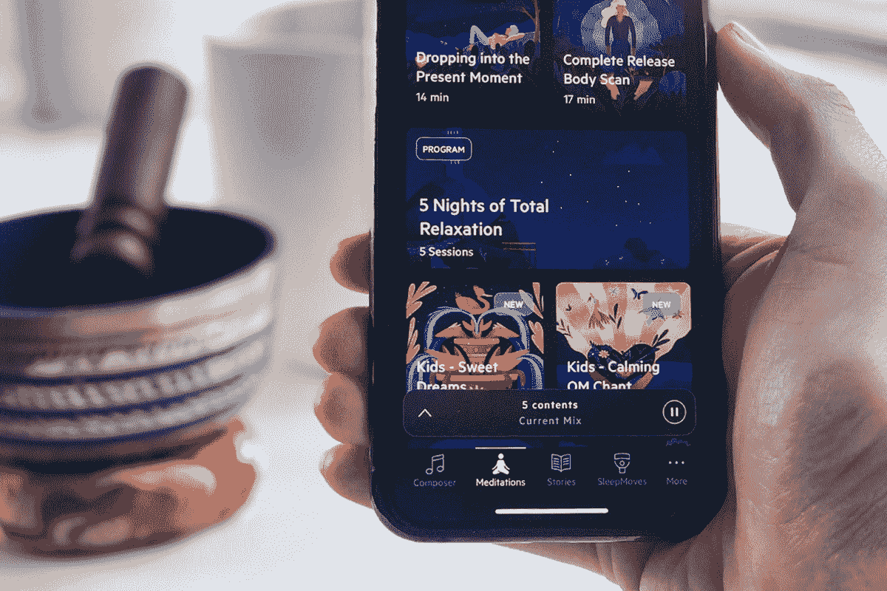
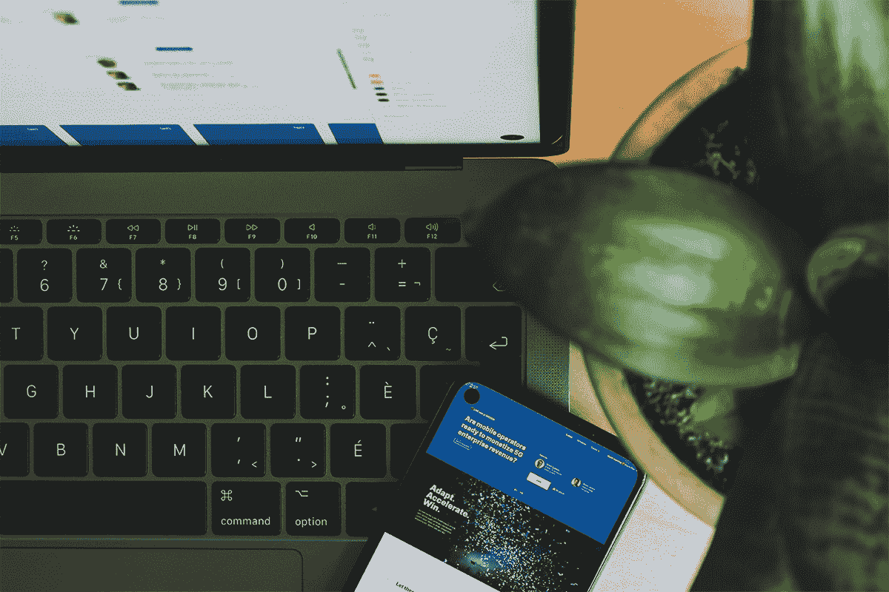
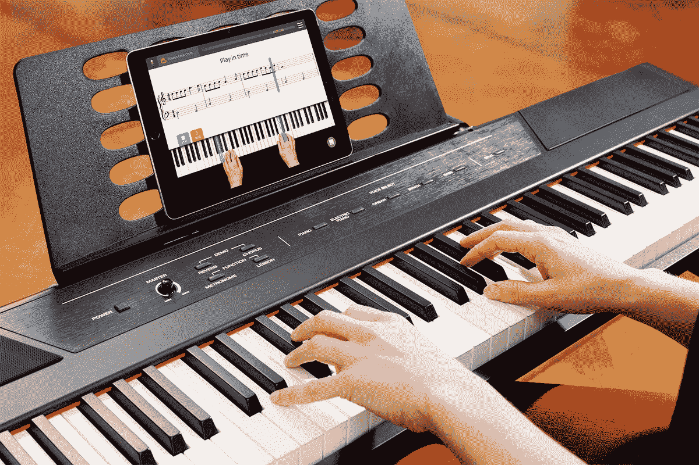
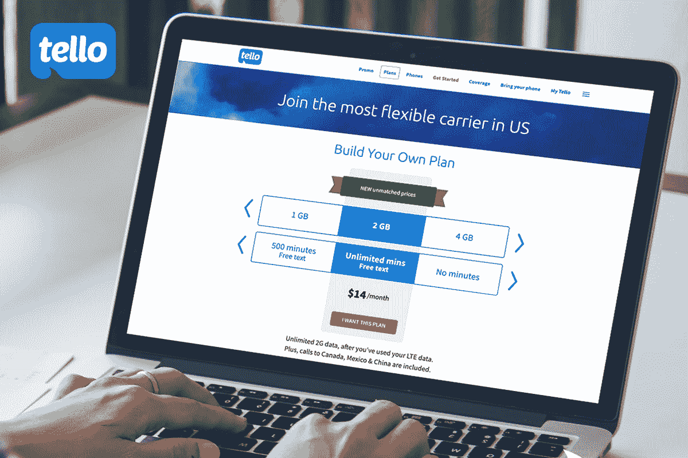

# 你每天都会用到的 10 款热门应用

> 原文：<https://www.xda-developers.com/10-deals-on-top-rated-apps-you-will-use-every-day/>

虽然有些应用程序只是偶尔打开一次(*咳咳* Strava *咳咳*)，但其他应用程序已经成为你日常生活的一部分。为了让你的日子过得更好，这里有十个目前最好的日常应用程序——现在在 XDA Developers Depot 的高级订阅可以享受高达 96%的折扣。

*P.S .今年春天，消费满 75 美元或以上，即可获得 10 美元店铺积分。信用应该在购买后两周到达(只要任何退货不会使你的总额低于 75 美元)。*

## **1)放松旋律冥想 App:终身订阅**

****

这款应用在安卓系统上被评为 4.6 星，通过舒缓的声音、睡前故事和呼吸技巧引导你进入睡眠。经著名医生和神经心理学家批准，放松的旋律也可以通过引导冥想来帮助你克服焦虑。

获得一个 [放松旋律终身订阅](https://depot.xda-developers.com/sales/relax-melodies-lifetime-subscription?utm_source=xda-developers.com&utm_medium=referral&utm_campaign=relax-melodies-lifetime-subscription&utm_term=scsf-485959&utm_content=a0x1P000004exQCQAY&scsonar=1) 只需 79.99 美元(reg。250 美元)，节省了 68%。

## **2) LingvaNex 译者:终身订阅**

****

LingvaNex 支持 112 种不同的语言，是目前最强大的翻译应用之一。它可以处理文本、图像、录音等，并为语言学习者提供内置工具。通过这项交易，您可以同时访问桌面和移动应用程序。

获得一个 [LingvaNex Translator 终身订阅](https://depot.xda-developers.com/sales/lingvanex-translator-lifetime-subscription?utm_source=xda-developers.com&utm_medium=referral&utm_campaign=lingvanex-translator-lifetime-subscription&utm_term=scsf-485960&utm_content=a0x1P000004exQCQAY&scsonar=1) 只需 79.99 美元(reg。399 美元)，节省了 80%。

## **3)终极 KeepSolid 终身订阅包**

****

该套装结合了 VPN Unlimited 和 SmartDNS，非常适合保护您的在线隐私和解锁内容。超过 1000 万人使用 VPN Unlimited，它提供 AES-256 加密和对 500 多台服务器的访问。同时，SmartDNS 可帮助您以高清方式传输全球内容。

以 59.99 美元的价格获得 [终极 KeepSolid 终身套餐](https://depot.xda-developers.com/sales/the-ultimate-keepsolid-lifetime-subscription-bundle?utm_source=xda-developers.com&utm_medium=referral&utm_campaign=the-ultimate-keepsolid-lifetime-subscription-bundle&utm_term=scsf-485962&utm_content=a0x1P000004exQCQAY&scsonar=1)(reg。438 美元)，节省了 86%。

## **4) Degoo Premium 超级备份计划:终身订阅**

****

硬盘空间不足？Degoo 的大型备份计划为您的所有文件提供 15TB 的云存储空间。这项服务在 G2 上被评为 4 星，使用端到端加密，您可以在桌面和移动设备上访问您的文件。

购买一份[Degoo Premium Mega Backup 计划终身套餐](https://depot.xda-developers.com/sales/degoo-premium-mega-backup-lifetime-subscription-15tb?utm_source=xda-developers.com&utm_medium=referral&utm_campaign=degoo-premium-mega-backup-lifetime-subscription-15tb&utm_term=scsf-485961&utm_content=a0x1P000004exQCQAY&scsonar=1) ，价格为 149.99 美元(reg。4320 美元)，节省了 96%。

## **基本 NordVPN &密码管理器 2 年期套餐**

****

根据 CNET 的说法，有了这个捆绑包，你可以获得 NordVPN 两年的在线保护——“一个加密发电站”和“最物有所值的 VPN”。你还可以获得两年的 NordPass，PCMag 将其描述为“易于使用的密码管理器，具有吸引力的网络和移动应用程序。”

以 99.99 美元的价格获得[The Essential nord VPN&Password Manager 2 年期套餐](https://depot.xda-developers.com/sales/the-essential-nord-2-year-subscription-bundle?utm_source=xda-developers.com&utm_medium=referral&utm_campaign=the-essential-nord-2-year-subscription-bundle&utm_term=scsf-485947&utm_content=a0x1P000004exQCQAY&scsonar=1)(reg。406 美元)，节省了 75%。

## **6) Enpass 密码管理器 2 年订阅**

****

Enpass 是数字安全的另一个绝佳选择，它可以让您存储密码、信用卡信息、社会保险等信息。ProPrivacy 评为 4 星，这款安全的应用程序可在您的所有设备上运行，并连接到您的云存储帐户进行同步。

以 24.99 美元的价格获得一份 [Enpass 密码管理器 2 年期套餐](https://depot.xda-developers.com/sales/enpass-2-yr-subscription?utm_source=xda-developers.com&utm_medium=referral&utm_campaign=enpass-2-yr-subscription&utm_term=scsf-485963&utm_content=a0x1P000004exQCQAY&scsonar=1)(reg。36 美元)，节省了 30%。

## **7)淀粉 1TB 云存储:终身订阅**

鲍勃·迪伦和纽约爱乐乐团使用的这个云存储平台使用人工智能技术来自动组织你的媒体文件。它还具有强大的搜索功能，可以播放任何媒体类型，以及无限制的文件共享。

以 96.99 美元的价格获得 [的 1TB 云存储终身订阅](https://depot.xda-developers.com/sales/starchive-1-tb-individual-plan-cloud-storage-lifetime-subscription?utm_source=xda-developers.com&utm_medium=referral&utm_campaign=starchive-1-tb-individual-plan-cloud-storage-lifetime-subscription&utm_term=scsf-485956&utm_content=a0x1P000004exQCQAY&scsonar=1)(reg。1530 美元)，节省了 93%。

## **8) Skoove 高级钢琴课:终身订阅**

****

有了 Skoove，你就能释放你内在的音乐家气质。在 App Store 上被命名为编辑的选择，这个应用程序教你从头开始玩键盘。互动课程涵盖音符、音阶、和弦等，人工智能提供即时反馈。

以 149.99 美元获得一份 [Skoove 终身订阅](https://depot.xda-developers.com/sales/skoove-premium-lifetime-subscription?utm_source=xda-developers.com&utm_medium=referral&utm_campaign=skoove-premium-lifetime-subscription&utm_term=scsf-485957&utm_content=a0x1P000004exQCQAY&scsonar=1)(reg。299 美元)，节省了 50%。

## **9)泰洛超值预付费 6 个月计划:两个号码无限通话/短信+ 2GB LTE 数据**

****

使用该套餐，您可以获得两条预付费电话线路，通话时间和短信不限，每月还可获得 2GB 的 LTE 数据。泰洛提供海岸到海岸的无线覆盖，当你的配额用完时，你可以获得无限的 2G 数据。更好的是，没有正在进行的合同。

获得 [两线泰洛价值预付 6 个月计划](https://depot.xda-developers.com/sales/2-lines-of-tello-value-prepaid-6-month-plan-unlimited-talk-text-2gb-lte-data?utm_source=xda-developers.com&utm_medium=referral&utm_campaign=2-lines-of-tello-value-prepaid-6-month-plan-unlimited-talk-text-2gb-lte-data&utm_term=scsf-485958&utm_content=a0x1P000004exQCQAY&scsonar=1) 为 79 美元(reg。168 美元)，节省了 52%。

## **10) EasySplitter Pro 人声清除器:终身订阅**

****

EasySplitter 是采样和播客的完美之选，它允许你将人声从基础音乐中分离出来。该应用可在 Android 和 iOS 上使用，使用人工智能技术将任何音轨分成单独的部分，包括旋律、鼓和低音。

以 39.99 美元的价格获得一个 [EasySplitter Pro 终身订阅](https://depot.xda-developers.com/sales/easysplitter-pro-lifetime-subscription?utm_source=xda-developers.com&utm_medium=referral&utm_campaign=easysplitter-pro-lifetime-subscription&utm_term=scsf-485964&utm_content=a0x1P000004exQCQAY&scsonar=1) (注册 599 美元)，节省了 93%。

*价格随时变化*