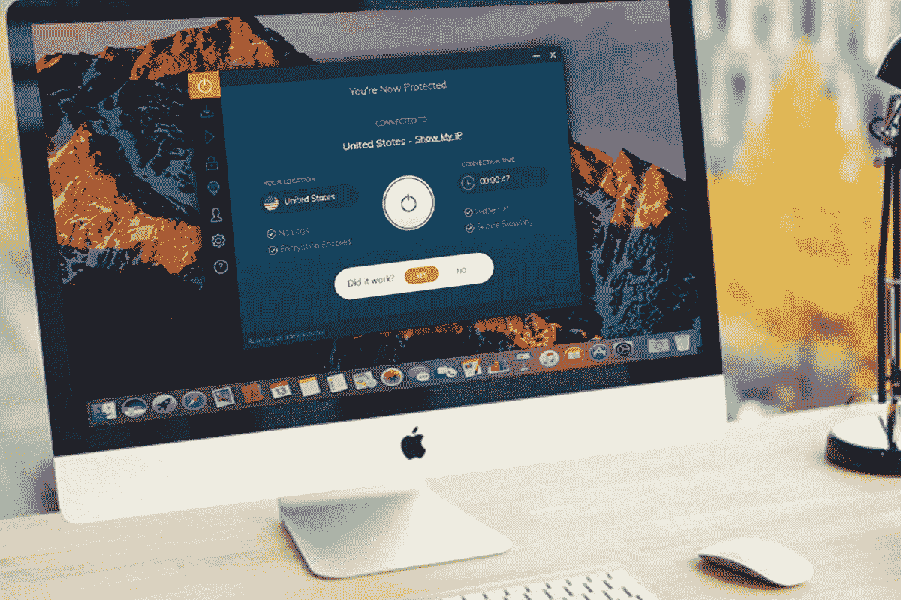
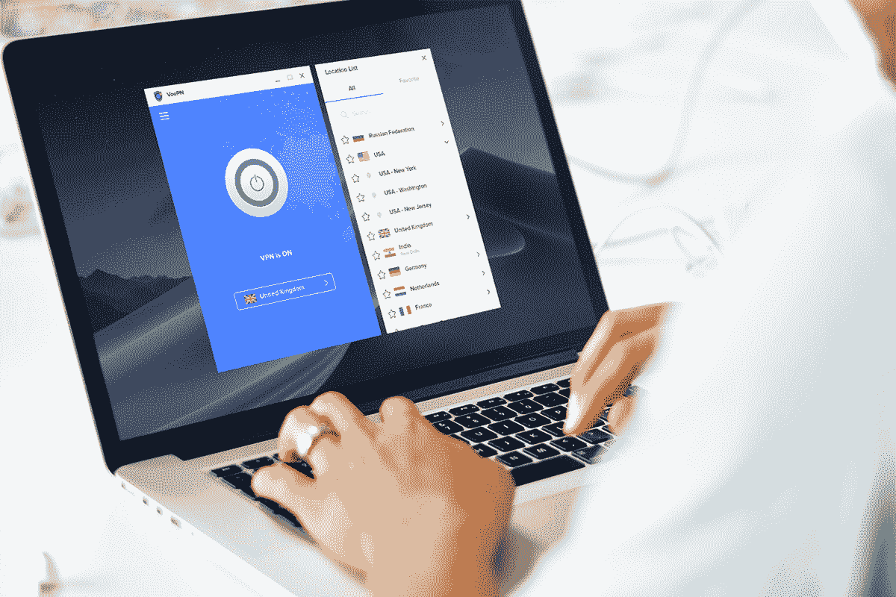
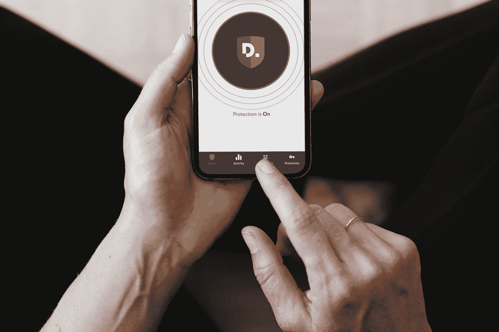

# 10 大安全和流 VPN 现已上市

> 原文：<https://www.xda-developers.com/10-top-vpns-for-security-and-streaming-on-sale-now/>

无论您是想保护您的连接、丢掉追踪器，还是传输受地理限制的内容，使用 VPN 都是明智之举。现在，您可以通过 XDA Developers Depot 从顶级提供商那里节省高达 96%的订阅费用。

## **FastestVPN:终身订阅(5 台设备)**

****

借助 P2P 优化的服务器和无限带宽，FastestVPN 是流媒体工具的绝佳选择。它还通过 AES-256 加密、恶意软件保护和 kill switch 帮助您在所有主要平台上保持安全和匿名。

花费 19.99 美元获得一个 [FastestVPN 终身订阅](https://depot.xda-developers.com/sales/fastestvpn-lifetime-subscription?utm_source=xda-developers.com&utm_medium=referral&utm_campaign=fastestvpn-lifetime-subscription&utm_term=scsf-476950&utm_content=a0x1P000004Z8zKQAS&scsonar=1)(reg。600 美元)，节省了 96%。

## **Ivacy VPN:终身订阅**

****

作为 BestVPN.com 最快 VPN 奖的获得者，这项服务在全球 100 个地方拥有 1，000 多台服务器。Ivacy VPN 可以在所有支持 P2P 的主要平台上工作，甚至还有一个专用的 Kodi 插件。

花费 39.99 美元获得一个 [Ivacy VPN 终身订阅](https://depot.xda-developers.com/sales/ivacy-vpn-lifetime-subscription?utm_source=xda-developers.com&utm_medium=referral&utm_campaign=ivacy-vpn-lifetime-subscription&utm_term=scsf-476953&utm_content=a0x1P000004Z8zKQAS&scsonar=1)(reg。1194 美元)，节省了 96%。

## **通过 VeePN 的 VPN:终身订阅**

****

VeePN 在全球 2，500 个地方拥有闪电般速度的服务器，并有严格的禁止登录政策，提供了我们都希望的在线隐私。该服务在 TrustPilot 上的评级为 4.5 星，还为多达 10 台设备提供银行级加密和覆盖。

以 29.99 美元获得一份 [VeePN 终身订阅](https://depot.xda-developers.com/sales/veepn-lifetime-subscription-10-devices?utm_source=xda-developers.com&utm_medium=referral&utm_campaign=veepn-lifetime-subscription-10-devices&utm_term=scsf-470522&utm_content=a0x1P000004Z8zKQAS&scsonar=1)(reg。659 美元)，节省了 95%。

## **断开 VPN 高级服务:终身订阅**

****

除了通常的 VPN 保护，Disconnect blocks 追踪器可以保护您的隐私、电池寿命和移动数据许可。这项服务被 VPN Mentor 评为 4 星，纽约时报称之为“我们首选的反跟踪工具”

获得一个 [断开 VPN 高级终身订阅](https://depot.xda-developers.com/sales/disconnect-vpn-premium-lifetime-subscription-1-device?utm_source=xda-developers.com&utm_medium=referral&utm_campaign=disconnect-vpn-premium-lifetime-subscription-1-device&utm_term=scsf-476948&utm_content=a0x1P000004Z8zKQAS&scsonar=1) 为 19.99 美元(注册。300 美元)，节省了 93%。

## **KeepSolid VPN Unlimited:终身订阅**

****

作为 PC Mag 的顶级 VPN，这项服务在全球 80 个地方拥有 400 台服务器，允许您解锁网飞、iPlayer、Hulu 和其他流媒体网站。零日志策略、军用级加密和安全开关可确保您的数据安全。

以 39.99 美元的价格获得一个 [KeepSolid VPN 无限期套餐](https://depot.xda-developers.com/sales/vpn-unlimited-lifetime-subscription?utm_source=xda-developers.com&utm_medium=referral&utm_campaign=vpn-unlimited-lifetime-subscription&utm_term=scsf-476956&utm_content=a0x1P000004Z8zKQAS&scsonar=1)(reg。199 美元)，节省了 80%。

## **Goose VPN: 2 年订阅**

****

用 Tech Radar 的话来说，Goose VPN 提供了简单的保护，既“物有所值，又比许多产品更快”它可以在所有主要平台上工作，零日志记录，同时保护无限的设备。

获得 [两年的鹅 VPN](https://depot.xda-developers.com/sales/goose-vpn-2-yr-subscription?utm_source=xda-developers.com&utm_medium=referral&utm_campaign=goose-vpn-2-yr-subscription&utm_term=scsf-476952&utm_content=a0x1P000004Z8zKQAS&scsonar=1) 售价 19.99 美元(reg349 美元)，节省了 94%。

## **人事网 Pro**

****

personalVPN Pro 具有一键式保护功能，是首次使用 VPN 的用户的绝佳选择。它可以有效地解除对流媒体网站的封锁，并提供高达 4096 位的连接加密。PCWorld 称之为“一项速度极快的伟大服务”。

花费 34.99 美元获得 [一年的 personalVPN Pro](https://depot.xda-developers.com/sales/personalvpn-pro-1-year?utm_source=xda-developers.com&utm_medium=referral&utm_campaign=personalvpn-pro-1-year&utm_term=scsf-476947&utm_content=a0x1P000004Z8zKQAS&scsonar=1)(reg69 美元)，节省了 50%。

## **Hop VPN:终身订阅**

****

想要运行自己的虚拟专用网络？使用 Hop VPN，您可以。它提供了您所期望的所有保护，并且您可以完全控制。你所需要的是一台台式机作为服务器。

花费 39.99 美元获得一个 [Hop VPN 终身订阅](https://depot.xda-developers.com/sales/hop-vpn-lifetime-subscription?utm_source=xda-developers.com&utm_medium=referral&utm_campaign=hop-vpn-lifetime-subscription&utm_term=scsf-476945&utm_content=a0x1P000004Z8zKQAS&scsonar=1)(reg。148 美元)，节省了 72%。

## **IPVanish VPN: 1 年订阅**

****

拥有超过 1，600 台服务器和 40，000 个共享 IP 地址，IPVanish 保持着惊人的速度和安全性。这些应用非常用户友好，用户甚至可以通过 SugarSync 获得 250GB 的云存储空间。用 CNET 的话说:“它有趣、快速、灵活。”

花 29 美元获得 [一年的 IP vanish VPN](https://depot.xda-developers.com/sales/1-year-of-ipvanish?utm_source=xda-developers.com&utm_medium=referral&utm_campaign=1-year-of-ipvanish&utm_term=scsf-476954&utm_content=a0x1P000004Z8zKQAS&scsonar=1)(reg。143 美元)，节省了 79%。

## **Windscribe VPN Pro 计划:3 年订阅**

****

如果你在乎隐私，Windscribe VPN 绝对值得你关注。被汤姆的指南评为“非常好”，这项服务有一个严格的不登录政策，你可以注册没有电子邮件地址。它还有一个内置功能，可以阻止追踪器和恶意软件。

花费 89.99 美元获得 [三年的 Windscribe VPN](https://depot.xda-developers.com/sales/windscribe-vpn-pro-plan-3-year-subscription?utm_source=xda-developers.com&utm_medium=referral&utm_campaign=windscribe-vpn-pro-plan-3-year-subscription&utm_term=scsf-476955&utm_content=a0x1P000004Z8zKQAS&scsonar=1)(reg324 美元)，节省了 72%。

*价格随时变化*