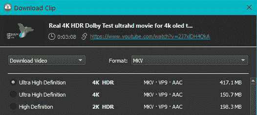
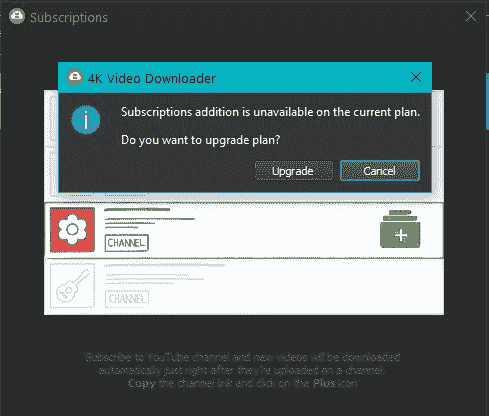

# 保存 4K 的 YouTube 视频，使用这个免费的 4K 视频下载器

> 原文：<https://www.xda-developers.com/4k-video-downloader/>

如果你曾经试图从 YouTube 或其他视频网站下载视频，你可能已经知道这可能比你想象的更困难。如果不使用第三方软件，就无法直接下载 YouTube 视频。即便如此，也很难找到一种简单的方法来下载质量不错的视频，更不用说 4K 了。这个问题是通过使用 4K 视频下载器来解决的，免费以最高分辨率保存视频。

## 如何在 4K 下载 YouTube 视频

1.  从免费下载 [4K 视频下载器](https://www.4kdownload.com/products/product-videodownloader)开始。你可以用这个软件轻松地从 YouTube 上保存 4K 质量的视频。软件安装完成后，您就可以开始第一次下载了。
2.  现在转到你想下载的 YouTube 视频，复制网址。您可以使用**粘贴链接**按钮将 URL 粘贴到下载管理器中。这时，您将看到不同的下载选项。选择您希望保存视频的分辨率和格式。

 <picture></picture> 

Download Options for 4K Video Downloader

默认情况下，你的视频将保存在你的 C:\视频\4K 视频下载器文件夹。粘贴新的 YouTube 链接时，您可以更改指定的下载文件夹。

## 视频下载订阅

在许多不同的情况下，你会发现自己想要从 YouTube 上的特定频道下载所有新视频。例如，您可以设置免费的 4K 视频下载订阅从电影预告片频道下载。这将下载您指定的视频格式和分辨率的每个新视频。

1.  要开始新的订阅，请转到**工具>订阅**并粘贴您想要订阅的频道的 URL。如果你有免费计划，你将被提示升级到付费计划之一，起价仅为 15 美元。
2.  要升级到其中一个付费计划，您可以前往 **[本页面](https://www.4kdownload.com/products/product-videodownloader#)** ，查看他们的实惠选项。

 <picture></picture> 

Channel Subscriptions

这个下载器也可以用来下载音频格式的视频。许多人从 YouTube 下载免版税的音乐，用于视频编辑项目。这是获得特定格式的高质量音频文件的最快方法，这种格式将与您的编辑器一起工作。

一旦你尝试了 4K 视频下载软件，你就会发现免费下载视频是多么的快捷和简单。对于任何从事视频编辑或社交媒体的人来说，这是一个特别有用的工具。你可以点击这里查看更多 4K 视频下载指南。

###### 我们感谢 4K 视频下载者赞助了这篇文章。我们的赞助商帮助我们支付与运行 XDA 相关的许多费用，包括服务器成本、全职开发人员、新闻撰稿人等等。虽然您可能会在门户内容旁边看到赞助内容(这些内容将始终被标记为赞助内容),但门户团队对这些帖子不承担任何责任。赞助内容、广告和 XDA 仓库完全由一个独立的团队管理。XDA 绝不会通过接受金钱来赞扬一家公司，或以任何方式改变我们的观点或看法，从而损害其新闻诚信。我们的意见不能被收买。