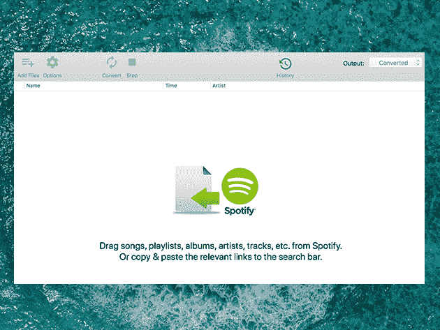
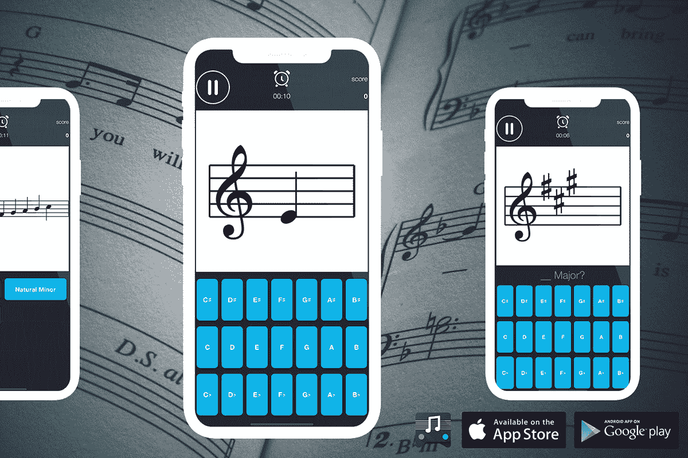

# 6 款顶级音频和音乐制作应用——现在高达 93%的折扣

> 原文：<https://www.xda-developers.com/6-top-audio-and-music-making-apps-now-with-up-to-93-off/>

对于真正热爱音乐的人来说，好的音频应用值得投资。无论你喜欢巴赫还是披头士，XDA Developers Depot 上的这些应用程序都将增强你的聆听体验，并帮助你制作自己的曲子——现在订阅高达 93%的折扣。

## **Mac 版 Spotify 音乐转换器**

讨厌 Spotify 对离线收听的限制？这个 Mac 应用程序允许您保存没有 DRM 的歌曲，并将音频转换为任何文件类型。它适用于免费和高级账户，拥有完整的元数据和原始质量。

以 19.99 美元的价格获得[Mac 版 Spotify 音乐转换器](https://depot.xda-developers.com/sales/spotify-music-converter-for-mac?utm_source=xda-developers.com&utm_medium=referral&utm_campaign=spotify-music-converter-for-mac&utm_term=scsf-491110&utm_content=a0x1P000004f6CXQAY&scsonar=1)(reg。39 美元)，节省了 49%。

## **ChordIQ Pro:终身订阅**

****

在 Play Store 上被评为 4.5 星，这款出色的手机应用通过有趣的迷你游戏教你音乐理论。你还学习如何用耳朵识别音符和和弦，提高你的乐器演奏技巧，磨练你的歌声！

花 5.99 美元获得一份 [ChordIQ Pro 终身订阅](https://depot.xda-developers.com/sales/chordiq-pro-lifetime-subscription?utm_source=xda-developers.com&utm_medium=referral&utm_campaign=chordiq-pro-lifetime-subscription&utm_term=scsf-491112&utm_content=a0x1P000004f6CXQAY&scsonar=1)(reg。11 美元)，节省了 50%。

## **Skoove 高级钢琴课:终身订阅**

****

Skoove 是一个应用商店编辑的选择，拥有 4.5 颗星，帮助有抱负的音乐人掌握关键。该应用程序提供了超过 400 个专家视频教程，带有人工智能反馈和量身定制的学习。该应用程序还有数千个视频课程，向您展示如何播放经典曲目。

花费 149.99 美元获得一份 [Skoove Premium 终身订阅](https://depot.xda-developers.com/sales/skoove-premium-lifetime-subscription?utm_source=xda-developers.com&utm_medium=referral&utm_campaign=skoove-premium-lifetime-subscription&utm_term=scsf-491113&utm_content=a0x1P000004f6CXQAY&scsonar=1) (注册 299 美元)，节省了 50%。

## **音频优化体验:终身订阅**

****

这款 Windows 和 Mac 软件由 Bongiovi Acoustics Lab technology 提供支持，让您对电脑的音频输出进行难以置信的控制。使用 120 个优化点，您可以增强音乐，带来生动的游戏音频，甚至提高视频通话的清晰度。

获得一个[【AOE】终身订阅](https://depot.xda-developers.com/sales/audio-optimization-experience-lifetime-subscription?utm_source=xda-developers.com&utm_medium=referral&utm_campaign=audio-optimization-experience-lifetime-subscription&utm_term=scsf-491109&utm_content=a0x1P000004f6CXQAY&scsonar=1) 只需 49.99 美元(reg。299 美元)，节省了 83%。

## **EasySplitter Pro 人声清除器:终身订阅**

****

现代音乐制作非常依赖样本。EasySplitter 使用人工智能来分离任何歌曲的部分，这意味着你可以在几秒钟内抓取完美的样本。它可以在 Android 和 iOS 上工作，具有完整的音质和完整的文件历史。

花费 39.99 美元获得一个 [EasySplitter 终身订阅](https://depot.xda-developers.com/sales/easysplitter-pro-lifetime-subscription?utm_source=xda-developers.com&utm_medium=referral&utm_campaign=easysplitter-pro-lifetime-subscription&utm_term=scsf-491111&utm_content=a0x1P000004f6CXQAY&scsonar=1) (注册 599 美元)，节省了 93%。

## **SYQEL 人工智能音乐可视化工具:终身订阅**

****

SYQEL 利用人工智能，是目前最先进的音乐可视化工具之一。这个应用程序只需要两分钟就可以设置好，它提供了超过 5000 个视觉效果。用 DJ YT 的话说:“SYQEL 立即将我的 Twitch DJ 流变成一种超越竞争对手的体验。”

花费 49.99 美元获得一份 [SYQEL 终身订阅](https://depot.xda-developers.com/sales/syqel-lifetime-subscription-lite-plan?utm_source=xda-developers.com&utm_medium=referral&utm_campaign=syqel-lifetime-subscription-lite-plan&utm_term=scsf-491107&utm_content=a0x1P000004f6CXQAY&scsonar=1)(reg。149 美元)，节省了 66%。

*价格随时变化*