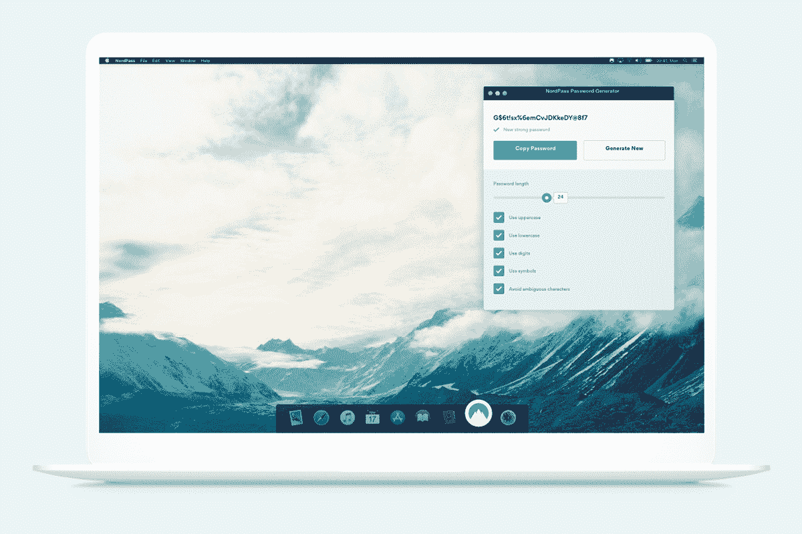
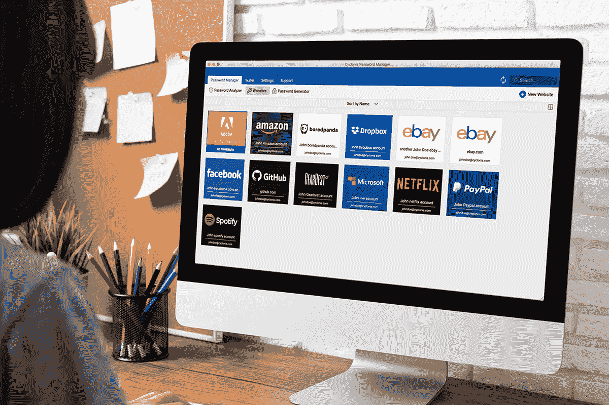
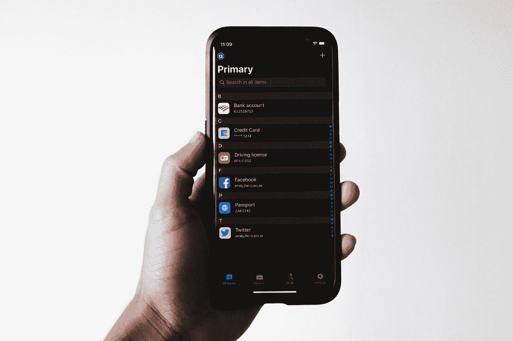
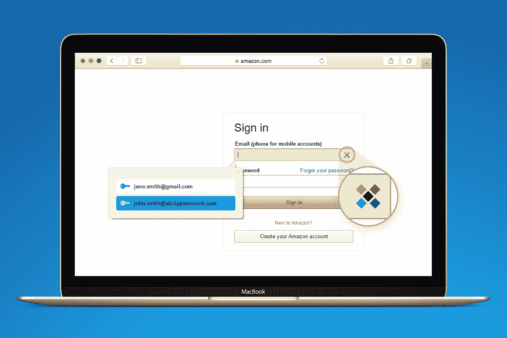

# 关于密码管理器的 6 大优惠，确保您的安全

> 原文：<https://www.xda-developers.com/6-top-deals-on-password-managers-to-keep-you-secure/>

最安全的密码也是最复杂的。这就是为什么网络安全专家建议使用密码管理器来记录你的登录信息。有很多可供选择——这里有六个最好的，现在在 XDA Developers Depot 订阅可以享受高达 93%的折扣。

## **密码 Boss Premium:终身订阅**

****

被《PC Magazine》评为 4 星的这项服务可以让您在无限的设备上存储无限的密码。Password Boss 使用 256 位加密来锁定您的数据，您可以让家人或同事安全访问。它还可以存储您的支付信息，以便更快地在线结账。

获得一个 [密码 Boss Premium 终身订阅](https://depot.xda-developers.com/sales/password-boss-premium-lifetime-subscription?utm_source=xda-developers.com&utm_medium=referral&utm_campaign=password-boss-premium-lifetime-subscription&utm_term=scsf-490321&utm_content=a0x1P000004Z8zHQAS&scsonar=1) (无限设备)只需 34.99 美元(reg。499 美元)，节省了 93%。

## **NordPass 密码管理器:1 年订阅**

****

在安全性方面，NordPass 密码管理器首屈一指。这项跨平台服务使用零知识体系结构和最新的加密方法来保护您的数据安全。PCMag 还将其描述为“一个易于使用的密码管理器，具有吸引力的网络和移动应用程序。”

以 29.99 美元的价格获得一份 [NordPass 密码管理器 1 年期套餐](https://depot.xda-developers.com/sales/nordpass-1-yr-subscription?utm_source=xda-developers.com&utm_medium=referral&utm_campaign=nordpass-1-yr-subscription&utm_term=scsf-490322&utm_content=a0x1P000004Z8zHQAS&scsonar=1) (注册。59 美元)，节省了 49%。

## **无限设备的 Cyclonis 密码管理器:终身订阅**

****

如果您正在寻找一个简单、安全的解决方案，Cyclonis 可以满足您的需求。这个密码管理器使用军用级 AES-256 加密来保护您的密码，支付信息，重要说明，等等。一份套餐涵盖无限设备。

获得一个 [Cyclonis 密码管理器终身订阅](https://depot.xda-developers.com/sales/lifetime-cyclonis-password-manager-unlimited-devices?utm_source=xda-developers.com&utm_medium=referral&utm_campaign=lifetime-cyclonis-password-manager-unlimited-devices&utm_term=scsf-490319&utm_content=a0x1P000004Z8zHQAS&scsonar=1) 只需 29 美元(reg。180 美元)，节省了 83%。

## **Enpass 密码管理器**

****

如果您喜欢完全控制您的数据，Enpass 是您需要的密码管理器。这款应用可以在 Windows、Mac、Android 和 iOS 上使用，可以离线工作，并通过您喜欢的云存储提供同步。ProPrivacy 的评级为 4 星，该服务可以处理登录、信用卡、银行账户、许可证、文件、文档或任何其他信息。

以 24.99 美元的价格获得一份 [Enpass 密码管理器 2 年期套餐](https://depot.xda-developers.com/sales/enpass-2-yr-subscription?utm_source=xda-developers.com&utm_medium=referral&utm_campaign=enpass-2-yr-subscription&utm_term=scsf-490320&utm_content=a0x1P000004Z8zHQAS&scsonar=1) (注册费:100 美元)。36 美元)，节省了 30%。

## **粘性密码高级版终身订阅:2 个帐户捆绑**

****

这份 PCMag 编辑的选择让你在云同步和离线存储之间做出选择。无论哪种方式，通过安全的密码共享和高度响应的支持，您都可以在生物识别安全背后保存无限的密码和支付细节。通过这项交易，您可以获得两个独立的终身保费账户。

获得 [两个粘性密码高级终身订阅](https://depot.xda-developers.com/sales/sticky-password-premium-lifetime-subscription-2-account-bundle?utm_source=xda-developers.com&utm_medium=referral&utm_campaign=sticky-password-premium-lifetime-subscription-2-account-bundle&utm_term=scsf-470519&utm_content=a0x1P000004Z8zHQAS&scsonar=1) 为 49.99 美元(reg。399 美元)，节省了 87%。

## **Enpass 密码管理器家庭计划:1 年订阅**

通过 Enpass 家庭计划，您可以帮助您的家人和同事保持安全。在一个订阅下，您可以为工作和家庭生活创建多个保管库。密码可以在无限的设备上访问，帐户通过双重身份验证进行保护。

以 23.99 美元的价格获得一份 [Enpass 密码管理器家庭计划 1 年期套餐](https://depot.xda-developers.com/sales/enpass-password-manager-family-plan-1-year-subscription?utm_source=xda-developers.com&utm_medium=referral&utm_campaign=enpass-password-manager-family-plan-1-year-subscription&utm_term=scsf-490323&utm_content=a0x1P000004Z8zHQAS&scsonar=1)(reg。47 美元)，节省了 50%。

*价格随时变化*