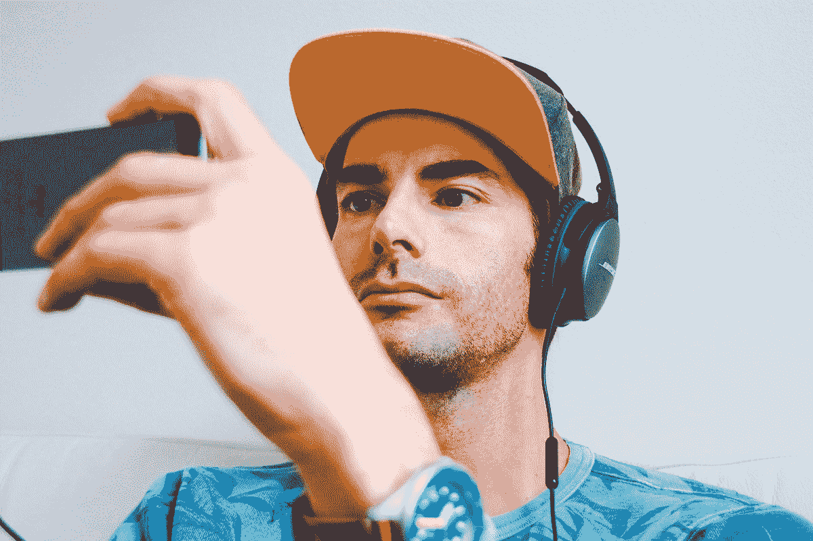
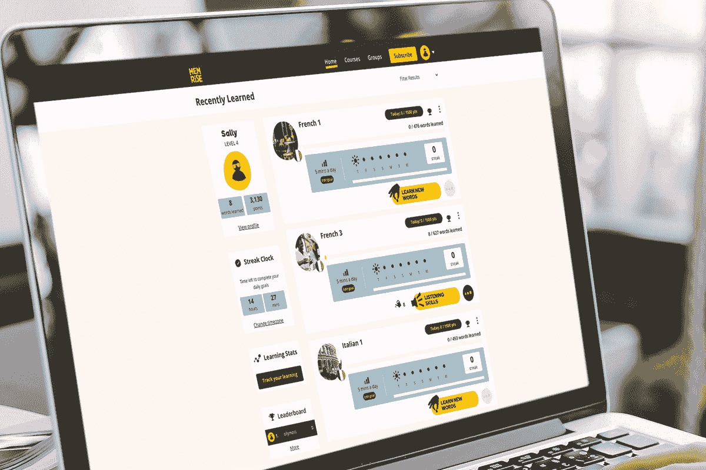

# 6 款热门语言和语音应用本周高达 95%的折扣

> 原文：<https://www.xda-developers.com/6-top-language-and-speech-apps-with-up-to-95-off-this-week/>

对于我们这些喜欢旅行的人来说，2020 年是糟糕的一年。但是随着科学家的进步，明年看起来会更加光明。如果你想学习下一个目的地的语言，试试这些顶级的语言学习应用程序——现在在 XDA 开发者仓库有很大的折扣。

## **Mondly:终身订阅**

作为多个 App Store 和 Google Play 奖项的获得者，Mondly 结合了母语者音频和图片测验，帮助您学习 33 种语言。该应用程序甚至有增强现实功能，可以帮助你记住日常物品的单词。

以 99.99 美元获得一份 [Mondly 终身订阅](https://depot.xda-developers.com/sales/mondly-lifetime-subscription-all-languages?utm_source=xda-developers.com&utm_medium=referral&utm_campaign=mondly-lifetime-subscription-all-languages&utm_term=scsf-459461&utm_content=a0x1P000004YrpQQAS&scsonar=1)(reg。2199 美元)，节省了 95%。

## **LingvaNex 译者:终身订阅**

一旦你掌握了基本知识，LingvaNex Translator 可以帮助你翻译你所选择语言的文章和音频。这款应用程序曾是本周搜索产品的头号产品，提供 112 种语言的准确翻译。

获得一个 [LingvaNex Translator 终身订阅](https://depot.xda-developers.com/sales/lingvanex-translator-lifetime-subscription?utm_source=xda-developers.com&utm_medium=referral&utm_campaign=lingvanex-translator-lifetime-subscription&utm_term=scsf-459463&utm_content=a0x1P000004YrpQQAS&scsonar=1) 只需 79.99 美元(reg。399 美元)，节省了 80%。

## **有声读物:1 年订阅**

****

无论你是在学习一门语言还是其他东西，雄辩可以节省你很多时间。这款智能应用程序可以将任何文本文档转换成有声读物，这意味着您可以随时随地聆听。

花费 39.99 美元获得 [一年的有声读物](https://depot.xda-developers.com/sales/speechify-1-year-subscription?utm_source=xda-developers.com&utm_medium=referral&utm_campaign=speechify-1-year-subscription&utm_term=scsf-459464&utm_content=a0x1P000004YrpQQAS&scsonar=1) (注册 390 美元)，节省了 89%。

## **社交距离终身订阅包 Ft。罗塞塔石碑**

****

这三款顶级应用包括 Rosetta Stone，它连续五年被 PCMag 评为最佳语言学习软件。该应用程序每秒钟分析你的口音 100 次，以提供现场指导；该套餐还包括终身访问 12 分钟微型图书和 VPN 无限。

花费 189 美元获得 [社交距离终身订阅捆绑](https://depot.xda-developers.com/sales/the-social-distancing-lifetime-subscription-bundle-ft-rosetta-stone-2?utm_source=xda-developers.com&utm_medium=referral&utm_campaign=the-social-distancing-lifetime-subscription-bundle-ft-rosetta-stone-2&utm_term=scsf-459460&utm_content=a0x1P000004YrpQQAS&scsonar=1)(reg。744 美元)，节省了 74%。

## **记忆语言学习:终身订阅**

****

Memrise 在 App Store 上被评为 4.8/5 颗星，她通过三个步骤教授 22 种语言。这些课程是个性化的，你可以在真实世界的语境中看到单词，这意味着你可以自信地开始说话。

花 99.99 美元获得一份 [Memrise 终身订阅](https://depot.xda-developers.com/sales/memrise-lifetime-subscription?utm_source=xda-developers.com&utm_medium=referral&utm_campaign=memrise-lifetime-subscription&utm_term=scsf-459462&utm_content=a0x1P000004YrpQQAS&scsonar=1) (注册 139 美元)，节省了 28%。

## 巴贝尔语言学习:终身订阅

****

Babbel 提供 10，000 小时的内容，涵盖 14 种不同的语言，非常适合忠诚的学习者。这些课程可在桌面和移动设备上使用，使用迷你游戏和语音识别来教你日常词汇。

花 199 美元获得一份 [巴贝尔终身订阅](https://depot.xda-developers.com/sales/babbel-language-learning-lifetime-subscription-all-languages?utm_source=xda-developers.com&utm_medium=referral&utm_campaign=babbel-language-learning-lifetime-subscription-all-languages&utm_term=scsf-459433&utm_content=a0x1P000004YrpQQAS&scsonar=1)(reg。399 美元)，节省了 50%。

*价格随时变化*