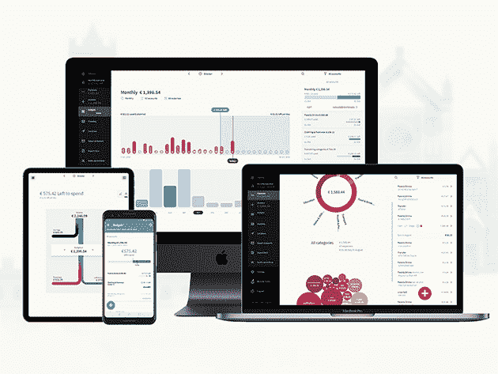
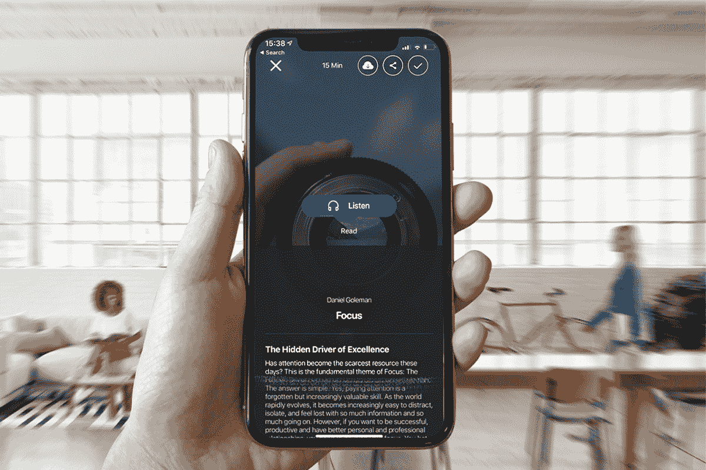
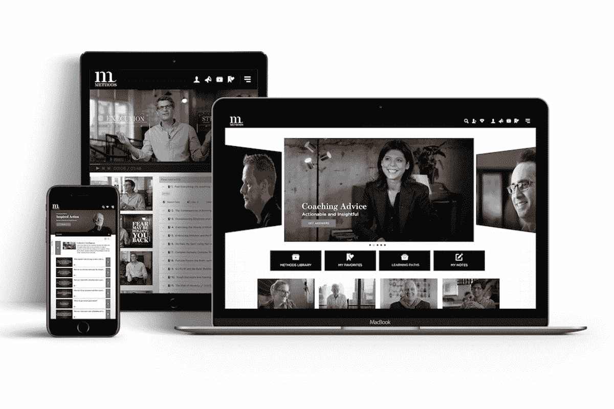

# 在为期两天的圣诞节促销活动中，7 款热门应用额外享受 15%的优惠

> 原文：<https://www.xda-developers.com/7-top-apps-with-an-extra-15-off-in-this-2-day-christmas-sale/>

虽然主要的购物季节又过去了一年，圣诞节仍然有一些礼物在等待着我们。无论你是想学习新的东西还是想改善你的工作流程，这些高评级的应用程序都可以提供帮助。使用促销代码 **MERRY15** 在 XDA Developers Depot 参加为期两天的促销活动，额外节省 15%的费用。

## **Mondly:终身订阅**

****

2021 年想学语言？Mondly 帮助您更快地开始说话，使用高级语音识别和母语者音频来教您新单词。这是 Google Play 和 App Store 大奖得主。

以 59.49 美元获得一份 [Mondly 终身订阅](https://depot.xda-developers.com/sales/mondly-lifetime-subscription-5-languages?utm_source=xda-developers.com&utm_medium=referral&utm_campaign=mondly-lifetime-subscription-5-languages&utm_term=scsf-463176&utm_content=a0x1P000004YrpkQAC&scsonar=1)(reg。1199 美元)，促销代码为 MERRY15。

## **XSplit VCam:终身订阅**

****

从视频通话到 YouTube 制作，这款 Windows 应用程序可以帮助您创建完美的绿屏背景。它甚至增加了 DSLR 风格的模糊，可以用滑块来调整，使整体效果看起来更自然。

以 15.99 美元的价格获得[XSplit VCam](https://depot.xda-developers.com/sales/xsplit-vcam-lifetime-subscription?utm_source=xda-developers.com&utm_medium=referral&utm_campaign=xsplit-vcam-lifetime-subscription&utm_term=scsf-459453&utm_content=a0x1P000004YrpkQAC&scsonar=1)终身订阅(reg。$49)，促销代码为 MERRY15。

## **Toshl Finance Medici 计划:3 年期认购**

****

Toshl Finance 在 Google Play 上被评为 4.5 星，在 App Store 上被评为 4.7 星，帮助您控制自己的支出。该应用程序与全球 13，062 家银行和金融服务机构同步，提供您银行账户的实时数据。

获得 [三年的托什金融](https://depot.xda-developers.com/sales/toshl-finance-medici-plan-3-year-subscription?utm_source=xda-developers.com&utm_medium=referral&utm_campaign=toshl-finance-medici-plan-3-year-subscription&utm_term=scsf-463175&utm_content=a0x1P000004YrpkQAC&scsonar=1) 售价 33.99 美元(reg199 美元)，促销代码为 MERRY15。

## **12 分钟微书库:终身高级订阅**

****

花 2021 年读完三本书，还是用 12 个月完成你的整个阅读清单，哪个更好？《12 分钟》可在 Android 和 iOS 上使用，它将 1800 多篇热门阅读浓缩成简短的摘要，您可以在午休时欣赏。

花费 51.15 美元获得 [终身访问 12 分钟库](https://depot.xda-developers.com/sales/12min-micro-book-library-lifetime-premium-subscription?utm_source=xda-developers.com&utm_medium=referral&utm_campaign=12min-micro-book-library-lifetime-premium-subscription&utm_term=scsf-463177&utm_content=a0x1P000004YrpkQAC&scsonar=1)(reg。$399)，促销代码为 MERRY15。

## **可知音频学习平台:终身订阅**

****

比起阅读，你更喜欢听？Knowable 提供了来自 200 多名世界级专家的大量高质量音频课程。它涵盖了广泛的主题，该应用程序被评为 Google Play 的“我们喜爱的新应用程序”之一。

获得一个 [可知终身订阅](https://depot.xda-developers.com/sales/knowable-lifetime-subscription?utm_source=xda-developers.com&utm_medium=referral&utm_campaign=knowable-lifetime-subscription&utm_term=scsf-463179&utm_content=a0x1P000004YrpkQAC&scsonar=1) 只需 50.99 美元(reg。$249)，促销代码为 MERRY15。

## **IPVanish VPN: 1 年订阅**

****

凭借全球超过 40，000 个 IP 和 1，600 台服务器，IPVanish 真正让您…嗯…消失。它还提供无限的带宽，并有严格的零日志策略。用 CNET 的话说，这项服务“有趣、快捷、灵活”

花费 34.65 美元获得 [一年的 IP vanish VPN](https://depot.xda-developers.com/sales/1-year-of-ipvanish?utm_source=xda-developers.com&utm_medium=referral&utm_campaign=1-year-of-ipvanish&utm_term=scsf-463180&utm_content=a0x1P000004YrpkQAC&scsonar=1)(reg$143)，促销代码为 MERRY15。

## **领导力在线学习方法:终身订阅**

****

由马歇尔·戈德史密斯和几位顶级思想领袖创立的“领导方法”是一个认证项目，帮助你轻松承担管理角色。你总共有 500 章的内容，包括现场互动和练习册。

获得 [终生获得领导的方法](https://depot.xda-developers.com/sales/methods-plus-lifetime-subscription?utm_source=xda-developers.com&utm_medium=referral&utm_campaign=methods-plus-lifetime-subscription&utm_term=scsf-463178&utm_content=a0x1P000004YrpkQAC&scsonar=1) 花费 125.79 美元(reg。$2，940)，促销代码为 MERRY15。

*价格随时变化*