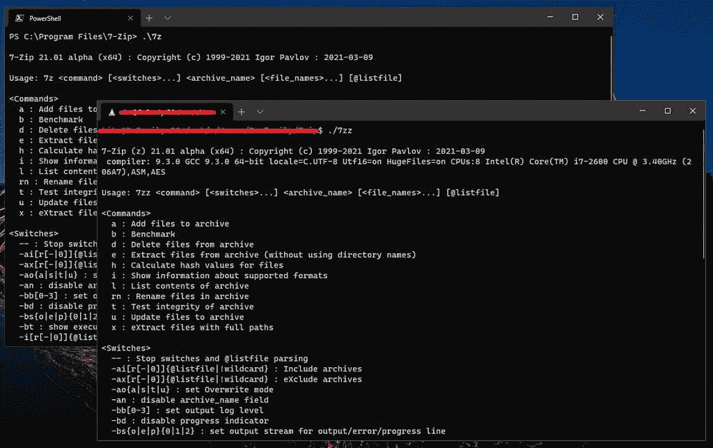

# 开源文件归档器 7-Zip 现在可以在 Linux 上使用了

> 原文：<https://www.xda-developers.com/7-zip-linux-official-release/>

7-Zip 的正式版本现可用于 Linux x86、x86-64、ARMv7 和 ARM64 架构，将流行的开源文件压缩程序从运行微软 Windows 的 PC 扩展到数千台 Linux 驱动的设备，包括 [Chromebooks](https://www.xda-developers.com/best-chromebooks/) 和 [Raspberry Pi](https://www.xda-developers.com/raspberry-pi-400-personal-computer-keyboard/) 。

由于文件格式的[开放架构，Linux 用户已经能够使用 7-Zip 存档(*.7z)一段时间了，使用像](https://www.7-zip.org/7z.html) [p7zip](https://sourceforge.net/projects/p7zip/) 这样的应用程序。但是自从 7-Zip 21.01 alpha 发布以来，开发人员、系统管理员和 Linux 爱好者可以直接从 7-Zip 的网站上获得该程序的 Linux 二进制文件，并享受原生支持。您可以在一个容器、一台远程机器，甚至是在【Linux 的 Windows 子系统(WSL) 下调用它。

 <picture></picture> 

7-Zip Linux running under WSL 2 together with the Windows CLI version

7-Zip 的 21.01 alpha 版本(2021 年 3 月 9 日发布)的完整变更日志如下:

*   Linux 的命令行版本 7-Zip 发布了。
*   使用 AES、CRC-32、SHA-1 和 SHA-256 的硬件 CPU 指令来提高 ARM64 版本的速度。
*   18.02 - 21.00 版本中的 bug 已修复:7-Zip 无法正确提取一些用 xz 压缩方法创建的 Zip 存档。
*   一些错误被修复。

随着 Linux 版本成为标准产品，您可以期待发布机制与官方的 7-Zip 版本保持一致。鉴于 p7zip [最后一次更新是在 2016 年](https://sourceforge.net/projects/p7zip/files/p7zip/16.02/)，7-Zip 开发者伊戈尔·巴甫洛夫(Igor Pavlov)将事情掌握在自己手中并发布基于最新 7-Zip 代码库的官方 Linux 二进制文件确实是一个明智的举动。然而，开发者还没有公布这个版本的源代码。正如在发布讨论线程中提到的( [*通过哔哔声计算机*](https://www.bleepingcomputer.com/news/software/7-zip-developer-releases-the-first-official-linux-version/) )，巴甫洛夫自己承认[不能与 Linux 一起工作，](https://sourceforge.net/p/sevenzip/discussion/45797/thread/cec5e63147/#94e9/2017/0774)这意味着一个正式的构建系统需要一些时间才能出现。尽管 p7zip 的构建脚本[可以用来在 Linux 上编译](https://sourceforge.net/p/sevenzip/discussion/45797/thread/cec5e63147/#16f2/f81c) 7-Zip，但从长远来看，这可能不是一个合适的解决方案。

如果你想试用 7-Zip 的官方 Linux 版本，你可以直接从[公告线程](https://sourceforge.net/p/sevenzip/discussion/45797/thread/cec5e63147/)或者从其网站的[下载部分下载 alpha 版本。第一步是为您的 CPU 架构选择您需要的包。下载完成后，您必须解压*.tar.xz 归档文件以获得`7zz`可执行文件。值得注意的是，CLI 版本的第一方官方 GUI 前端还不可用。](https://www.7-zip.org/download.html)