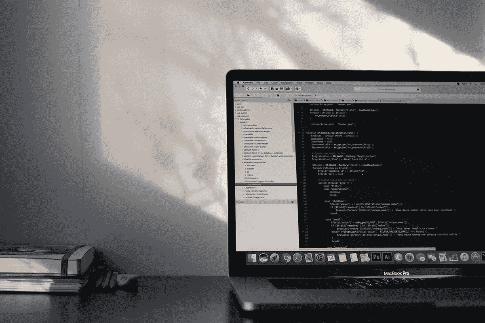

# 本周顶级技术课程的 8 个不容错过的交易

> 原文：<https://www.xda-developers.com/8-unmissable-deals-on-top-rated-tech-courses-this-week/>

在这个购物季节，人们很容易在低价科技产品上挥霍你的银行存款。但是如果你想在下个假期花更多的钱，现在是时候投资你的职业生涯了。无论你是想成为一名数据大师，还是一名高薪程序员，XDA 仓库的这些课程都可以满足你——现在有超过 90%的折扣。

## **Premium 2021 Microsoft Excel&数据认证包**

拥有 24 门独立课程，这个 [庞大的培训库](https://depot.xda-developers.com/sales/the-microsoft-and-data-power-super-certification-bundle?utm_source=xda-developers.com&utm_medium=referral&utm_campaign=the-microsoft-and-data-power-super-certification-bundle&utm_term=scsf-448430&utm_content=a0x1P000004YkA6QAK&scsonar=1) 帮助你成为真正的数据大师。通过 90 小时的视频教程，您将学习如何使用 Excel、Power BI、Tableau、VBA、Python 和许多其他重要工具进行分析和可视化。总共价值 2376 美元， [培训现在只要 69.99 美元](https://depot.xda-developers.com/sales/the-microsoft-and-data-power-super-certification-bundle?utm_source=xda-developers.com&utm_medium=referral&utm_campaign=the-microsoft-and-data-power-super-certification-bundle&utm_term=scsf-448430&utm_content=a0x1P000004YkA6QAK&scsonar=1) 。

## **JavaScript 大师班课程**

****

由顶级讲师 Rob Merrill 讲授， [本课程](https://depot.xda-developers.com/sales/javascript-masterclass-course?utm_source=xda-developers.com&utm_medium=referral&utm_campaign=javascript-masterclass-course&utm_term=scsf-448433&utm_content=a0x1P000004YkA6QAK&scsonar=1) 帮助您获得宝贵的 web 编程经验。它包含 34 小时的初学者友好教程，向您展示如何使用 JavaScript 的最新特性构建各种项目。该课程通常售价 199 美元，但你今天只需花 15 美元就能买到。

## **面向所有人的 Python 课程**

****

评分 4.6 星， [这六个小时的课程](https://depot.xda-developers.com/sales/python-for-everyone-course?utm_source=xda-developers.com&utm_medium=referral&utm_campaign=python-for-everyone-course&utm_term=scsf-448434&utm_content=a0x1P000004YkA6QAK&scsonar=1) 帮助你掌握 Python 编程的基础。由 Rob Merrill 提供，这些教程将教您关键语法，并引导您构建迷你项目应用程序。价值 199 美元，课程现 [92 折 15](https://depot.xda-developers.com/sales/python-for-everyone-course?utm_source=xda-developers.com&utm_medium=referral&utm_campaign=python-for-everyone-course&utm_term=scsf-448434&utm_content=a0x1P000004YkA6QAK&scsonar=1) 。

## **完整的网络开发课程:建立 20 个网站课程**

****

无论你是想创办一家在线创业公司，还是以建立网站为生，你都需要了解 CSS、JavaScript 和 HTML。 [这个 10 小时的课程](https://depot.xda-developers.com/sales/the-complete-web-developer-course-build-20-websites-course?utm_source=xda-developers.com&utm_medium=referral&utm_campaign=the-complete-web-developer-course-build-20-websites-course&utm_term=scsf-448435&utm_content=a0x1P000004YkA6QAK&scsonar=1) 通过 20 个项目现场帮助你掌握这些语言。内容来自猛犸互动，由顶级导师约翰·布拉所有。您现在只需 15 美元 就可以 [买到，比全价节省 92%。](https://depot.xda-developers.com/sales/the-complete-web-developer-course-build-20-websites-course?utm_source=xda-developers.com&utm_medium=referral&utm_campaign=the-complete-web-developer-course-build-20-websites-course&utm_term=scsf-448435&utm_content=a0x1P000004YkA6QAK&scsonar=1)

## **免费:精益六适马入门课程**

****

想不花一分钱就改善你的简历吗？ [本课程](https://depot.xda-developers.com/sales/the-lean-six-sigma-introduction-specialist-freebie-course?utm_source=xda-developers.com&utm_medium=referral&utm_campaign=the-lean-six-sigma-introduction-specialist-freebie-course&utm_term=scsf-448459&utm_content=a0x1P000004YkA6QAK&scsonar=1) 通过 60 个视频教程帮助你掌握六适马和精益六适马项目管理的基本原理。它被评为 4.2 颗星，通常售价为 200 美元——但你今天可以绝对免费获得它。

## **AWS 认证云从业者一体机套装**

随着成千上万的企业将日常运营转移到网上，云计算技能变得炙手可热。 [本培训库](https://depot.xda-developers.com/sales/aws-certified-cloud-practitioner-all-in-one-bundle?utm_source=xda-developers.com&utm_medium=referral&utm_campaign=aws-certified-cloud-practitioner-all-in-one-bundle&utm_term=scsf-448432&utm_content=a0x1P000004YkA6QAK&scsonar=1) 帮助你成为认证 AWS 专家，拥有 25 小时视频教程，390 道考试练习题，两本电子书。这一批价值 300 美元，但你现在只需 24.99 美元 就可以获得终身使用权。

## **Salesforce 管理员认证实践测试+课程包**

如果你想从事销售或市场营销工作，了解 Salesforce 是必不可少的。 [本课程](https://depot.xda-developers.com/sales/salesforce-administrator-certification-practice-tests-course-bundle?utm_source=xda-developers.com&utm_medium=referral&utm_campaign=salesforce-administrator-certification-practice-tests-course-bundle&utm_term=scsf-448461&utm_content=a0x1P000004YkA6QAK&scsonar=1) 教授您基础知识，并指导您获得管理员认证，包含 14 个教程、三次模拟考试以及对每个问题的详尽解释。平时 59 美元， [课程现在只要 19.99 美元](https://depot.xda-developers.com/sales/salesforce-administrator-certification-practice-tests-course-bundle?utm_source=xda-developers.com&utm_medium=referral&utm_campaign=salesforce-administrator-certification-practice-tests-course-bundle&utm_term=scsf-448461&utm_content=a0x1P000004YkA6QAK&scsonar=1) 。

## **2021 项目&产品经理必备套装**

****

包含 11 小时关于敏捷、Trello、看板、JIRA 和 Scrum 的内容， [这个捆绑包](https://depot.xda-developers.com/sales/the-2021-project-product-manager-essentials-bundle?utm_source=xda-developers.com&utm_medium=referral&utm_campaign=the-2021-project-product-manager-essentials-bundle&utm_term=scsf-448460&utm_content=a0x1P000004YkA6QAK&scsonar=1) 帮助你成为更好的领导者。它总共包含九门课程，侧重于日常项目管理和生产力技能。这些课程总共价值 1791 美元，现在只需 39.99 美元 在有限的时间内。

*价格随时变化*