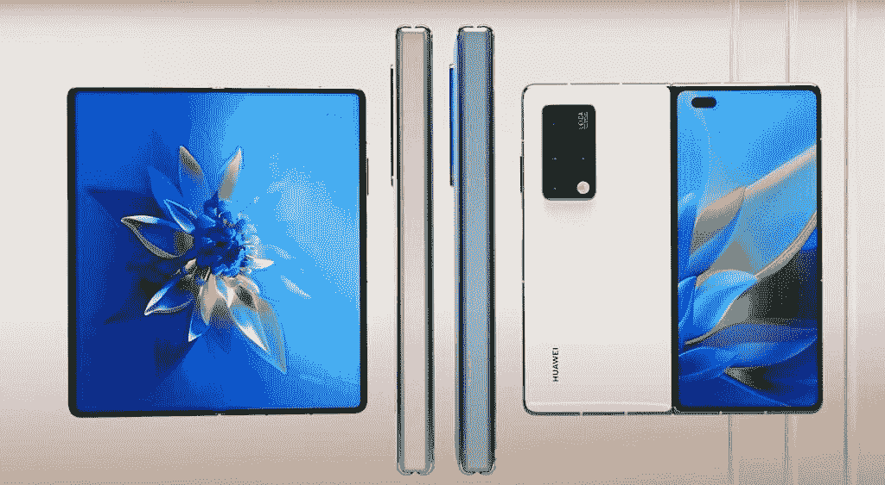
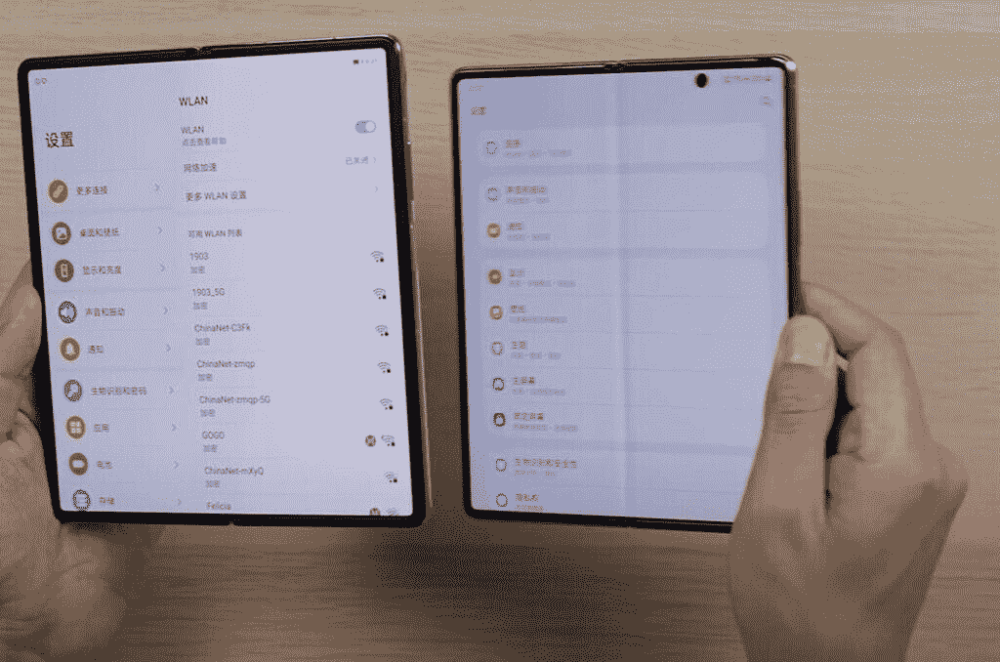
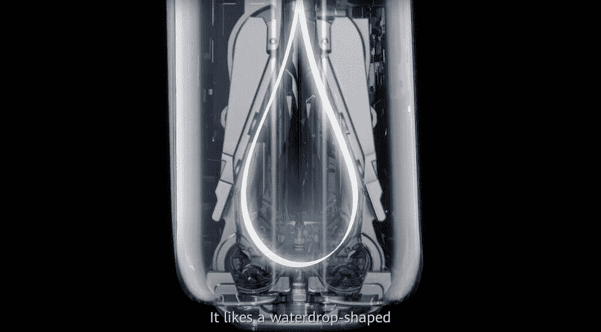
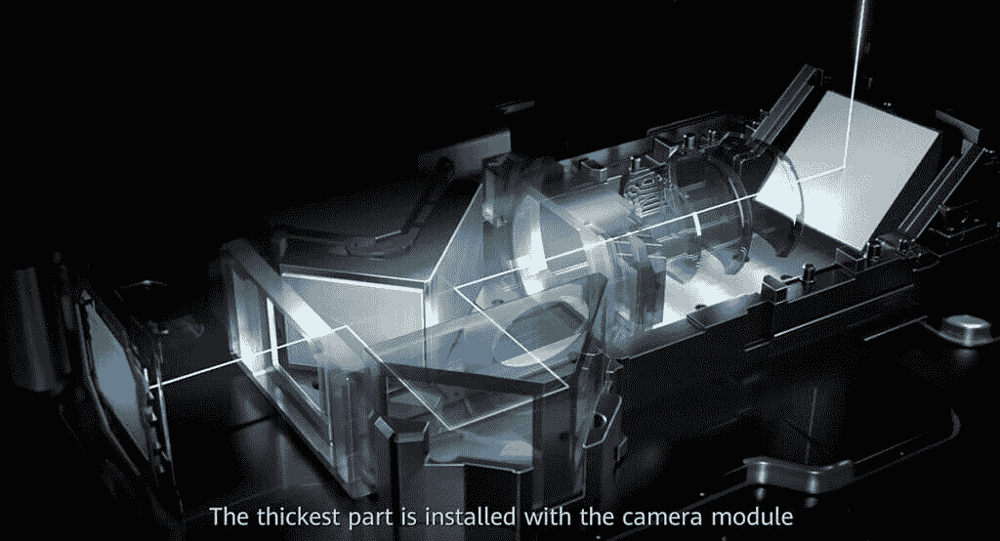
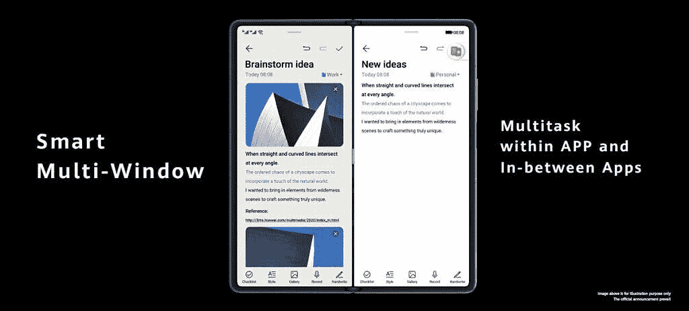

# 仔细看看华为 Mate X2 的独特之处

> 原文：<https://www.xda-developers.com/a-closer-look-at-what-makes-huawei-mate-x2-unique/>

新产品类别中的前沿消费产品通常需要一两年才能找到立足点，可折叠智能手机似乎就是这种情况。华为的第三次尝试是 [Mate X2](https://consumer.huawei.com/en/community/details/topicId_149122/?utm_source=xda&utm_medium=content&utm_campaign=matex2) ，这是迄今为止最精致、最令人印象深刻的可折叠智能手机硬件，不仅改进了华为以前的可折叠手机，还超越了三星 Galaxy Z Fold 2。在这篇文章中，让我们来看看是什么让华为 Mate X2 脱颖而出。

 <picture></picture> 

Official product renders of the Huawei Mate X2\. Photo: Huawei

**没有折痕的大型不间断折叠显示屏**

华为的 Mate X2 既可以用作 6.45 英寸显示屏的普通智能手机，也可以用作 8 英寸的平板电脑——后一种屏幕是革命性的，因为它没有像三星 Galaxy Z Fold 2 等其他可折叠手机那样明显的褶皱。

这在一定程度上要归功于多维铰链设计历时五年的发展。

 <picture></picture> 

A screenshot showing the difference in crease between the Huawei Mate X2 (left) and the Samsung Galaxy Z Fold 2 from a video by China-based reviewer Vincent Zhong.

它是这样工作的:多维锁定机制在设备折叠时创建了一个水滴状的空腔，这意味着屏幕不会像 Galaxy Z Fold 2 的铰链那样弯曲成苛刻的角度。

 <picture></picture> 

A render of the Mate X2's hinge. Photo: Huawei

此外，当 Mate X2 折叠时，它完全是平的，不像三星的可折叠手机。这得益于最先进的建筑和结构设计。

Mate X2 采用锥形设计，巧妙地将重心转移到最厚的一侧，这也是你握手机的地方。

**可折叠手机不再需要在摄影体验上妥协**

在华为 Mate X2 之前，可折叠智能手机不得不在相机性能上做出妥协。无论是最初的华为 Mate X，后续的 Mate XS，还是三星的任何可折叠产品，包括 Z Fold 2，都缺乏当时平板电脑所使用的顶级相机系统。

这不再是了:华为 Mate X2 配备了 50MP 主摄像头，16MP 超广角摄像头(华为称之为电影摄像头)，12MP 3x 倍光学变焦镜头，以及 8MP 潜望镜变焦摄像头，可提供 10 倍光学变焦。这实际上与华为 Mate 40 Pro+中使用的相机系统相同，华为 Mate 40 Pro+是该公司当前的 apex slab 智能手机产品。

但关于 Mate X2 的相机系统，最令人印象深刻的是，华为设法将一个潜望镜变焦镜头(使用更复杂、更大、更厚的传感器)塞进一个可折叠设备中，这在以前被认为是不可能的。

 <picture></picture> 

A render of the Periscope camera design that Huawei manage to fit inside a foldable device. Photo: Huawei

华为在不牺牲设备厚度的情况下成功做到了这一点。华为 Mate X2 展开后最薄处为 4.4 毫米。折叠后，其厚度从最薄处的 13.6 毫米到 14.7 毫米不等——仍然比 Z Fold 2 的 16.8 毫米薄。

**稍后升级到鸿蒙系统**

华为 Mate X2 开箱即用，运行开源版本的安卓系统。然而，从 4 月份开始，用户将可以选择将手机升级到华为的专有软件鸿蒙系统，该公司承诺将可折叠手机的体验提升到一个新的水平。华为 Mate X2 将是首批获得这一改变游戏规则的升级的华为设备之一。鸿蒙系统将在 Mate X2 和华为的多样化消费产品系列之间实现无缝连接，包括华为 FreeBuds 4i。

**迄今为止寿命最长的 TWS 耳塞**

与华为 Mate X2 一同发布的还有 FreeBuds 4i，这是华为最新的入耳式真无线立体声耳塞。华为产品一直比其他产品提供更长的电池寿命，FreeBuds 4i 也不例外，一次充电可以连续播放 10 小时的音乐。在便携包中充电 10 分钟可延长电池寿命 4 小时。

这款小巧的耳塞还配有主动降噪功能、直观的触摸控制以及与智能设备的无缝配对。

**针对大屏幕使用优化的用户界面**

有了平板电脑大小的屏幕，你会想用你的设备做更多的事情，华为优化了它的用户界面，以充分利用增加的屏幕面积。用户只需使用“多窗口”点击几下，就可以进入分屏多任务处理，这是 Mate X2 软件内置的一种直观的快捷手势。在原生华为应用和选择的第三方应用之间拖放媒体文件工作。

用户还可以在浮动窗口中打开几乎任何应用程序，该窗口可以调整大小或放置在屏幕上的任何位置。“App Multiplier”，顾名思义，打开同一个 App 的多个实例。

 <picture></picture> 

Photo: Huawei

像调整大小和拆分原生键盘这样的小改动应该会让平板电脑体验更加愉快。

**最先进的可折叠手机**

Mate X2 延续了华为在移动领域取得硬件突破的趋势。随着可折叠市场的成熟和可折叠手机成为主流，华为将继续在这一领域取得更多突破。[了解更多关于队友 X2](https://consumer.huawei.com/en/community/details/topicId_149122/?utm_source=xda&utm_medium=content&utm_campaign=matex2) ！

###### *本文由华为赞助并撰写。我们的赞助商帮助我们支付与运行 XDA 相关的许多费用，包括服务器成本、全职开发人员、新闻撰稿人等等。虽然您可能会在门户内容旁边看到赞助内容(这些内容将始终被标记为赞助内容),但门户团队对这些帖子不承担任何责任。赞助内容、广告和 XDA 仓库完全由一个独立的团队管理。XDA 绝不会通过接受金钱来赞扬一家公司，或以任何方式改变我们的观点或看法，从而损害其新闻诚信。我们的意见不能被收买。*