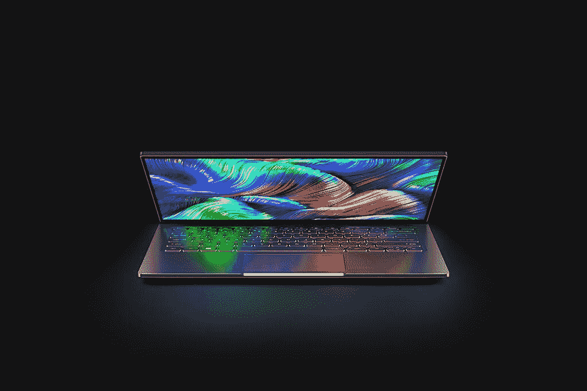
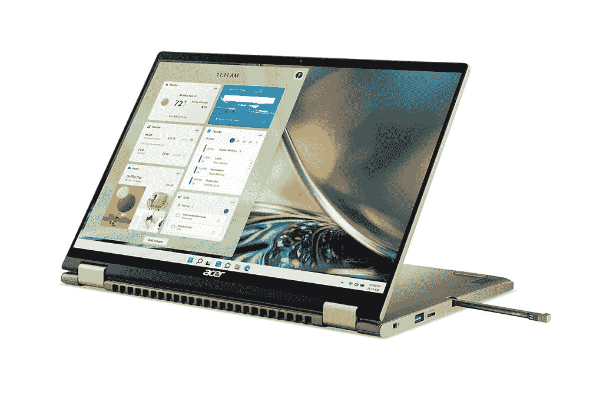
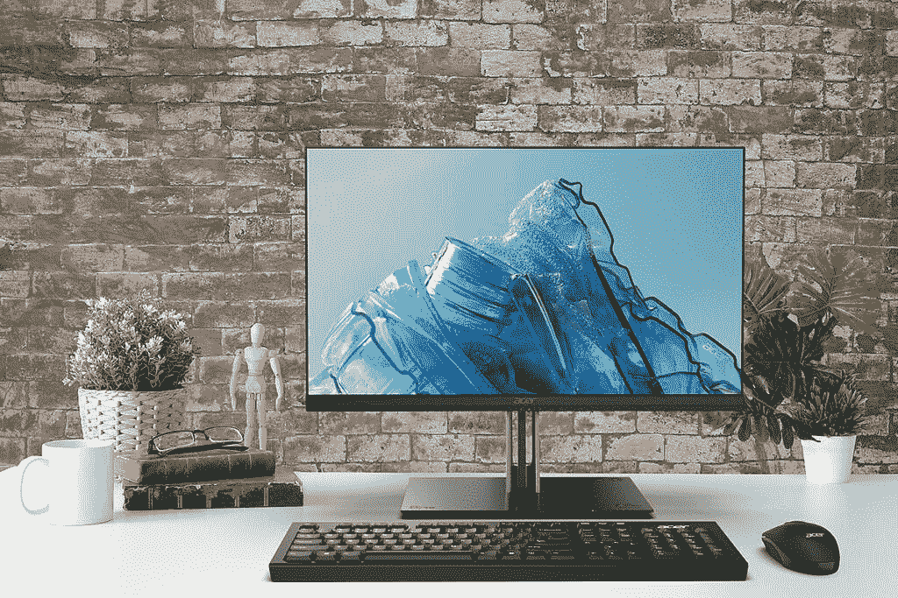

# 宏碁推出了功能强大的新 Swift 3 有机发光二极管笔记本电脑

> 原文：<https://www.xda-developers.com/acer-has-a-powerful-new-swift-3-oled-laptop/>

今天是 next@acer，所以新闻稿是从 acer 推出的。该公司今天宣布了一系列产品，包括 Swift 3 有机发光二极管、Spin 3 和 Spin 5 等消费者笔记本电脑，以及 Vero 系列中更环保的笔记本电脑。

## 宏基 Swift 3 有机发光二极管

首先是 Swift 3 有机发光二极管，这是一款 14 英寸的笔记本电脑，采用英特尔的第 12 代 H 系列处理器。这意味着它实际上拥有 45 瓦 TDP 的强大 CPU 能力，而笔记本电脑本身仍然只有 17.9 毫米薄，重量为 1.4 千克。

 <picture></picture> 

Acer Swift 3 OLED

屏幕为 2.8K 有机发光二极管，宏碁承诺屏幕与机身的比例为 92%。它支持 100% DCI-P3 色域，这是你可以从像这样的有机发光二极管笔记本电脑中期待的。

它还配备了一个 FHD 网络摄像头，并具有一些功能，如宏碁的时域降噪功能，可在弱光下提供更好的视频质量，以及人工智能降噪功能，可提高麦克风质量。宏碁 Swift 3 有机发光二极管将于 7 月份在美国上市，起价 899.99 美元。

## 宏碁 Spin 5 和 Spin 3

除了雨燕，还有一些新的 Spin 5 和 Spin 3 敞篷车。Spin 5 被提升到 14 英寸 16:10 的显示屏，分辨率为 2，560x1，600，屏幕与机身的比例为 88%。它配备了高达 16GB 的 LPDDR5 内存和高达 1TB 的 PCIe 第四代固态硬盘存储。

 <picture></picture> 

Acer Spin 5

宏碁还表示，Swift 5 有一个 TwinAir 冷却系统，以及双 D6 铜热管，增加了更好的散热，从而带来更好的性能。Spin 5 将于 7 月在美国上市，起价为 1，349.99 美元。

 <picture></picture> 

Acer Spin 3

宏碁 Spin 3 更加入门级，仍然配备 16:9 FHD 显示屏。它升级到了英特尔第 12 代处理器，并且具有快速充电功能，可以在 30 分钟内使用 4 小时。Spin 3 将于 8 月在美国上市，起价为 849.99 美元。

## Acer Vero

Vero 是宏碁的一个相对较新的品牌，它代表了一种更环保的产品。这些设备旨在更具可持续性，包括新的 Aspire Vero、Veriton Vero 一体机等。

 <picture></picture> 

Acer Aspire Vero

对于 Aspire Vero，它有 14 英寸和 15 英寸两种尺寸，配有全高清 16:9 显示屏。它们都有鹅卵石灰色，14 英寸的还有马里亚纳蓝，15 英寸的有星空黑。

至于规格，它们配备了 Inel 的第 12 代处理器、Thunderbolt 4 等。您还可以获得全高清摄像头，有助于满足英特尔的 Evo 规范。

更重要的是，机箱使用了 30%的消费后回收塑料，在制造时节省了 21%的碳排放。屏幕边框也使用 30%的 PCR 塑料，而键帽使用 50%的 PCR 塑料。没有使用油漆，它的设计便于维修，易于拆卸的内存和固态硬盘。它配有 100%工业回收塑料笔记本电脑套，包装中的屏幕和按键之间是 100% PIR 塑料板。

宏碁 Aspire Vero 将于 9 月份在美国上市，两款机型的起价都是 749.99 美元。

 <picture></picture> 

Acer Veriton Vero

宏基 Veriton Vero 是一款全新的多功能一体机。它由 30%的 PCR 材料制成，宏碁表示，它附带的键盘和鼠标也是由 PCR 材料制成的。包装也是 100%可回收的。

规格方面，它最高配有第 12 代酷睿 i9、GeForce MX550 GPUs、64GB DDR4 和 Wi-Fi 6E。Veriton Vero 将于 10 月份在美国上市，起价 799 美元。

还有一些其他 Vero 设备也即将推出，它们都同样注重使用 PCR 材料和可回收包装。Vero 键盘和鼠标将于 11 月上市，售价为 79.99 美元。还有几款显示器，Vero CB273 和 B247Y G，将于第三季度上市，售价分别为 349.99 美元和 199.99 美元。最后，Vero PD2325W 投影仪的对比度为 2，000，000:1，流明为 2，200，分辨率为 1，280x800，将于第三季度上市，售价为 559 美元。