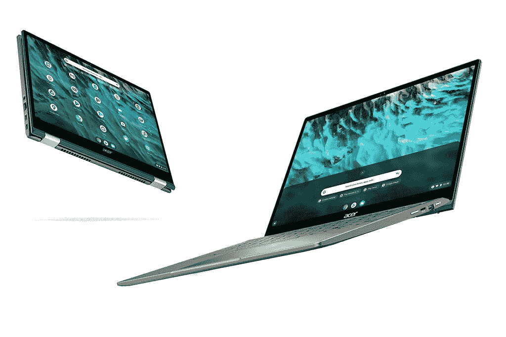

# 宏碁 Chromebook 系列推出四款新机型

> 原文：<https://www.xda-developers.com/acer-launches-new-chromebook-models-2021/>

在 2021 年的新系列产品中，宏碁今天宣布了四款新的 Chromebooks，包括世界上第一款 17 英寸的外形。该公司还宣布了其广受欢迎的 Chromebook Spin 713 的更新，这是一个强烈推荐的高级 Chromebook 选项。宏碁还宣布了两款新的 14 英寸机型，其中一款采用联发科芯片组。

## 宏碁 Chromebook 317

宏碁推出了世界上第一款 17 英寸的 Chromebook。该公司表示，它为用户提供“享受流媒体内容和完成更多工作所需的所有工作空间。”17.3 英寸的显示屏具有全高清分辨率，带有防眩光涂层和窄边框，并且可以选择触摸屏。这款笔记本电脑还配有一个全尺寸键盘，如果你喜欢的话，还有一个数字小键盘和两个朝上的扬声器。

据说这款笔记本电脑非常适合学生等，因为它采用了最新的英特尔赛扬处理器以及英特尔 Wi-Fi 6(Gig+)和长达 10 小时的电池续航时间。Chromebook 317 上的 I/O 选项包括两个 USB 3.2 Type-C 端口、两个标准 USB Type-A 端口、一个耳机组合插孔和一个 microSD 卡插槽。

## 宏碁 Chromebook Spin 713

## 

屡获殊荣的 Chromebook Spin 713 已经更新为最新的[第 11 代英特尔酷睿处理器](https://www.xda-developers.com/intel-tiger-lake-11th-gen-core-i3-i5-i7-xe/)，据说是世界上第一款[英特尔 Evo](https://www.google.com/url?sa=t&rct=j&q=&esrc=s&source=web&cd=&cad=rja&uact=8&ved=2ahUKEwiQhfvGmOnwAhXJ9nMBHYQyCMgQFjAAegQIAxAD&url=https%3A%2F%2Fwww.intel.in%2Fcontent%2Fwww%2Fin%2Fen%2Fproducts%2Fdocs%2Fevo.html&usg=AOvVaw3lU1WRi1-dU8hoiOsSlUQq) 平台验证的 Chromebook。它采用高端设计，配有铝制机箱、军用级(美国 MIL-STD 810H)耐用性和可转换外形。它还带来了 Thunderbolt 4 连接，用于数据传输、电力传输以及与外部显示器共享视频和音频。13.5 英寸显示屏现在更高，分辨率为 2256x1504，而可转换设计允许用户在各种外形规格之间进行选择，包括笔记本电脑、平板电脑、帐篷或显示模式。据称，新的 Spin 713 的电池续航时间为 10 小时，由于快速充电，充电 30 分钟可续航长达 4 小时。宏碁将向商业和企业客户提供 Spin 713。

## 宏碁 Chromebook 514 和 314

宏碁还推出了两款新的 14 英寸 chrome book——chrome book 514 和 Chromebook 314。514 是两个最高配备第 11 代英特尔酷睿处理器的选项中功能更强大的一个。它配备了一些有用的功能，如快速从睡眠中唤醒和快速充电电池，据说电池可持续 10 小时。Chromebook 514 还配有带 Thunderbolt 4 的双 USB Type-C 端口、背光键盘和可选的嵌入式指纹读取器。它采用坚固的金属顶盖设计，并且经过验证，机器具有 MIL-STD 810H 军用级耐用性。其他值得注意的功能包括英特尔 Wi-Fi 6(Gig+)和大猩猩玻璃覆盖的触控板，而企业版笔记本电脑包括 Chrome Enterprise 的业务功能，以提供速度快、内置安全、快速部署和降低总拥有成本的设备。

Acer Chromebook 314 是该公司宣布的最实惠的 Chromebook，专为寻求可靠机器来执行移动任务的学生而设计。该机由联发科 MT8183 八核处理器驱动，而电池据说可以提供长达 15 小时的正常运行时间。14 英寸 IPS 显示屏配有全高清(1920x1080)分辨率，周围是 7.3 毫米(0.29 英寸)的窄边框，并且可以通过全功能 USB-C 端口实现现代连接。

## 价格和可用性

新款宏碁 Chromebook 317 将于 6 月上市，起价为 379.99 美元，而 Chromebook Spin 713 将于同月上市，起价为 699.99 美元。宏碁 Chromebook Spin 514 将于 10 月晚些时候上市，起价为 599.99 美元，Chromebook 314 将于 7 月上市，起价为 269.99 美元。