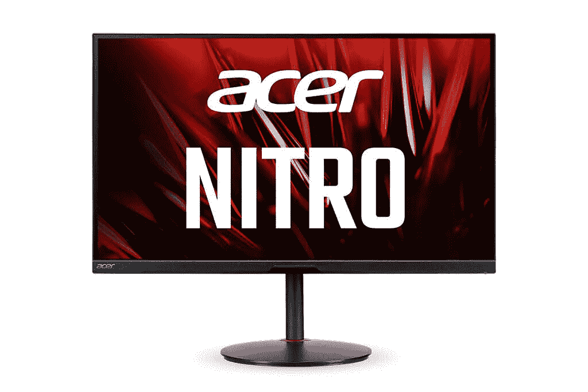
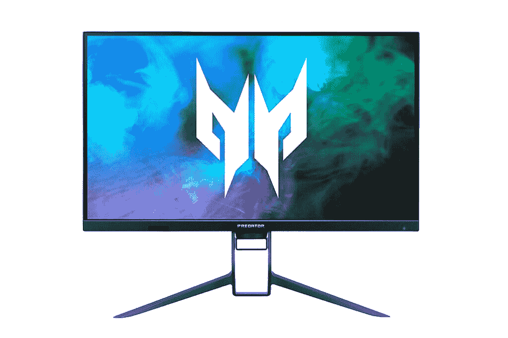
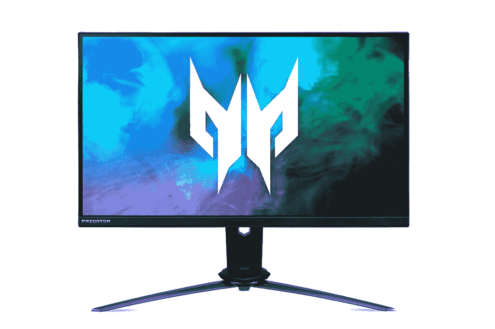

# 宏碁宣布推出 Nitro 和 Predator 系列新游戏显示器

> 原文：<https://www.xda-developers.com/acer-nitro-xv282k-kv-4k-uhd-144hz-hdr400-hdmi-2-1-monitor-launch-ces-2021/>

宏碁已经宣布在其游戏品牌 Nitro 和 Predator 下推出三款新显示器，其令人印象深刻的规格集使它们成为最新一代的游戏机。作为该公司 CES 2021 发布会的一部分，宏碁还发布了全新的 AMD 处理器的 Acer Spin 514 Chromebook。

## Acer Nitro XV282K KV

回到显示器，新系列的亮点当然是 Nitro XV282K。这是该公司第一款配备 HDMI 2.1 的 4K UHD (3840 x 2160)显示器。这使得显示器能够以高达 120Hz 的刷新率和可变刷新率(VRR)提供未压缩的 4K 视频。从本质上说，这不仅对使用 NVIDIA 或 AMD 最新 GPU 的 PC 用户来说很棒，而且对拥有 [Xbox 系列 X/S](https://www.xda-developers.com/xbox-series-x-restocks/) 或[索尼 PlayStation 5](https://www.xda-developers.com/playstation-5-restocks/) 的下一代游戏机用户来说也很棒，只要你使用兼容的 HDMI 2.1 电缆，就可以在 4K 以 120fps 的速度玩游戏。

 <picture></picture> 

Acer Nitro XV282K KV

该显示器配有 HDR 400 IPS 面板，宏碁声称它覆盖了 90%的 DCI-P3 宽色域，对比度高达 100，000，000:1。其他功能包括 AMD FreeSync Premium、tüV Rheinland eye safe 认证和宏碁的 Agile-spread IPS 技术，以宽视角提供清晰的图像。最后，这款显示器还配备了宏碁 VisionCare 3.0，据说它集成了多种技术，包括 LightSense、ColorSense、ProxiSense 和 BluelightShield Pro，以帮助减轻眼睛疲劳。

该显示器还具有一组可靠的端口，包括两个 HDMI 2.1 端口(当然)，一个 DisplayPort，一个带 65W PD 充电的 USB Type-C 端口，四个 USB Type-A 3.0 端口和一个 USB Type-B 端口。

### 定价和可用性

Nitro XV282K 将于 5 月上市，起价 899.99 美元。

* * *

## Acer Predator XB273U NX 和 Acer Predator XB323QK NV

与 Nitro 系列相比，宏碁的 Predator 系列更高端，但出于某种原因，该公司选择将 HDMI 2.1 仅引入更实惠的阵容。话说回来，掠夺者 XB273U NX 和 XB323QK NV 在纸面上也是相当可观的。

 <picture></picture> 

Acer Predator XB323QK NV

Predator XB323QK NV 是一个 31.5 英寸的选项，具有 4K UHD (3840 x 2160)分辨率和 144Hz 刷新率。宏碁声称，该面板具有 90%的 DCI-P3 宽色域，具有宏碁的 Agile spread IPS 和 VESA DisplayHDR 400 认证，因此非常生动。它也是 G-Sync 兼容的，具有与 Nitro XV282K 类似的一组端口(不包括 HDMI 2.1)。该公司将于 5 月销售这款显示器，价格为 1199.99 美元。

 <picture></picture> 

Acer Predator XB273U NX

最后，Predator XB273U NX 专为寻求超快刷新率显示器的游戏玩家而设计。这款 27 英寸显示器配有 WQHD (2560 x 1440) IPS 面板，刷新率为 240Hz，可超频至 275Hz，响应时间为 0.5 毫秒(G 到 G)，可带来身临其境的流畅体验。它配备了标准的 HDR400，据说可以覆盖 95%的 DCI-P3 光谱，以获得鲜艳的颜色和更深的黑色。除了兼容 G-SYNC 之外，该显示器还支持 NVIDIA 新发布的 Reflex Latency Analyzer，这是一款系统延迟测量工具，可以测量并优化从单击鼠标按钮到屏幕上像素发生变化所需的时间。这款机型也将于 5 月开始购买，起价 1099.99 美元。