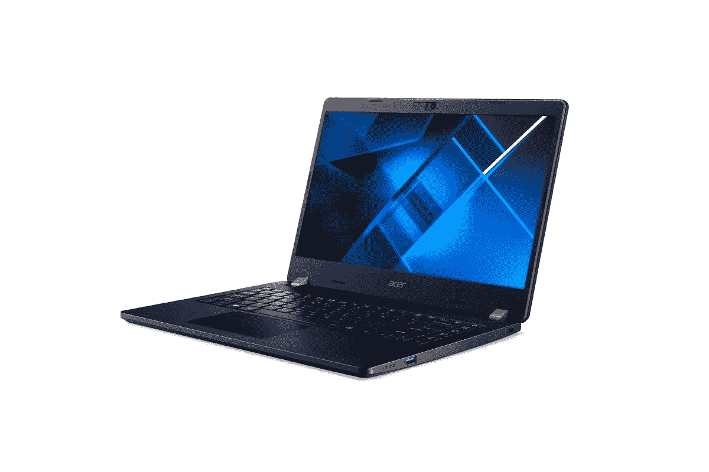

# 宏碁新推出的 TravelMate P2 笔记本电脑采用 AMD 锐龙 PRO 处理器

> 原文：<https://www.xda-developers.com/acer-travelmate-p2-amd-ryzen-pro/>

宏碁宣布推出两款新的 Travelmate P2 系列笔记本电脑。新的笔记本电脑有 14 英寸和 15.6 英寸两种尺寸，它们采用 AMD 最新的锐龙 PRO 移动处理器。与英特尔的博锐系列相似，这些 CPU 具有额外的安全性和远程管理功能，是企业的理想选择。他们也运行 Windows 10 Pro，并将在今年晚些时候支持对 Windows 11 的更新。

14 英寸的型号是宏碁 Travelmate P214-41-G2，它配备了 AMD 锐龙 5 PRO 5650U 处理器，具有 6 个核心和 12 个线程。与此同时，15 英寸的版本是 TravelMate P215-41-G2，它最高可以配备 AMD 锐龙 7 Pro 5850U，这是一种 8 核 16 线程 CPU。

除了处理器和屏幕尺寸，这两款笔记本电脑几乎完全相同。它们都有 8GB 的内存，256GB 的固态硬盘存储，以及你想要的所有端口。有三个 USB Type-A 端口，一个 USB Type-C，HDMI，VGA，以太网，一个全尺寸 SD 读卡器和一个耳机插孔，所以你可以连接所有的外围设备而无需加密狗。

除了尺寸之外，这两款笔记本电脑的显示屏也很相似。宏碁 TravelMate P2 采用全高清 IPS 面板，具有 170 度的视野，侧面有窄边框，尽管顶部和底部的边框仍然有些大。顶部挡板容纳了一个 720o 摄像头和一个用于 Windows Hello 的红外摄像头，以及两个用于语音通话的麦克风。网络摄像头也有物理快门，以防你担心隐私。如果你喜欢，还有一个可选的指纹识别器。

新的 15 英寸宏碁 TravelMate P2 已经可以从宏碁购买，其起价为 749.99 美元，采用锐龙 5 处理器。你可以花 849.99 美元升级到锐龙 7 型号。这两款机型似乎都包括指纹识别器，尽管宏碁表示这是可选的。14 英寸型号将于 2022 年 1 月上市。

 <picture></picture> 

Acer TravelMate P2

##### 宏碁 TravelMate P2

宏基 TravelMate P2 是一款商务笔记本电脑，采用 AMD 锐龙 PRO 处理器和 IPS 显示屏，视野开阔。它们还有大量端口，因此您可以轻松连接外围设备