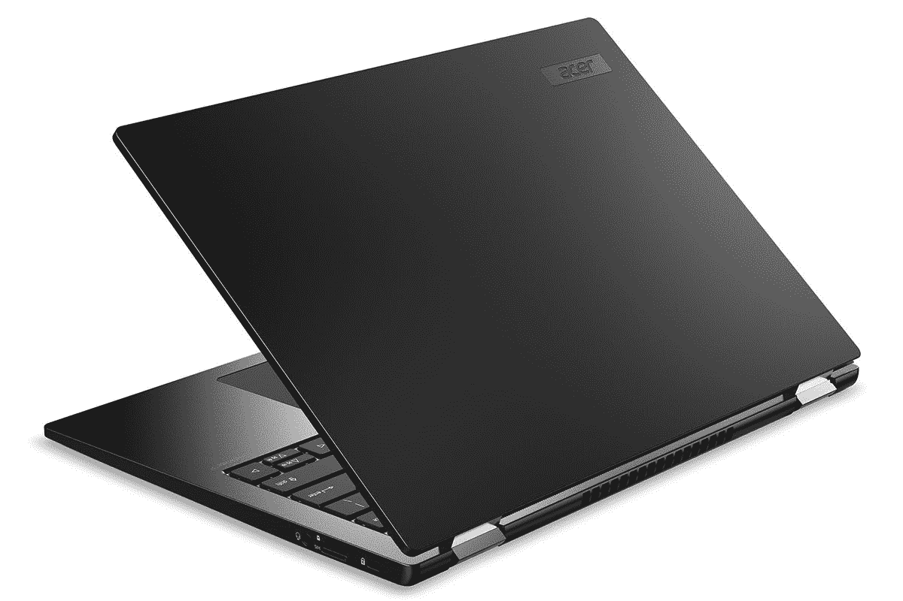

# 宏碁推出新的超轻型 TravelMate P6 商务笔记本电脑

> 原文：<https://www.xda-developers.com/acer-travelmate-p6-business-laptops/>

宏碁今天举行了下一次@acer 大会。这是一年一度的活动，该公司在这里更新其所有产品，从[游戏笔记本电脑](https://www.xda-developers.com/acer-predator-triton-500-se-helios-500-11th-gen-intel-launch/)到[创造者笔记本电脑](https://www.xda-developers.com/acer-conceptd-notebooks-creators-3d-display/)。它甚至有一款名为 Aspire Vero 的[新型可持续笔记本电脑。普通消费者也不会被排除在外，新款 Swift X](https://www.xda-developers.com/acer-aspire-vero-launch/) 仅重 3 磅多一点，配有 RTX 图形。最后，我们推出了 Acer TravelMate P6 品牌的新型商用笔记本电脑。

“新的 Acer TravelMate Spin P6 是花大量时间开会的专业人士的理想选择，具有增强笔记和绘图、展示

Acer Inc .笔记本电脑、IT 产品业务总经理 James Lin 表示:“他们还会喜欢能够连续工作多个工作日而无需充电，以及耐用、轻薄的机箱，这是商务旅行的理想选择。"

这在很大程度上是一个规格提升，因为其中一个关键的新特性是英特尔的第 11 代“老虎湖”博锐处理器。这也意味着它们还配备了更强大的 Iris Xe 显卡。除此之外，您还可以获得高达 32GB 的 DDR4x 内存和 1TB 的 PCIe Gen3 固态硬盘。

它通过了 MIL-STD-810H 测试，因此可能会受到一些碰撞和冲击。尽管如此，它仍然是超级的东西和轻。它们的厚度都是 16.8 毫米，宏碁 TravelMate P6 和 TravelMate Spin P6 的重量分别为 2.2 磅和 2.4 磅。这要归功于镁铝合金。它不仅比纯铝轻得多，而且强度也更高。

屏幕为 14 英寸，长宽比为 16:10，分辨率为 FHD+。它支持 100% sRGB 色域和 170 度视角，所以这应该是一个相当不错的屏幕。它还有一个四麦克风阵列，可以在 6.5 英尺外听到你的声音。

在连接方面，它配备了 Thunderbolt 4，这是老虎湖处理器的一项额外功能。另一个好处是支持 Wi-Fi 6。宏碁还推出了新的 Acer Connect M5 5G 移动 WiFi 路由器，这几乎是一个 5G 热点。遗憾的是，该公司仍然没有在其商用笔记本电脑中内置蜂窝连接。

宏碁 TravelMate P6 将于 12 月在北美上市，起价为 1，299.99 美元，EMEA 将于 9 月在€上市，起价为 999 美元，TravelMate Spin P6 将于 12 月在北美上市，起价为 1，399 美元，EMEA 将于 10 月在€上市，起价为 1，199 美元。

 <picture></picture> 

Acer TravelMate P6

##### 宏碁 TravelMate P6

宏碁的商用笔记本电脑轻薄，采用镁铝合金，配有英特尔博锐处理器