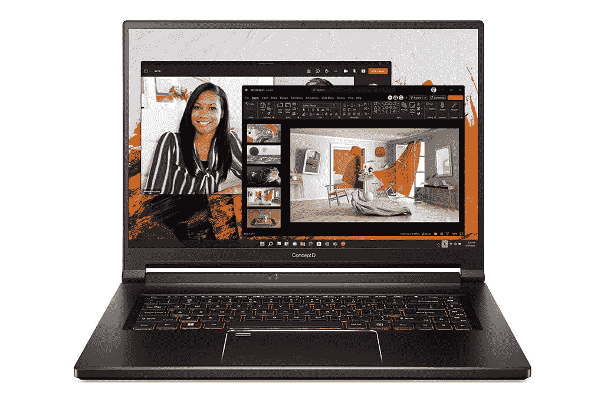
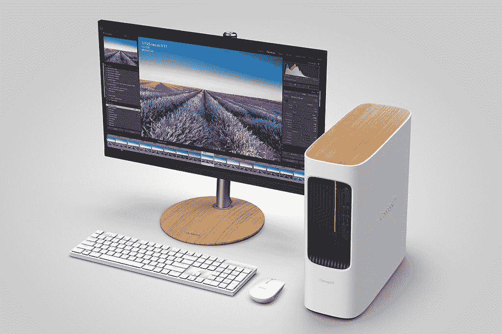

# 宏碁的新概念 creator 笔记本电脑有有机发光二极管显示屏

> 原文：<https://www.xda-developers.com/acers-new-conceptd-creator-laptops-have-oled-displays/>

今天，宏碁正在举办一年一度的 next@acer 活动，介绍其整个产品组合的新产品。这包括 ConceptD，它为[创造者](https://www.xda-developers.com/best-creator-laptops/)的阵容。具体来说，该公司宣布了新的概念 D 5、概念 D 5 Pro、概念 D 500 和概念 D 100。

## 宏碁 ConceptD 5 和 ConceptD 5 Pro

在今天的市场上，ConceptD 5 系列正在转向 16 英寸 16:10 显示器，这或许并不令人惊讶。毕竟，我们已经看到越来越多的 16:10 笔记本电脑。更酷的是，你现在可以用 3840 x2，400 400 尼特的有机发光二极管显示器来获得它，所以你会得到更黑的黑色和更鲜艳的颜色。

 <picture></picture> 

Acer ConceptD 5

即使是有机发光二极管显示器，你仍然可以打赌宏碁致力于色彩的准确性。该公司仍然承诺 PANTONE 匹配系统颜色和 Delta E<2 校准。

它还配备了最大的电池，99.98 瓦时。这是任何笔记本电脑中最大的电池，因为这是你可以带上飞机的最大电池。自然，它配备了英特尔酷睿 i7-12700H，以及带有工作室驱动程序的 NVIDIA GeForce RTX 3070 Ti，或者在 ConceptD 5 Pro 上，你可以获得 RTX A5500。

它有一个全尺寸的 SD 读卡器，一个 HDMI 2.1 端口，Thunderbolt 4 和其他你希望的现代端口。当然，1.55 毫米的键盘有你期待的 ConceptD 的琥珀色背光。

ConceptD 5 将于 8 月在北美上市，起价为 2，499.99 美元，6 月在 EMEA 上市，€起价为 2，399 美元。ConceptD 5 Pro 将于 9 月在 EMEA 上市，起价为€2599 英镑。

## 宏碁 ConceptD 500 和 ConceptD 100

宏碁 ConceptD 500 是一款 20L 的台式机，而 ConceptD 100 则是为了更紧凑。前者进行了相当大的重新设计，从顶部移除了木质面板，并代之以木质装饰。这两款设备都配备了第 12 代英特尔处理器，尽管 ConceptD 500 升至酷睿 i9，而 ConceptD 100 升至酷睿 i7。

 <picture></picture> 

Acer ConceptD 100

对于图形，ConceptD 500 配备了高达英伟达 RTX A4000，而 ConceptD 100 可以配备 T400 或 T1000。它们都是将尽可能多的功能放在一个时尚的包装中，因此 ConceptD 500 自然更强大。

宏碁 ConceptD 500 将于 9 月在 EMEA 上市，起价为€2，599 英镑，ConceptD 100 将于 9 月在 EMEA 上市，起价为€999 英镑。