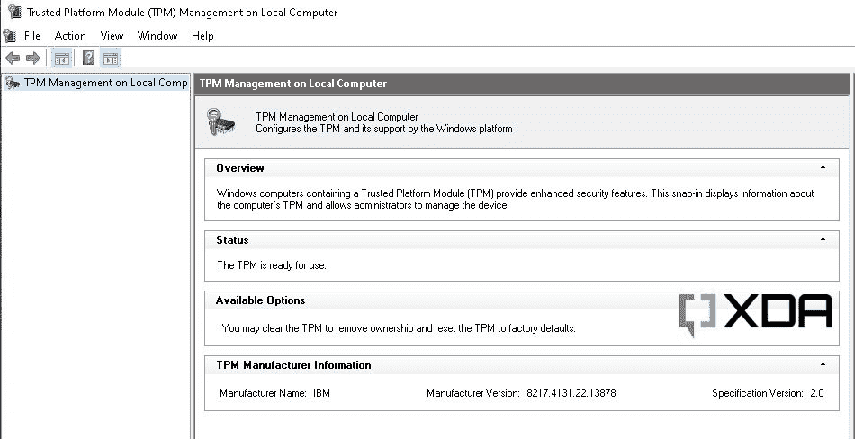

# 如何在 Windows 11 的虚拟机上添加 TPM:VMware、VirtualBox、Parallels Desktop 和 Hyper-V

> 原文：<https://www.xda-developers.com/add-tpm-windows-11-vm-vmware-virtualbox-parallels-desktop-hyperv/>

Windows 11 是一次大规模的更新，带来了一系列的变化——从大规模的视觉革新到增强，如微软团队集成和对运行安卓应用的[的支持。谈到新操作系统的](https://www.xda-developers.com/how-to-run-android-apps-on-any-windows-11-pc/)[系统需求](https://www.xda-developers.com/windows-11-minimum-requirements/)，微软也做了一些重大改变。受到广泛批评的需求之一是对可信平台模块(TPM) 2.0 芯片的需求。虽然如果你在虚拟机中安装 Windows 11 的当前稳定渠道版本( [Build 22000.x](https://www.xda-developers.com/windows-11-update-tracker/) )的话，这一要求可以免除，但微软已经[开始在较新的开发渠道版本上实施](https://www.xda-developers.com/windows-11-vms-will-likely-soon-require-tpm-2-0/)它。

微软将 TPM 2.0 作为 Windows 11 的一个要求的原因是因为有必要提供硬件级保护来抵御网络安全攻击。请记住，自 2016 年年中以来，几乎每台 PC 都在其固件中内置了 TPM 您可能只需要摆弄 BIOS 设置来启用它。不过，在虚拟机(VM)上的场景略有不同，因为虚拟机管理程序供应商还没有提出 TPM 透传的通用标准。此外，TPM 本身的虚拟化过程因虚拟机管理程序的不同而有很大差异。

在本教程中，我们将向您展示如何配置一些最流行的托管虚拟机管理程序，以便为 Windows 11 虚拟机添加虚拟化 TPM 设备。

* * *

**浏览这篇文章:**

## 什么是托管虚拟机管理程序

托管的虚拟机管理程序需要底层操作系统才能工作。它们可以像普通的计算机程序一样安装。客户操作系统作为主机上的一个进程运行。由于这种设计，您不需要仅仅为了虚拟化而使用专门的硬件，任何人都可以在自己的家用电脑上使用托管的虚拟机管理程序。

### 超 V

Microsoft [Hyper-V](https://docs.microsoft.com/en-us/virtualization/hyper-v-on-windows/about/) 最初是作为一个本机虚拟机管理程序创建的，现在作为一个可选功能包含在 Windows 的客户端版本(Pro 和更高版本)中。稍微调整一下，也可以将[安装到 Windows](https://www.xda-developers.com/how-to-install-hyper-v-windows-11-home/) 的 Home SKUs 上。

在您的主机 Windows 操作系统上启用 Hyper-V 功能后，您可以通过以下步骤在 Windows 11 虚拟机上轻松添加虚拟化的 TPM 2.0 设备:

1.  打开 Hyper-V 管理器。
2.  从左窗格中单击主机名称。
3.  如果您想为 Windows 11 生成一个新的虚拟机，请确保在虚拟机创建向导中选择“第 2 代”。
    *   对于现有虚拟机，从右侧窗格中选择适当的虚拟机，并在页面底部的“Summary”选项卡中确认“Generation”设置为“2”。
4.  右键点击 Windows 11 虚拟机，选择*设置*选项，点击*安全*。
5.  在“安全引导”部分，检查*启用安全引导*选项。
6.  使用“模板”下拉菜单并选择 *Microsoft Windows* 选项。
7.  在“加密支持”选项下，选中*启用可信平台模块*选项以启用虚拟化 TPM。
8.  或者，检查*加密状态和虚拟机迁移流量*选项。
9.  单击确定按钮。

如果您喜欢从命令行管理 Hyper-V 设置，那么您也可以使用`Enable-VMTPM` PowerShell cmdlet 来执行上述步骤。要了解更多信息，请查看 cmdlet 的官方文档。

* * *

### Oracle VM VirtualBox

[Oracle VM VirtualBox](https://www.virtualbox.org/) 是一款出色的开源管理程序，项目背后的开发人员[正在积极开发](https://forums.virtualbox.org/viewtopic.php?f=2&t=103946)安全引导和 TPM 2.0 等功能，以支持 Windows 11。

值得注意的是，当前的 VirtualBox 6.1 . x 系列不太可能获得这些特性，因为需要对代码库进行大量的修改。下一个主要版本，即 VirtualBox 7，应该支持它们。有开发快照可用，其中包括对 TPM 2.0 设备的软件仿真的初步支持，但您的体验可能会有所不同。

如果您已经准备好体验最新的版本，请从[本页](https://www.virtualbox.org/wiki/Testbuilds)下载最新的 Oracle VM VirtualBox 快照版本。接下来，从头开始创建一个虚拟机实例，并将目标操作系统设置为 Windows 11。虚拟机管理程序应该自动为虚拟机创建虚拟化的 TPM 设备。通过引导至 UEFI 固件并导航至*设备管理器* = > *TCG2 配置*可以看到该模块。

* * *

### Parallels 桌面

从 17.1.0 版本开始， [Parallels Desktop](https://www.anrdoezrs.net/links/100122946/type/dlg/sid/UUxdaUeUpU31695/https://www.parallels.com/products/desktop/) [默认为所有 Windows 11 虚拟机启用虚拟 TPM 芯片(vTPM)](https://www.anrdoezrs.net/links/100122946/type/dlg/sid/UUxdaUeUpU31695/https://www.parallels.com/blogs/Windows-11-TPM/)—包括新的和现有的——基于英特尔的 MAC 以及[苹果 M1 的 MAC](https://www.xda-developers.com/first-10-things-to-do-m1-mac/)。如果您有传统版本(如用于基于 Intel 的 Mac 电脑的 Parallels Desktop 15 和 16)，vTPM 芯片仅适用于专业版和商业版。Parallels Desktop 16 在装有苹果 M1 芯片的 Mac 电脑上不支持此功能。

请注意，当启用虚拟化 TPM 时，虚拟机被限制在其他 MAC 上运行。此外，如果复制或移动，它不能在另一台计算机上启动。

在 Parallels Desktop 虚拟机上启用 vPTM 的[手动流程如下:](https://kb.parallels.com/en/122702)

1.  关闭 Windows 虚拟机。
2.  打开虚拟机的配置设置。然后导航到*硬件*选项卡，点击“+”号，选择 *TPM 芯片*。然后点击*添加*按钮。
3.  启动虚拟机。如果一切顺利，Windows 实例将自动检测 TPM 芯片。

* * *

### VMware

VMware 为 Windows、Linux 和 macOS 提供了几种托管的虚拟机管理程序。您可以轻松地在所有这些平台上启用虚拟化 TPM。

#### VMware Fusion Pro 和 VMware Workstation Pro

对于 [VMware Fusion Pro](https://www.vmware.com/products/fusion.html) (macOS)和[VMware Workstation Pro](https://www.vmware.com/products/workstation-pro.html)(Windows/Linux)，您必须创建一个最低硬件版本为 14 且固件类型设置为 UEFI 的虚拟机。在尝试启用虚拟化的 TPM 之前，您还需要对虚拟机进行加密。

##### *在 VMware Workstation Pro 下加密虚拟机*

要[添加](https://docs.vmware.com/en/VMware-Fusion/12/com.vmware.fusion.using.doc/GUID-4EC58A68-BE9E-42F6-B005-4BB63AE5D85B.html)虚拟 [TPM 2.0](https://docs.vmware.com/en/VMware-Workstation-Pro/16.0/com.vmware.ws.using.doc/GUID-6E166EDC-BF27-438D-BA98-CF216A850ACE.html) 设备，请执行以下步骤:

1.  从左侧窗格(适用于 Workstation Pro)或虚拟机库(适用于 Fusion)中选择虚拟机，并打开其设置。
2.  单击“添加”(对于 Fusion，单击“添加设备”)。
3.  单击“可信平台模块”条目。如果该选项不可用，则 guest 虚拟机不支持受信任的平台模块设备。
4.  点击*完成*完成向导。

#### VMware 工作站播放器

与其“专业”兄弟不同， [VMWare Workstation Player](https://www.vmware.com/products/workstation-player.html) 不提供添加虚拟化 TPM 的选项。尽管如此，您仍然可以使用一个巧妙的调整来启用它。

早在今年 10 月，VMWare 产品经理 Michael Roy 证实，免费 VMWare Workstation Player 的用户可以通过一个未记录的标志来启用 TPM。在引擎盖下，该标志在没有密码的情况下对虚拟机进行部分加密。该调整应适用于 VMWare Workstation Player 16.2/Fusion Player 12.2 及更高版本。

以下是如何将 TPM 添加到 VMWare Workstation Player 虚拟机的方法:

1.  创建一个新的客户操作系统，但暂时不要安装任何操作系统。
2.  关闭虚拟机管理程序，并导航到存储虚拟机的文件夹。
3.  找到 VMX 文件，这是目标虚拟机的配置。
4.  用文本编辑器(如记事本)打开 VMX 文件，并在其中添加下面一行。

    ```
     managedvm.autoAddVTPM = "software" 
    ```

5.  保存更改并关闭文本编辑器。
6.  启动 VMware Workstation Player 并访问虚拟机的设置。它应该把 TPM 列为一个选项，但是你不能用应用程序的免费版本编辑它。
7.  继续正常安装 Windows 11(或任何其他操作系统)。

* * *

## 确认

配置虚拟机监控程序后，执行以下操作以检查虚拟化 TPM 是否正常工作。

1.  启动 Windows 11 虚拟机。
2.  在桌面上，按键盘上的 Windows 键打开运行提示符。
3.  键入`tpm.msc`并按回车键。
4.  您应该看到 TPM 管理控制台，它会告诉您是否有 TPM 设备，以及您有什么版本。

 <picture></picture> 

Virtualized TPM under Oracle VM VirtualBox

* * *

* * *

如您所见，在虚拟机管理程序上配置虚拟化可信平台模块 2.0 设备并不困难，但这也不是一种完全简单的方法。希望这篇教程能让你更容易理解和遵循这个过程。享受使用 Windows 11 虚拟机的乐趣！