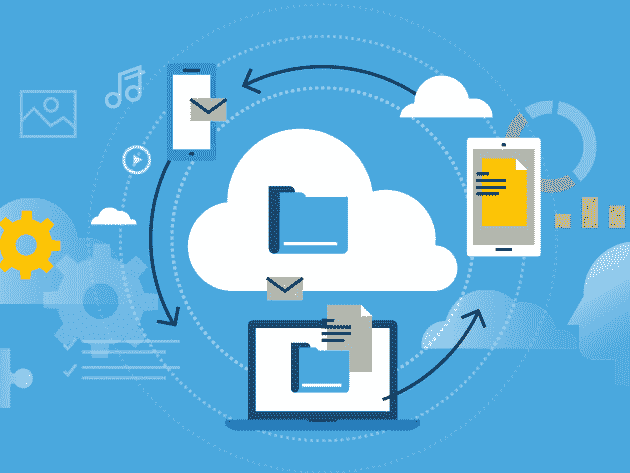
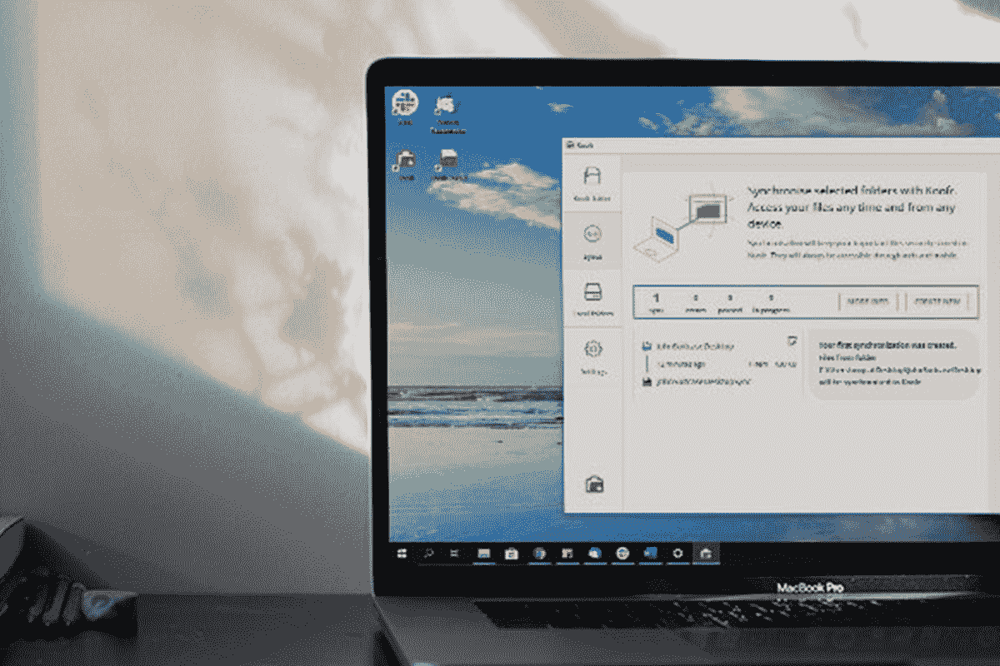

# 经济实惠的备份:您今天可以获得的 7 大云存储优惠

> 原文：<https://www.xda-developers.com/affordable-backup-7-top-deals-on-cloud-storage-you-can-grab-today/>

如果您想确保您的文件不会被意外删除或丢失，备份您的设备非常重要。这也是安装 [自定义 rom](https://www.xda-developers.com/the-most-popular-custom-roms-on-xda/)时必不可少的一步。这里有七个非常实惠的云备份解决方案，现在在 XDA 开发者仓库有很大的折扣。

## **TransferCloud Premium Lite:终身订阅**

****

这个平台其实是设计成云端的一个下载文件夹，让你随意 torrent。但是，您也可以连接多个云存储帐户(包括 Google Drive、Dropbox、Mega、OneDrive ),以最大化您的免费限额。

以 79 美元的价格获得 [终身 TransferCloud Premium Lite 套餐](https://depot.xda-developers.com/sales/transfercloud-premium-lite-lifetime-subscription?utm_source=xda-developers.com&utm_medium=referral&utm_campaign=transfercloud-premium-lite-lifetime-subscription&utm_term=scsf-470616&utm_content=a0x1P000004Z8zDQAS&scsonar=1) (注册 1000 美元)，节省了 92%。

## **Koofr 云存储:终身订阅(100GB)**

****

如果你只是需要简单的云存储，Koofr 是一个不错的选择。除了 100GB，您还可以访问其他云帐户并获得强大的安全性。这项服务还承诺不收集任何数据。

花费 29.99 美元获得一份 [Koofr 100GB 终身订阅](https://depot.xda-developers.com/sales/koofr-cloud-storage-plans-lifetime-subscription-100gb?utm_source=xda-developers.com&utm_medium=referral&utm_campaign=koofr-cloud-storage-plans-lifetime-subscription-100gb&utm_term=scsf-470556&utm_content=a0x1P000004Z8zDQAS&scsonar=1)(reg。540 美元)，节省了 94%。

## **Genie Timeline Pro 10 备份软件:终身订阅**

这款应用在 Google Play 上被评为 4.5 星，可为您的所有文件提供自动本地备份。您只需三个步骤就可以配置 Genie Timeline，该软件提供了出色的版本控制。

花费 29.99 美元获得 [精灵时间轴 Pro 10](https://depot.xda-developers.com/sales/genie-timeline-pro-10-1-pack?utm_source=xda-developers.com&utm_medium=referral&utm_campaign=genie-timeline-pro-10-1-pack&utm_term=scsf-470555&utm_content=a0x1P000004Z8zDQAS&scsonar=1)(reg。59 美元)，节省了 49%。

## **Degoo Premium Mega 备份计划:终身订阅**

****

Degoo Premium 提供 15TB 的加密存储空间，应该可以为您的所有设备提供足够的备份。TechRadar 将这项服务描述为“快速、简单的备份，重点是照片。”

以 149.99 美元的价格获得[Degoo Premium Mega Backup 计划](https://depot.xda-developers.com/sales/degoo-premium-mega-backup-lifetime-subscription-15tb?utm_source=xda-developers.com&utm_medium=referral&utm_campaign=degoo-premium-mega-backup-lifetime-subscription-15tb&utm_term=scsf-470558&utm_content=a0x1P000004Z8zDQAS&scsonar=1) (注册 4320 美元)，节省了 96%。

## **Degoo 高级备份计划:终身 10TB 云存储(2 个装)**

****

需要更多空间吗？这个捆绑包让您可以终身访问两个 10TB 的文件云保管库。Degoo 适用于桌面和移动设备，具有端到端加密功能，并且对连接设备的数量没有限制。

花费 159 美元获得 [Degoo 高级备份计划](https://depot.xda-developers.com/sales/the-degoo-premium-lifetime-backup-plan-10tb-2-pack?utm_source=xda-developers.com&utm_medium=referral&utm_campaign=the-degoo-premium-lifetime-backup-plan-10tb-2-pack&utm_term=scsf-470515&utm_content=a0x1P000004Z8zDQAS&scsonar=1) (注册 7200 美元)，节省了 97%。

## **Familio 私有备份平台:终身订阅**

****

这个平台有两个作用:对你的照片进行云备份和一种私人社交网络。Familio 允许您上传和存储全分辨率的图像，家人可以订阅安全的时事通讯来查看最新的快照。

以 39.99 美元获得一份 [Familio 终身订阅](https://depot.xda-developers.com/sales/familio-lifetime-subscription?utm_source=xda-developers.com&utm_medium=referral&utm_campaign=familio-lifetime-subscription&utm_term=scsf-470553&utm_content=a0x1P000004Z8zDQAS&scsonar=1)(reg。300 美元)，节省了 86%。

## **淀粉 1TB 云存储:终身订阅**

****

除了纯粹的云管理，该平台还利用人工智能提供全面的数字资产管理。您可以获得 1TB 的云存储，具有自动标记、几乎所有文件类型的即时预览，并且可以在任何设备上访问。

以 96.99 美元的价格获得 [的 1TB 终身订阅](https://depot.xda-developers.com/sales/starchive-1-tb-individual-plan-cloud-storage-lifetime-subscription?utm_source=xda-developers.com&utm_medium=referral&utm_campaign=starchive-1-tb-individual-plan-cloud-storage-lifetime-subscription&utm_term=scsf-470554&utm_content=a0x1P000004Z8zDQAS&scsonar=1)(reg。1530 美元)，节省了 93%。

*价格随时变化*