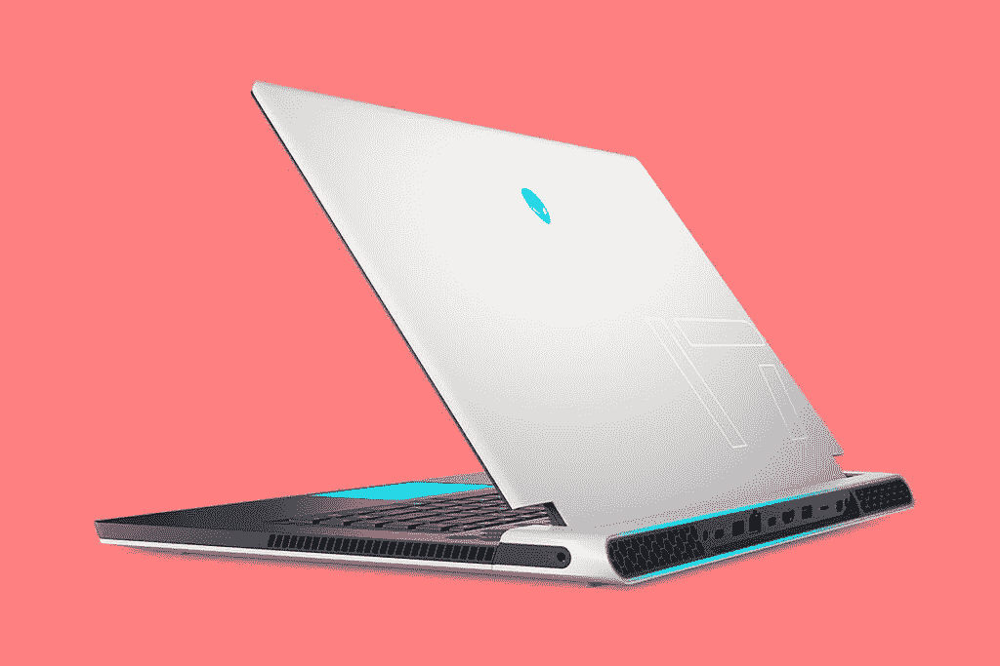
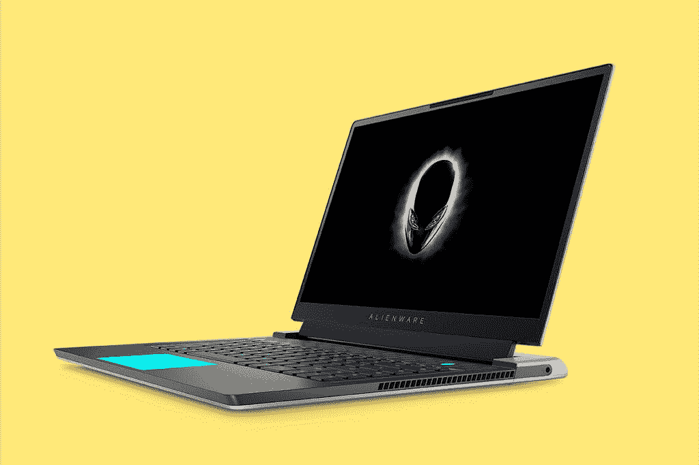

# 外星人全面推出新的 X 系列，以显示它能做什么

> 原文：<https://www.xda-developers.com/alienware-unveils-x-series/>

当英特尔发布其最新的 H 系列处理器时，[戴尔也发布了一系列笔记本电脑](https://www.xda-developers.com/dell-xps-15-xps-17-come-with-11th-gen-processors-rtx-30-graphics/)。当时可能被忽略的是外星人 X 系列，更确切地说是 X17。这只是一个玩笑，但是现在已经揭开了。

在戴尔的博客文章中，它指的是“X 因素”，一种使事情变得伟大的品质。这是使它脱颖而出的原因。通过外星人 X 系列，这是该公司打算展示它能做什么的地方。正如博客帖子所说，这就是外星人 X 系列“体现我们大胆创新、高性能、标志性设计和优质品质的价值观”的地方

 <picture></picture> 

Alienware x17

X 系列的两款笔记本电脑是外星人 x15 和 x17，显然分别是 15 英寸和 17 英寸的笔记本电脑。他们展示了新的外星人设计语言，传奇 2.0，这实际上是与最新的外星人 m15 首次亮相。显然，传奇是我们在过去几年中看到的设计语言，它非常具有标志性。这些笔记本电脑也出奇的薄。x15 不到 16 毫米，戴尔声称它是世界上最强大的 16 毫米以下 15 英寸游戏笔记本电脑。

部分原因是新的冷却，这是它在 5 月份取笑的主要内容。这两款笔记本电脑都引入了一种新的热界面材料，称为 31 号元素。它由封装的镓硅液态金属化合物制成，位于 CPU 和热元件之间。外星人承诺比市面上的产品提高 25%。

 <picture></picture> 

Alienware x15

对于游戏笔记本电脑来说，散热非常重要。这是因为所有这些电脑都有相同的部件，包括第 11 代英特尔酷睿 H 系列 CPU 和 NVIDIA GeForce 30 系列显卡。无论哪台笔记本电脑能够将这些组件保持在最低温度，它都将获得最佳性能，而且是持续的性能。

外星人 X 系列的另一个卖点是六边形通风口图案。笔记本电脑应该是漂亮的，但也应该是实用的。你得到了漂亮的照明，这些漂亮的通风口也让机器保持凉爽。

除了明显的第 11 代英特尔处理器和高达 RTX 3080 GPU，还有很多其他选择。有一个热控制电路功能，可以让您设置 CPU 温度的限制，除此之外，还有定制的电源状态，包括全速、性能模式、平衡模式、电池节电模式和安静模式。所有这些都可以调整冷却、风扇等，以获得不同级别的性能或效率。

外星人 X 系列还配备了一个可选的 3.5 毫米超薄设计的 Cherry MX 键盘。这是外星人几个月前宣布的合作伙伴关系。

外星人 X 系列的有限配置目前已经上市，x15 的起价为 1999.99 美元，x17 的起价为 2099.99 美元。完整配置将于 6 月 15 日提供。