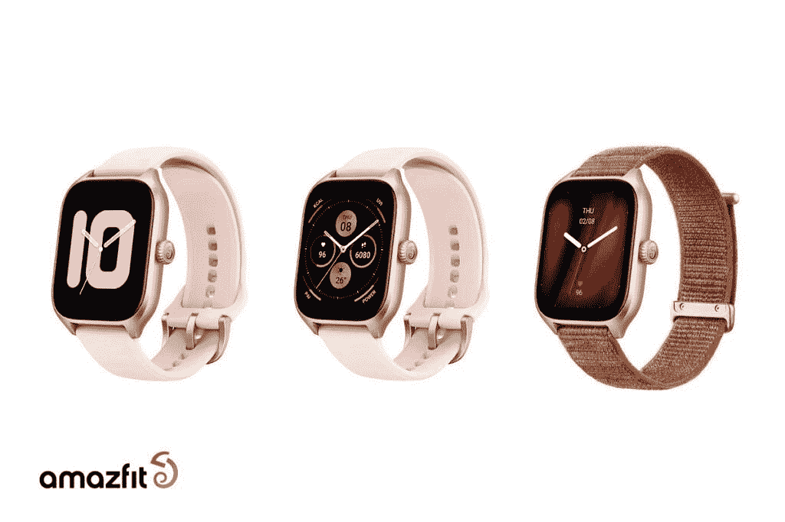

# Amazfit 的 GTR 4 和 GTS 4 智能手表将在全球发售

> 原文：<https://www.xda-developers.com/amazfit-gtr-4-and-gts-4-smartwatches-available-globally/>

Amazfit 是一家相对年轻的公司，但它不仅设法生存下来，还在拥挤的市场中茁壮成长。该公司已经生产了许多健身可穿戴设备，其中大多数价格合理。现在，该公司已经宣布了其最新的健身手表，GTR 4 和 GTS 4，都是 2022 年产品线的最高端。Amazfit GTR 4 和 GTS 4 将在全球发售。

Amazfit GTR 4 采用圆形 1.43 英寸高清 AMOLED 显示屏，看起来像传统手表。它确实提供了一种运动设计，带有一点突出的红色，可以在皇冠上找到。这款手表采用金属中框，将有三种不同的颜色:超高速黑色、复古棕色皮革和赛道灰色。那些喜欢定制的人会很高兴知道这款手表将提供 200 多种不同的表盘。

 <picture></picture> 

Amazfit GTR 4

现在，Amazfit GTS 4 看起来很不一样，它的方形显示屏达到了 1.75 英寸。屏幕采用 AMOLED 技术，室内室外均可轻松阅读。这款手表纤薄轻巧，尺寸为 9.9 毫米，重 27 克。它还将有定制选项，利用超过 150 个表盘。Amazfit GTS 4 将有四种颜色可供选择:无限黑、雾白、秋棕和玫瑰花蕾粉。

那么，是什么让 GTR 4 和 GTS 4 与众不同呢？这两款健身手表提供了“行业首创”的双频圆极化 GPS 天线。那么这对普通用户来说意味着什么呢？根据 Amazfit 的说法，这意味着两只手表将非常精确，无论环境如何，都可以提供 99%的精度。在发布时，这些设备将支持五个卫星定位系统，第六个将在未来某个时候添加。

当然，作为 Amazfit 设备，你可以选择任何数量的运动来跟踪它。目前，这款手表支持多达 150 种不同的运动模式，甚至可以在没有用户交互的情况下自动识别和跟踪一些运动。Amazfit GTR 4 号和 GTS 4 号将配备一个全新的跟踪系统，即 BioTracker 4.0 PPG 生物光学传感器。该传感器将采用一个 2LED 传感器，与以前的传感器相比，它将收集更多的数据，高达 33%。新的传感器在跟踪血氧、压力水平甚至睡眠时也将更加准确。

 <picture></picture> 

Amazfit GTS 4

虽然大多数这是 Amazfit 产品的标准配置，但有一个软件功能将使手表变得独一无二。它们将是第一批支持与阿迪达斯 Runtastic 应用程序同步的 Amazfit 手表。Amazfit Zepp 应用程序将收到一个更新，这将使两者之间的同步成为可能。最重要的是，Amazfit GTR 4 和 GTS 4 的电池续航时间将会很好，GTR 4 的续航时间可达 14 天，GTS 4 的续航时间略超过一周。当然，如果启用了升级的节电模式，这些数字还可以进一步扩大。

关于娱乐，Amazfit 手表将能够存储音乐，也可以用作遥控器来控制连接的智能手机上的音乐播放。此外，手表将能够为健身跟踪提供语音更新，使人们更容易专注于目标，而不是不断低头看手表。Amazfit GTR 4 和 GTS 4 将从€200 开始，这比去年发布的前几款车型要高很多。对于德国和波兰的用户，从 9 月 2 日开始可以预订。对于其他地区，详细信息将在不久的将来公布。

* * *

来源: [Amazfit](https://www.amazfit.com/us/) ，[安卓警察](https://www.androidpolice.com/amazfit-gtr-4-gts-4-launch/)