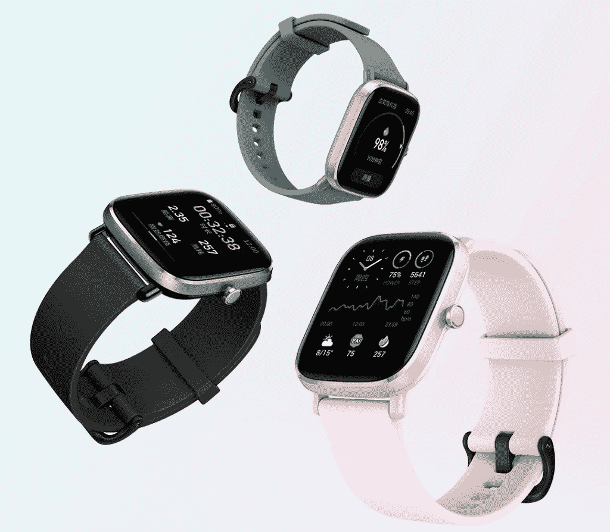

# Amazfit GTS 2 迷你获得最新更新的 Alexa 支持

> 原文：<https://www.xda-developers.com/amazfit-gts-2-mini-alexa-update/>

# Amazfit GTS 2 迷你获得最新更新的 Alexa 支持

Amazfit 开始为 GTS 2 mini 推出 OTA 更新，启用所有 Alexa 驱动的语音控制。

去年在印度推出 GTS 2 和 GTR 2 几周后，amaz fit T2 公司在印度推出了平价的 GTS 2 迷你智能手表。这款经济型智能手表采用方形铝合金和塑料外壳，配有 1.55 英寸 AMOLED 显示屏，一系列健身跟踪功能，以及内置麦克风，帮助用户与 [Alexa](https://www.xda-developers.com/tag/amazon-alexa/) 互动。然而，其基于 Alexa 的智能功能在推出时并不可用。Amazfit 现在终于推出了智能手表的 OTA 更新，启用了所有的 Alexa 功能。

根据 Amazfit 的新闻稿，GTS 2 mini 的最新 OTA 更新已经开始向印度用户推出。此次更新启用了亚马逊虚拟助手 Alexa 支持的一系列语音控制功能。这些功能包括播放音乐、设置闹钟、提供天气预报、获取交通信息等等。如果你有一台 Amazfit GTS 2 mini，你需要按照以下步骤激活这些功能:

*   通过蓝牙将手表与手机配对
*   打开 Zepp 应用程序，点击个人资料，然后选择 GTS 2 迷你
*   将固件更新至 1.0.2.31 版本
*   更新完成后，向左滑动手表主屏幕
*   点击“在应用程序的设备页面上授权 Alexa”
*   打开 Zepp 应用程序，点击个人资料，然后选择添加帐户
*   点击“亚马逊 Alexa”
*   登录您的亚马逊账户

一旦完成，你应该可以在你的 GTS 2 mini 上发出 Alexa 语音命令。该功能应该完全像在 Echo 智能扬声器上一样工作。如果你想使用这些功能，但你没有 GTS 2 mini，你可以通过下面的亚马逊链接购买一台。这款手表的价格为₹6,999，有两种颜色可供选择——午夜黑和火烈鸟粉。

 <picture></picture> 

Amazfit GTS 2 mini

##### Amazfit GTS 2 mini 功能特色

Amazfit GTS 2 mini 是一款经济实惠的智能手表，配有 1.55 英寸 AMOLED 显示屏，一系列健身功能，并支持亚马逊 Alexa。