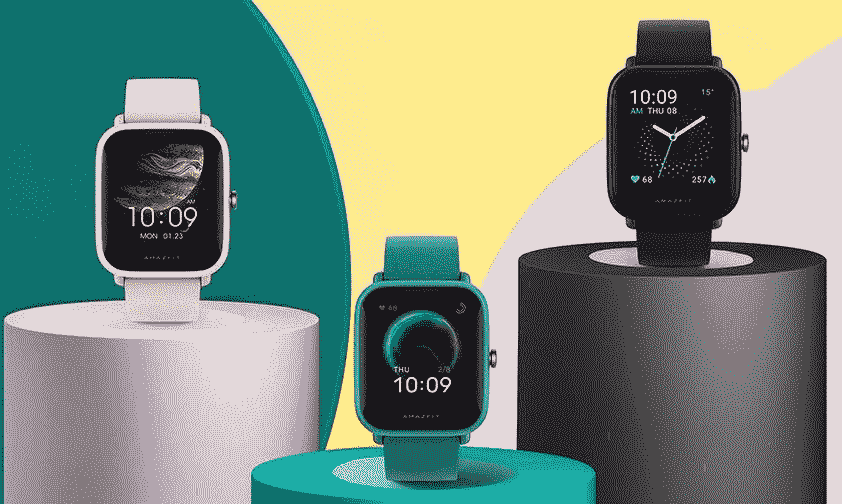

# Amazfit 在中国推出 GTS 2 mini 和 POP Pro 智能手表

> 原文：<https://www.xda-developers.com/amazfit-unveils-gts-2-mini-pop-pro-smartwatches-china/>

在今年 10 月早些时候推出 Amazfit GTS 2 和 GTR 2 之后，Amazfit 现在又在中国推出了两款经济型智能手表。顾名思义，新款 Amazfit GTS 2 mini 是 GTS 2 的平价版，它的方形表盘与高级智能手表相同，但显示屏较小，为 1.55 英寸。另一方面，新的 Amazfit POP Pro 是今年早些时候推出的 Amazfit POP 的 GPS 版本。

根据*微博*[上的](https://www.fonearena.com/blog/328412/amazfit-gts-2-mini-price-specifications-amazfit-pop-pro.html)[公告帖](https://weibo.com/5230569371/Jwq1nnZjn)(通过 *fonearena* )显示，Amazfit GTS 2 采用 1.55 英寸(354 x 306 像素)AMOLED 显示屏，像素密度为 301ppi。智能手表支持 70 多种运动模式和活动，持续心率监测和深度睡眠监测。在传感器方面，它采用了华米的 BioTracker 2 PPG 传感器，具有血氧水平检测，加速度计，陀螺仪传感器，地磁传感器和环境光传感器。

 <picture></picture> 

Amazfit GTS 2 mini

此外，Amazfit GTS 2 mini 的防水性能高达 5ATM，它具有蓝牙 5.0 BLE 连接功能，GPS 和 GLONASS 定位跟踪功能，以及 NFC 支付功能。与 Amazfit GTS 2 非常相似，这款手表也配有内置麦克风，以帮助用户与语音助手互动，但它不是亚马逊的 Alexa，而是支持萧艾语音助手。最后，这款手表配备了一块 220 毫安时的电池，一次充电可以提供长达 14 天的电池续航时间。

如前所述，Amazfit POP Pro 只是今年早些时候推出的 Amazfit POP 的 GPS 版本。它具有分辨率为 320 x 302 像素的 1.43 英寸 TFT 触摸显示屏，用于持续心率监测的光学心率传感器，血氧(SpO2)传感器，以及用于活动跟踪的 3 轴加速度计和陀螺仪。该手表支持 60 多种运动模式，并基于 PAI 健康评估系统。

 <picture></picture> 

Amazfit POP Pro

除了健身跟踪功能，Amazfit POP Pro 还提供通知支持、远程相机控制、天气和音乐控制。这款手表还具有高达 5 个大气压的防水性能，并包含蓝牙 5.0 BLE 用于连接。它装有一个 225 毫安时的电池，一次充电可以持续 9 天。

## 定价和可用性

Amazfit GTS 2 mini 的售价为 CNY 699 英镑(约合 106 美元)，已经在中国开始销售。这款腕表有三种颜色可选——深松绿、玫瑰红和黑曜石黑。Amazfit POP Pro 在 CNY 的售价为 399 英镑(约合 61 美元)，将于 12 月 10 日开始在中国销售。这款手表还有三种颜色可供选择——黑色、绿色和粉色。截至目前，Amazfit 尚未发布任何关于国际可用性的信息，但 *fonearena* 声称，Amazfit POP Pro 将很快在印度市场推出，名为 Amazfit BIP U Pro。