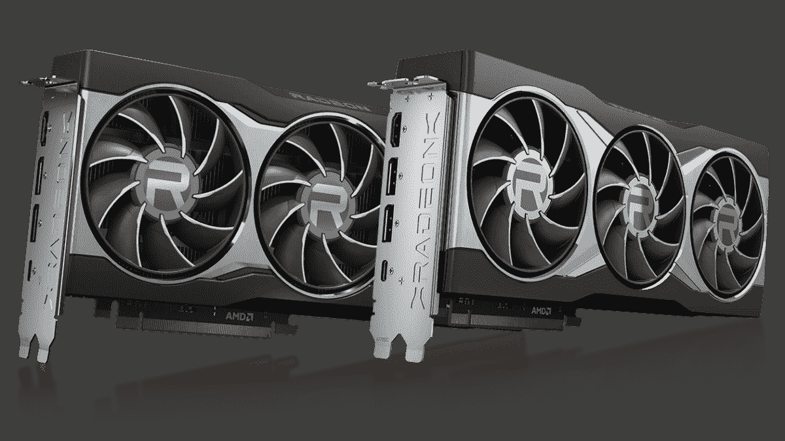

# AMD 镭龙 RX 6000 系列 GPU 挑战英伟达 RTX 3000 系列

> 原文：<https://www.xda-developers.com/amd-radeon-rx-6000-gpu-series-announced/>

2020 年对我们大多数人来说都不太好，但毫无疑问，对于游戏玩家来说，今年有一些激动人心的时刻。我们已经看到 NVIDIA 宣布了新的 RTX 3000 GPU 系列，我们将看到新的 Xbox 系列和 S 系列以及 PlayStation 5 游戏机下个月上市。今天，AMD 宣布推出新的镭龙 RX 6000 系列 GPU，加入了主要游戏相关产品的竞争。

新系列基于新的 AMD RDNA 2 游戏架构。该公司声称，与上一代镭龙 RX 5700 XT 显卡相比，顶级的 RX 6900 XT 在精选产品中提供了高达两倍的性能。与镭龙 RX 5700 XT 显卡相比，镭龙 RX 6800 XT 显卡的性能功耗比高出 54%。

 <picture></picture> 

Credits: AMD

AMD 公司副总裁兼图形业务部门总经理 Scott Herkelman 表示:“新的 AMD 镭龙 RX 6800、RX 6800 XT 和 RX 6900 XT 显卡提供了主要 AAA 级产品的 4K 和 1440p 性能，带来了令人惊叹的逼真视觉效果，以及提供终极游戏体验的必备功能。我迫不及待地想让游戏玩家手中拥有这些令人难以置信的新显卡。”

新的 AMD 镭龙 RX 6000 系列显卡也支持 PCIe 4.0 技术，并提供高达 16GB 的 GDDR6 内存。据称，它能够提供足够的功率来处理 4K 的工作负载。AMD 已经宣布了三种型号——镭龙 6900 XT、镭龙 6800 XT 和镭龙 6800。镭龙 RX 6900 XT 和镭龙 6900 都提供 16GB 的 DDR6 内存和 2015MHz 的时钟速度，以及 2250Mhz 的提升时钟速度。两者之间的唯一区别是 6900XT 配有 80 个计算单元，而 6900 配有 72 个计算单元。另一方面，镭龙 6800 配备了相同的 16GB DDR6 内存，但时钟速度较慢，为 1815MHz，具有 2105Mhz 的升压时钟和 60 个计算单元。

至于定价，AMD 镭龙 RX 6800 和镭龙 RX 6800 XT 显卡将于 2020 年 11 月 18 日开始上市，分别为 579 美元和 649 美元。AMD 镭龙 RX 6900 XT 预计将于 2020 年 12 月 8 日上市，售价 999 美元。预计所有 AMD 主板合作伙伴，包括 ASRock、ASUS、Gigabyte、MSI、PowerColor、SAPPHIRE 和 XFX，将从 2020 年 11 月开始发运新的镭龙 GPU。AMD 印度公司已经确认，RX 6800 MBA(由 AMD/Reference 制造)卡将于 11 月 18 日开始在零售商处发售，有效成本为₹45,999 +商品及服务税。从 11 月 25 日开始，合作伙伴将提供 RX 6800 XT 和 RX 6800 卡的 AIB(附加板)型号。要了解更多关于新的镭龙 RX 6000 系列显卡的信息，[请访问 AMD 的网站](https://www.amd.com/en/graphics/amd-radeon-rx-6000-series)。