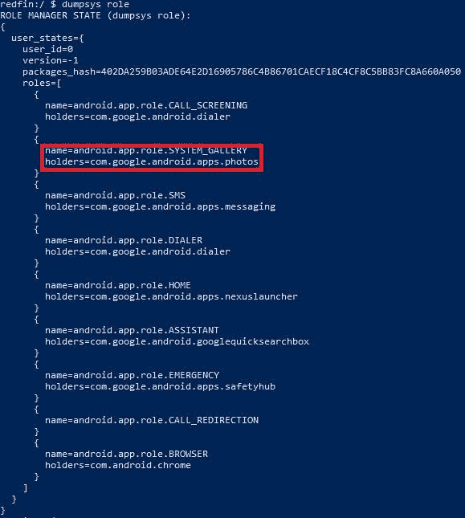

# Android 11 让谷歌照片用起来很烦，但可能会有解决办法

> 原文：<https://www.xda-developers.com/android-11-google-photos-trash-fix/>

我们无法知道市场上有多少运行 Android 11 的设备，因为谷歌[不再公布分发统计数据](https://www.xda-developers.com/android-version-distribution-statistics-android-studio/)，但现在可能有数千万，因为小米和三星等公司有时间将更新推送到[他们的许多型号](https://www.xda-developers.com/android-11-update-tracker/)。如果你的设备运行 Android 11，并且你使用谷歌照片，那么你有可能在应用处理图像删除和恢复的方式上遇到了一个相当恼人的变化。现在，你不必简单地选择想要删除的图像和视频，点击垃圾桶图标，然后点击“移至垃圾桶”按钮，而是需要点击额外的提示，以授予 Google 相册删除或恢复文件的权限。

对于那些拍摄大量照片和视频的人来说，必须授予 Google 相册删除或恢复文件的权限可能会很烦人。正如 [*AndroidPolice*](https://www.androidpolice.com/2020/10/15/scoped-storage-on-android-11-is-ruining-the-google-photos-experience/) 所指出的，点击额外的按钮并不是你可能必须处理的唯一问题。如果你在另一台设备上使用谷歌照片，并希望编辑或删除你从运行 Android 11 的手机上传的文件，该应用程序可能会要求你检查“不同步的更改”。如果 Google 相册不断要求你查看你刚刚在另一个平台上所做的更改，这很快就会变得令人讨厌。

删除或恢复文件的额外步骤在 Android 10 中是不需要的，但现在在 Android 11 中是需要的，因为强制实施了范围存储。在作用域存储之前，对整个外部存储目录的访问由单一权限管理，这使得您很难限制哪些应用程序可以访问您的私人文档、图像或视频。有了范围存储，Android 限制了应用程序在没有明确用户同意的情况下对敏感文件的访问权限。你可以在这篇文章中找到关于作用域存储[的更多细节，或者查看 Google 下面的图表来获得变化的摘要。](https://www.xda-developers.com/android-11-developer-preview-privacy-security-features-changes/#affiliate-warning:~:text=Scoped%20Storage%20changes)

当他们忙于在 Android 11 中限制存储访问时，谷歌也在改进现有的 API 以改善用户体验。例如，针对 Android 11 的应用程序可以使用 MediaStore API 来[删除文件，而不是删除它](https://www.xda-developers.com/android-11-hidden-recycle-bin-trashed-photos-videos/)。然而，为了将一个文件移到垃圾箱，应用程序必须[提示用户授予它写权限](https://developer.android.com/reference/android/provider/MediaStore#createWriteRequest(android.content.ContentResolver,%20java.util.Collection%3Candroid.net.Uri%3E))。由于你从手机添加到 Google 相册的大部分图片和视频来自不同的应用程序，如 stock camera 应用程序，因此在将文件移入或移出垃圾桶之前，Photos 必须请求许可。然而，如果你使用的是安装了 Android 11 的 Pixel 手机，Google Photos 不会要求你允许你删除文件。然而，它确实要求其他几乎所有运行 Android 11 的设备都获得许可，包括大多数三星、小米、一加和华硕设备。怎么回事？

原因是系统图库应用不受范围存储限制。这意味着股票图库应用程序可以在没有明确许可的情况下打开、编辑或删除图像和视频。Google Photos 在 Pixel 手机上预设为系统图库应用，但大多数 OEM 厂商都预设了自己的图库应用。此外，没有面向用户的设置来更改系统图库应用程序，甚至在 Android 的“默认应用程序”屏幕中也没有。然而，*是*改变系统图库应用程序的一种隐藏方式，但是有一个*大*警告:只有一个系统应用程序可以被设置为系统图库应用程序。这意味着只有*已经预装了谷歌照片作为系统应用*的手机才能利用这个技巧。

符合这个标准的手机并不多，但是根据我们的测试，我们可以确认这个**可以在大多数一加和一些华硕手机上使用**。这种方法在我们测试的任何三星手机上都不起作用，在小米 Mi 10 Pro 上也不起作用。如果你有 root 权限或者正在运行一个定制的 ROM，在你系统化 Google Photos 应用程序之后，这个方法可能会在你的设备上工作，但是我们只在普通设备上测试了这个方法。

## 如何(或许)让 Google 相册成为系统图库应用

*感谢基隆·奎因([奎因 899](https://forum.xda-developers.com/m/quinny899.3563640/) 在 XDA 论坛上)分享了这个技巧！*

你需要做的第一件事是在你的电脑上安装 ADB。我们有一个关于如何做的更新指南[在这里](https://www.xda-developers.com/install-adb-windows-macos-linux/)。ADB 设置完成后，输入以下命令:

```
 adb shell cmd role add-role-holder android.app.role.SYSTEM_GALLERY com.google.android.apps.photos 
```

如果您没有看到错误，那么它可能工作了！你可以通过拍摄照片，然后尝试在 Google 相册中删除照片来快速验证它是否有效。或者，您可以运行以下命令:

```
 adb shell dumpsys role 
```

...并查看“Android . app . role . system _ GALLERY”的“持有者”是否为“com . Google . Android . apps . Photos”(Google Photos 的包名)。

 <picture></picture> 

If your output matches the text highlighted in the red rectangle, then it worked.

## 这个命令有什么作用？

Android 10 增加了一个名为“Roles ”的[新 API。当应用程序具有特定角色时，它会自动被授予特定权限。例如，](https://www.xda-developers.com/android-q-security-privacy-features/#caption-attachment-261733:~:text=location.-,Roles) [SYSTEM_GALLERY 角色](https://developer.android.com/reference/androidx/core/role/RoleManagerCompat#ROLE_SYSTEM_GALLERY)自动授予应用程序“对外部存储上的所有图像和视频文件的完全读写权限，包括对位置元数据的访问权限”SYSTEM_GALLERY 角色只能授予系统应用程序，其默认持有者由 Android 配置值“config_systemGallery”定义。正如我们之前解释的，大多数 OEM 将此值预设为与他们自己的图库应用程序对应的包名。如果不修改框架或安装一个覆盖层，这个值就不能改变，这两者都需要 root 访问权限。

然而，*可以将另一个应用程序*添加为 SYSTEM_GALLERY 角色的持有者，但只有在该应用程序也是系统应用程序的情况下，才可以添加*。这在许多一加和一些华硕手机上是可能的，因为这些原始设备制造商似乎在系统级而不是用户级预装了 Google 相册。正因为如此，Google Photos 应用程序有资格担任 SYSTEM_GALLERY 角色，我们利用 Android 的隐藏 RoleManager shell 接口来授予它访问通常无法授予的权限。如果您尝试将 SYSTEM_GALLERY 角色授予非系统应用程序，您将在 logcat 中看到以下错误:*

```
 E RoleControllerServiceImpl: Package does not qualify for the role, package: com.google.android.apps.photos, role: android.app.role.SYSTEM_GALLERY 
```

遗憾的是，我们还没有找到绕过这个限制的方法，但是如果我们找到了，我们将与社区分享我们的方法。当然，我们更希望 Google 简单地使 SYSTEM_GALLERY 角色可由用户定义，而不是局限于 OEM 的选择。