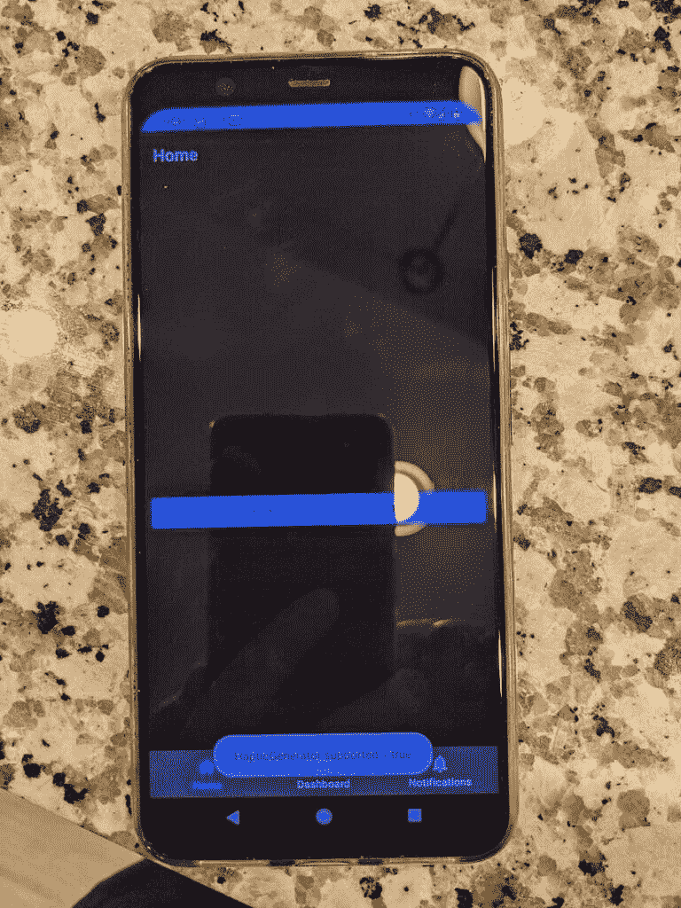

# Android 12 的音频耦合触觉效果比听起来更酷

> 原文：<https://www.xda-developers.com/android-12-audio-coupled-haptic-effect/>

如果你关注我们的博客，那么我不认为我需要告诉你谷歌上周发布了第一个 [Android 12](https://www.xda-developers.com/android-12/) 版本(说真的，我们已经向[发布了大量关于它的](https://www.xda-developers.com/tag/android-12/))。虽然我们主要关注于揭示未发布的功能，但今天我们后退一步，测试新操作系统的[官方宣布的功能](https://www.xda-developers.com/android-12-developer-preview-1/)。Android 12 中最酷的功能之一是音频耦合触觉效果，这一功能有效地承诺根据正在进行的音频会话振动你的手机。谷歌表示，它将让开发者创造更多身临其境的游戏和音频体验，在看到它的实际操作后，我们不得不同意这一点。

开发者 [kdrag0n](https://forum.xda-developers.com/m/kdrag0n.7291478/) ，他最近让我们第一次看到了 [Android 12 基于壁纸的主题系统](https://www.xda-developers.com/android-12-wallpaper-theming-system-leak/)，他想尝试一下新的音频耦合触觉效果功能，所以他快速开发了一个应用程序，看看哪些 Pixel 手机支持该功能。根据 [HapticGenerator](https://developer.android.com/reference/android/media/audiofx/HapticGenerator) API 的文档，“HG 是一个音频后处理器，它基于音频通道生成触觉数据。生成的触觉数据与音频数据一起发送到音频 HAL，这将要求设备支持音频耦合触觉回放。”不幸的是，看起来谷歌最新的 Pixel 手机——即 Pixel 4a 5G 或 Pixel 5——都不支持 HapticGenerator。谷歌 2018 款 Pixel 3 似乎也不支持(诚然，我们只测试了 XL 型号)，但幸运的是，谷歌 2019 款 Pixel 4 支持。

 <picture></picture> 

Google's Pixel 4 supports Android 12's audio-coupled haptic effect feature. Image credits: XDA Senior Member [cstark27](https://forum.xda-developers.com/m/cstark27.2712580/)

在确认 Pixel 4 支持它之后，kdrag0n 使用 HapticGenerator API 快速创建了另一个应用程序。这个应用程序根据设备上正在播放的音乐产生振动，结果比我们预期的要好。这里有两个视频，都是由 XDA 资深会员 [cstark27](https://forum.xda-developers.com/m/cstark27.2712580/) 录制的，展示了音频耦合触觉效果:

蠢朋克:再来一次

愚蠢的朋克:太阳能水手 _ 由漂亮的灯光混合)

谷歌过去曾尝试过音频耦合触觉技术，但 Android 12 的新功能远比我们以前从该公司看到的任何功能都更加通用。对于 Pixel 3，谷歌[准备了定制的振动模式](https://twitter.com/MishaalRahman/status/1053686158130065409)来匹配每一种股票铃声，但显然他们不可能为扬声器发出的每一种声音都创建定制的振动。

这就是为什么我认为 Android 12 的新音频耦合触觉可能是该操作系统最酷的功能之一，也是为什么谷歌最新的 Pixel 手机似乎缺乏对它的支持是不幸的。触觉反馈，如果做得正确，真的可以提升智能手机的体验。而我却看不到有多少人用这个来进行音乐播放(有多少人在播放音乐的时候把手机拿在手里？)，我可以看到它将如何让游戏在移动设备上更加身临其境。