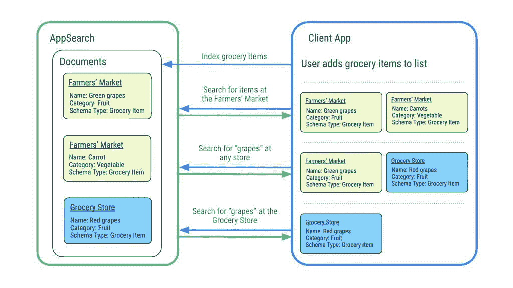

# Android 12 Beta 3 即将推出——以下是新功能！

> 原文：<https://www.xda-developers.com/android-12-beta-3-changes/>

我们距离谷歌移动操作系统的最新版本 Android 12 的稳定发布只有几个版本了。谷歌在 5 月份举行 I/O 开发者大会之前发布了三个开发者预览版，自 I/O 以来，我们已经获得了两个测试版。第一个测试版[带来了谷歌在 I/O 上取笑的一些主要设计变化，但第二个测试版](https://www.xda-developers.com/android-12-beta-1-hands-on/)带来了更重要的功能，如 Android 12 的隐私仪表盘和基于壁纸的主题。今天，谷歌发布了第三个测试版——Android 12 Beta 3——它带来了一些新功能，包括期待已久的滚动截图，更智能的自动旋转等等。

## **Android 12 Beta 3 的新功能**

从之前的开发者预览版和测试版来看，Android 12 是谷歌多年来最大的操作系统版本。谷歌在稳定版发布之前设法偷偷加入了更多功能，这令人印象深刻，尽管公平地说，他们一直在努力开发今天宣布的功能，这不是什么秘密。既然我们离稳定版已经很近了，我们认为这些新特性不会及时发布，但是我们错了。

那么谷歌到底给 Android 12 Beta 3 加了什么呢？根据官方博客帖子，Beta 3 中值得注意的新功能包括**更快的显示自动旋转**和**可滚动屏幕截图**。

通过 Android 12 中的**滚动截图**，你可以抓取可滚动的内容截图。这意味着你不必一个接一个地捕捉屏幕截图，然后手动将它们拼接在一起。自从去年的 Android 11 开发者预览版以来，谷歌一直在研究这个功能[，但是由于团队资源有限(由于新冠肺炎的原因)并且希望以正确的方式实现它，它](https://www.xda-developers.com/android-11-scrolling-screenshot-feature/)[没有为那个版本做出削减](https://www.xda-developers.com/android-11-ama-summary/)。然而，谷歌悄悄地恢复了对该功能的开发，我们[在第一次 Android 12 开发者预览中瞥见了它](https://www.xda-developers.com/android-12-finally-adds-scrolling-screenshots-natively/)。滚动屏幕截图的实现在随后的开发者预览版和测试版中是隐藏的，但我们[在几个月前看到了该功能的接近最终版本](https://www.xda-developers.com/android-12-beta-features-leak/#android12leakscrollingscreenshots)，这要归功于一个泄露的内部版本。

正如我们所怀疑的，Android 12 中滚动截图的工作方式是基于视图，而不是 OEM 实现中的图像拼接。当用户捕获可滚动内容的屏幕截图时，会显示一个新的“捕获更多”按钮，当点击该按钮时，会扩展屏幕截图以显示整个屏幕，用户可以调整以进行裁剪。

谷歌表示，只要应用程序使用标准的基于视图的用户界面，滚动屏幕截图对大多数应用程序来说都是现成的。如果一个应用或 UI 工具包不使用基于视图的 UI 或使用高度定制的 UI，那么它需要实现新的 [ScrollCapture API](https://developer.android.com/reference/android/view/ScrollCaptureCallback) 来告诉系统如何捕捉屏幕。谷歌正在努力让它的滚动截图功能在更多情况下发挥作用，比如滚动列表视图(Beta 4 即将推出)和网络视图。对后一种[的支持可能会在 Google Chrome 上自然出现](https://www.xda-developers.com/google-chrome-android-working-scrolling-screenshot-support/)，但是很高兴看到一个通用的实现可以在任何使用 WebView 的应用中工作。

### 更好、更快的自动旋转

Android 12 终于改进了操作系统最基本的功能之一:自动旋转。从 Beta 3 开始，Android 的自动旋转功能通过面部检测得到了增强，该功能使用前置摄像头来更准确地检测屏幕何时应该旋转。当你躺在沙发或床上时，这有望减少无意中的屏幕旋转。Android 增强的自动旋转功能捕获的图像在 Android 12 的[私人计算核心](https://www.xda-developers.com/android-12-privacy-private-compute-core-privacy-dashboard/)中进行处理，因此它们永远不会离开设备。

谷歌表示，这种基于面部的自动旋转功能在 Pixel 4 和更高版本的 Pixel 设备的 Beta 3 中可用，但所有运行 Android 12 的设备都可以利用对屏幕旋转的其他改进。这些改进包括对动画和屏幕重绘的优化，以及添加的 ML 驱动的手势检测算法，将基本自动旋转功能的延迟减少了 25%。

基于面部的自动旋转是传言中的 Android 12 最早的功能之一，我们 T2 在早期的开发者预览版中证实了它的存在。根据[我们的分析](https://twitter.com/MishaalRahman/status/1384980173813022721)，谷歌基于面部的自动旋转功能似乎是由设备个性化服务应用程序处理的，因此它可能会在其他 Pixel 设备上启用。

### 设备上搜索

在 Android 12 Beta 3 中，谷歌强调了 Android 的新应用搜索 API。这项功能的文档已经发布了[几个月了](https://www.xda-developers.com/android-12-device-search-api-third-party-launchers/)，甚至在此之前，我们已经怀疑谷歌正在为 Android 开发新的设备上搜索索引，这要归功于我们在 Pixel Launcher 中发现的一个隐藏的替代搜索小工具[。](https://www.xda-developers.com/android-12-dp2-hidden-features/#android12dp2searchwidget)

正如谷歌解释的那样，AppSearch 是一个高性能的设备搜索引擎。应用程序可以索引结构化数据，并使用全文搜索功能进行搜索。该 API 还支持本机特性，如高效的索引和检索、多语言支持和相关性排名。它有两种版本:通过上个月发布的 AppSearch Jetpack 库[向后兼容的本地应用索引](https://android-developers.googleblog.com/2021/06/sophisticated-search-with-appsearch-in-jetpack.html)，以及在 Android 12 中为整个系统维护的中央索引。如果你的应用程序参与了中央索引，Android 可以在 SystemUI 表面显示你的应用程序数据，除非你选择退出。您还可以安全地与其他应用程序共享数据，让他们搜索您的应用程序的数据。

 <picture></picture> 

Diagram illustrating indexing and searching within AppSearch. Source: Google.

### 杂项变更

*   **window insets 中的隐私指示器 API**:Android 12 Beta 3 在 [WindowInsets](https://developer.android.com/reference/android/view/WindowInsets) 中增加了新的[隐私指示器 API](https://developer.android.com/reference/android/view/WindowInsets#getPrivacyIndicatorBounds())，这将让应用程序获得隐私指示器的最大界限以及它们在屏幕上的相对位置，同时考虑到当前的屏幕方向和语言设置。这将让应用程序知道当应用程序处于沉浸式模式时，指示器绘制在哪里，因此它可以进行调整，以防止有用的控件或内容受到阻碍。
*   **可为企业配置的摄像头和麦克风开关:**企业管理员现在可以控制用户是否可以访问关闭设备麦克风和摄像头的系统开关。在这里了解更多。
*   **与 CDM 配对的应用启动前台服务的新权限:**与配套设备管理器(CDM)配对的应用可以通过声明[新的正常权限](https://developer.android.com/reference/android/Manifest.permission.html#REQUEST_COMPANION_START_FOREGROUND_SERVICES_FROM_BACKGROUND)从后台启动前台服务。这将让配套应用程序执行核心功能，同时对系统透明。

谷歌的博客帖子*从来没有*提到他们在 Android 测试版中添加的每一个功能，所以我们当然会下载第三个测试版并安装到我们自己的 Pixels 上，看看还有什么新功能。此外，我们将深入固件，寻找正在开发的其他功能的线索，因此请关注我们在 Android 12 上发布的更多[帖子。](https://www.xda-developers.com/tag/android-12/)

## **下载安装 Android 12 Beta 3**

Android 12 Beta 3 现已推出，支持注册 Android Beta 计划的 Pixel 手机[，包括 Pixel 3、Pixel 3 XL、Pixel 3a、Pixel 3a XL、Pixel 4、Pixel 4 XL、Pixel 4a、Pixel 4a 5G 和 Pixel 5。虽然 Android 12 测试版可用于其他 OEM 厂商的少数设备，但不能保证这些 OEM 厂商会推出基于 Beta 3 代码库的新更新。然而，拥有 Project Treble 兼容设备的用户可以手动安装 Android 12 Beta 3 的通用系统映像或 GSI，或者使用 DSU 加载器](https://www.google.com/android/beta)安装[，以尝试最新的功能。如果你没有兼容的设备，开发者可以通过 Android Studio 在 Android 模拟器](https://www.xda-developers.com/android-12-beta-best-way-to-install-dsu/)上启动 Beta 3 [。](https://developer.android.com/about/versions/12/get#on_emulator)

谷歌也再次向 ADT-3 开发者套件的所有者提供最新的 Android 12 测试版。将测试版安装到 ADT-3 上，在新的谷歌电视界面上尝试最新的 Android 电视功能和测试应用程序。

如果你在寻找 Android 12 Beta 3 的下载链接，[我们在这里有链接](https://www.xda-developers.com/how-to-download-android-12/)。一旦你获得了正确的文件，[阅读这个指南](https://www.xda-developers.com/how-to-install-android-12/)来学习如何安装它。如果你在测试 beta 版时发现了一个 bug，[留下一些反馈](https://developer.android.com/about/versions/12/feedback)，这样它就可以在今年秋天稳定版推出之前得到修复。

## **Android 12 测试版的下一步是什么**

在今天发布 Android 12 Beta 3 之后，谷歌可能没有多少面向用户的新功能留给我们，尽管他们仍然可以在第四个测试版中给我们带来一些惊喜。根据谷歌的发布时间表，Android 12 Beta 4 将是最终的测试版，它将标志着[平台稳定性里程碑](https://developer.android.com/about/versions/12/overview#platform_stability)。这意味着第四个测试版将带来最终的 API 和平台行为集，以及将针对 API 级别 31 的应用发布到 Google Play 的能力，因此正在等待 API 稳定性的开发者应该等待下一个测试版的发布。在 8 月份的 Beta 4 之后，会有一个候选版本，然后是面向 AOSP 和不在 Android beta 计划中的 Pixel 设备的稳定版本。