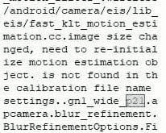

# Android 12 暗示 Pixel 6 拥有三星图像传感器和调制解调器

> 原文：<https://www.xda-developers.com/android-12-beta-4-pixel-6-camera-modem-leak/>

今天早些时候，Android 12 第四个测试版发布，标志着平台稳定性的里程碑。此次发布的[目的是为开发者提供一个包含最终 API 和面向应用行为的构建，以便他们可以在稳定发布之前测试和更新他们的应用。和往常一样，Beta 4 包含了几个谷歌博客文章中没有提到的变化，例如](https://www.xda-developers.com/android-12-beta-4/) [Android 12 的复活节彩蛋](https://www.xda-developers.com/android-12-easter-egg-material-you/)，但它也有几个谷歌应用程序的更新版本。对这些更新的谷歌应用程序的分析揭示了即将推出的 [Pixel 6](https://www.xda-developers.com/google-pixel-6/) 系列的一些新信息，包括主摄像头使用的图像传感器以及手机用于蜂窝连接的调制解调器。

## Pixel 6 的主摄像头可能会使用三星的 50MP GN1 传感器

随着 Android 12 Beta 4 更新，Pixel 手机上预装了新版本的谷歌相机应用程序。在 APK 包含的一个库中，GCam modder extra ordinaire[cstark 27](https://forum.xda-developers.com/m/cstark27.2712580/)发现了一个名为“gn1_wide_p21”的字符串，它暗示了谷歌 2021 Pixel 手机的主“广角”摄像头(即 Pixel 6 系列)将是三星的 50MP [ISOCELL GN1](https://shop-links.co/1748819567973870825?u1=beea5931-5b74-4025-8608-592702b83f3a) 图像传感器。

 <picture></picture> 

Credits: cstark27

这种高百万像素图像传感器是去年年中宣布的[，它支持双像素自动对焦，可以更快更准确地对焦。](https://www.xda-developers.com/samsung-50mp-isocell-gn1-image-sensor-dual-pixel-autofocus/)[早先的泄露](https://www.xda-developers.com/google-pixel-6-five-years-updates/)暗示主广角摄像头将有一个 50MP 传感器，cstark27 在谷歌相机应用程序中发现的字符串支持这一点。谷歌在过去几代 Pixel 手机中使用了索尼的 IMX363 图像传感器，因此三星 GN1 在原始规格方面是一次重大升级。当然，如果图像处理软件没有达到标准，一个好的图像传感器并不意味着什么，但如果 Pixel 手机有什么出名的话，那就是它们的相机软件。

## 谷歌可以使用三星的 Exynos 5123 调制解调器

在另一个系统 APK 中，modder cstark27 也发现了对“g5123b”调制解调器的引用。这种调制解调器型号被“映射”到多个设备，尽管标识这些设备的字符串是加密的。通过一些聪明的欺骗和逆向工程，类似于[我们如何确定](https://www.xda-developers.com/google-pixel-5-snapdragon-765/)Pixel 5 拥有高通的骁龙 765G，有可能解密这些字符串。在这样做之后，cstark27 确定“g5123b”调制解调器映射到具有以下代码名称的 5 个设备:Oriole、Raven、Passport、Slider 和一个未知的第五个产品。Oriole 和 raven 分别是 Pixel 6 和 Pixel 6 Pro 的代号，而 passport 是传闻中谷歌可折叠 Pixel T3 的代号，slider 是谷歌一款未知产品的代号。

此 APK 中的其他调制解调器型号映射与之前的设备及其骁龙处理器相匹配，因此很可能此“g5123b”字符串指的是 Google Tensor 芯片中的调制解调器。虽然没有得到证实，但这款调制解调器很可能基于[三星的 Exynos 调制解调器 5123](https://shop-links.co/1748820307539264841?u1=8dade586-9006-4ae6-ba33-b81dc7a75bdf) ，这是 Galaxy S20 和 Galaxy Note 20 的 Exynos 版本中使用的 [5G](https://www.xda-developers.com/5g/) 调制解调器。这款调制解调器同时支持 sub-6GHz 和 mmWave 5G，但尚不清楚谷歌是否计划在全球范围内发售配备这款调制解调器的 Pixel 6。三星在美国销售的旗舰产品通常使用高通制造的 SOC 和调制解调器，但没有证据表明谷歌也会这么做。

上周，[谷歌证实](https://www.xda-developers.com/google-pixel-6-teaser/)其 Pixel 6 智能手机将搭载该公司名为 Google Tensor 的内部芯片。[有传言称](https://www.xda-developers.com/google-pixel-6-custom-system-on-chip/)这款芯片是与三星的 SLSI 部门合作设计的，最近来自 [*日经*](https://asia.nikkei.com/Business/Technology/Google-unveils-first-in-house-chip-to-power-new-Pixel-phones) 的一份报告称，三星将使用其 5 纳米工艺技术生产该芯片。上周来自 [*GalaxyClub*](https://www.galaxyclub.nl/nieuws/soc-bingo-googles-tensor-soc-pixel-6-is-samsungs-exynos-9855/) 的另一份报告称，谷歌张量芯片的内部名称为“Exynos 9855”，介于 Exynos 9840(也就是 Galaxy S21 系列中的 Exynos 2100)和即将推出的 Exynos 9925(传言将作为 Galaxy S22 系列中的 Exynos 2200 推出)之间。因此，看到谷歌在其旗舰 Pixel 6 系列中使用 Exynos 调制解调器并不奇怪，但同样，在今年晚些时候推出之前，我们无法确认这款手机使用的是什么调制解调器。

*感谢 PNF 软件为我们提供了使用* *[JEB 反编译](https://www.pnfsoftware.com/?aid=xdadev)* *的许可，这是一款针对 Android 应用的专业级逆向工程工具。*