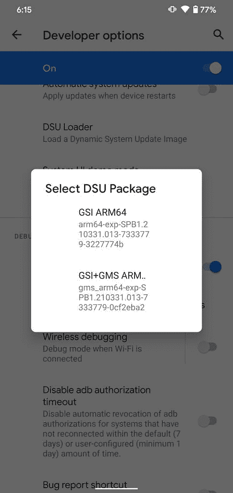

# 谷歌没有提到在 Pixels 上安装 Android 12 测试版的最佳方式

> 原文：<https://www.xda-developers.com/android-12-beta-best-way-to-install-dsu/>

上周第一个 [Android 12](https://www.xda-developers.com/android-12/) 测试版的发布受到了热烈的欢迎，但对于许多发现测试版阻塞了他们手机的人来说，兴奋很快变成了恐惧。处理偶尔的 bug 是运行尖端软件的入场费，但没人指望官方测试版会让他们的手机无法使用。这就是为什么谷歌没有提到在 Pixel 手机上安装 Android 12 测试版的最佳方式:DSU，这让我们感到困惑。由于没有对 DSU 施加更大压力，谷歌也错过了将更多 OEM 设备纳入 Android 12 测试版的机会。这就是为什么 DSU 很重要，以及我们如何让更多的设备参与测试。

根据设备的不同，有几种方法可以安装第一个 Android 12 Beta 版本。有些 OEM 厂商让你使用他们软件的内置更新工具来下载更新，[有些使用标准的 flash 工具](https://www.xda-developers.com/asus-zenfone-8-android-12-beta/)，而[有些则需要专门的工具](https://www.xda-developers.com/xiaomi-mi-11-series-android-12-beta/)。谷歌 Pixel 手机有最直接的方法来安装 Android 12 测试版:你可以注册测试程序，将 OTA 推送到你的设备上，从 recovery 中下载 OTA 文件，或者使用 fastboot 刷新工厂映像(手动或在 [Android Flash 工具](https://www.xda-developers.com/google-android-flash-tool-project-treble-gsi/)的帮助下)。在没有官方测试程序的设备上(甚至在*有*测试程序的设备上)，也可以通过[安装通用系统镜像](https://www.xda-developers.com/android-12-beta-gsi/) (GSI)来试用测试版。GSI 可以像工厂映像一样通过快速启动命令安装，但也可以通过 Android 11 的开发者选项中一个鲜为人知的工具“ [DSU 加载器](https://www.xda-developers.com/android-11-dsu-loader-gsi-locked-bootloader-developers-test-apps-stock-android/)”安装。

通过 DSU 加载器，这个页面上为开发者提供的最新 GSI 版本可以安装在 Pixel 手机上，而不需要解锁引导加载器，也不需要覆盖原始系统映像。这是开发人员在自己的硬件上测试最新 OS 的最不具破坏性的方法；一旦他们完成测试，他们只需重新启动，返回到原始操作系统，应用程序和数据保持不变。

 <picture></picture> 

DSU Loader is available in Android 11+ under Developer Options.

这里有一个来自 XDA 里奇伍兹的视频短片，展示了谷歌 Pixel 4 上的 DSU 装载机。他开始运行 Android 11，但在通过 DSU 安装后，重新启动到 Android 12 测试版 GSI。过了一会儿，他重新启动回到原来的 Android 11 操作系统，数据没有任何改变。

\ r \ nht TPS://www . YouTube . com/watch？v=Tfcf_qld2o8\r\n

与谷歌建议你遵循的安装 Android 12 测试版的现有方法相比，所有这些方法都覆盖了你现有的安装。如果你决定在安装测试版的时候重置你的手机，你可能已经和客户支持部门发生了冲突，认为你的手机被屏蔽了。正如 XDA 公认的开发者 luca020400 在 Twitter 上解释[的那样，似乎在设置工厂重置保护期间有一个问题——如果你在升级到测试版之前重置你的手机，当它要求你登录你的谷歌账户时，你将无法通过 SetupWizard。对于已经解锁了引导加载程序或启用了 OEM 解锁选项的 Pixel 用户来说，很容易通过刷新出厂映像来恢复正常。对于没有解锁引导程序的 Pixel 用户，你必须刷新 OTA，将固件降级到 Android 11——谷歌没有公布这些固件文件，但一些 Redditors 已经帮助编译了它们](https://twitter.com/luca020400/status/1394766353979121669)[这里](https://www.reddit.com/r/android_beta/comments/nfsvxj/after_factory_reset_phone_hung_in_loop/gyoqttp/?context=3)。

如果有更多的 Pixel 用户通过 DSU 安装了 Android 12 测试版，我们可能会看到更少的关于砖块手机的投诉。因为安装是临时的，所以你所要做的就是重启系统。

通过 DSU 加载器运行安卓 12 测试版 GSI 的华硕 ROG 手机 5。

DSU 加载器不仅适用于 Pixel 手机。事实上，它适用于大多数运行 Android 11 的设备。在上面显示的图片和英雄图片中，我们已经在华硕 ROG 手机 5 上安装并运行了 Android 12 测试版——华硕[尚未正式发布测试版](https://www.xda-developers.com/asus-zenfone-8-android-12-beta/)。就像在 Pixel 4 上一样，ROG 手机 5 的安装是临时的和非破坏性的——一个简单的重启，我们就回到了带有 ZenUI 的 Android 11。然而，有一个很大的不同:我们必须解锁 ROG Phone 5 的引导加载程序，才能通过 DSU 启动 Android 12 测试版。解锁引导加载程序会擦除手机的数据分区，这违背了使用 DSU 的主要目的。然而，我们不得不解锁引导程序的唯一原因是因为华硕没有包括[验证的引导密钥](https://cs.android.com/android/platform/superproject/+/master:build/make/target/product/developer_gsi_keys.mk)，它可以让谷歌签名的 GSIs 在不需要解锁引导程序的情况下启动。当我们第一次报道 DSU 时，我们了解到谷歌希望要求原始设备制造商预装这些密钥，但似乎这些计划都半途而废了，因为我们还没有看到任何设备能够通过 DSU 用锁定的引导程序引导 GSI。

然而，令人遗憾的是，既然谷歌创造了如此棒的工具，并为他们的构建建立了一种在大多数设备上运行的方式，情况就是如此。原始设备制造商甚至不需要做太多工作来为他们的设备添加支持，以在锁定的引导加载程序上引导谷歌的 GSIs 他们所要做的就是在构建固件时[向 device.mk 文件添加一行](https://cs.android.com/android/platform/superproject/+/master:build/make/target/product/developer_gsi_keys.mk;l=23)。我们不知道是什么讨论导致谷歌放弃了这一要求，但我们认为许多原始设备制造商对运行谷歌固件的后门感到不舒服，尽管这对开发者来说可能很方便。

如果事情有所不同，我们可能会有更多的设备运行 Android 12 测试版。我们还可以为一些人省去很多麻烦，因为通过 DSU 安装测试版的风险要小得多。来自 *Android Police* [的 Max Weinbach 在他试图在他的一加 9 上安装测试版时发现了这一点](https://www.androidpolice.com/2021/05/18/android-12-beta-is-bricking-oneplus-9-phones-heres-how-to-fix-it/)，导致他不得不按照我们的指导如何使用 EDL 解锁他的手机[。](https://www.xda-developers.com/oneplus-9-9-pro-9r-unbrick-msmdownloadtool/)

我希望 DSU 加载器在未来不会被抛弃，因为如果实现正确，这是尝试新的 Android 版本的最佳方式。谷歌完全没有提到这一点令人失望，特别是因为测试版是明确针对开发者而不是用户的。当然，特定于设备的测试版支持更多的像素功能，但在针对最新的操作系统版本测试应用程序时，这并不重要。鉴于 GSI 在 Android 设备上的工作不一致，以及似乎没有 OEM 支持使用锁定的引导加载程序来引导它们，也许谷歌不想引起人们的注意，因为没有确定的方法让 Android 12 测试版以这种方式引导。三星在其 Galaxy 手机上隐藏了这一选项，尽管该服务仍可通过其命令行界面访问，因此他们可能不同意整个想法。无论是哪种情况，我认为这里有一个错过的机会——谷歌要求三倍的合规性，并费尽心思实施 DSU，那么为什么不更努力地将其作为测试新 Android 版本的首选方式呢？