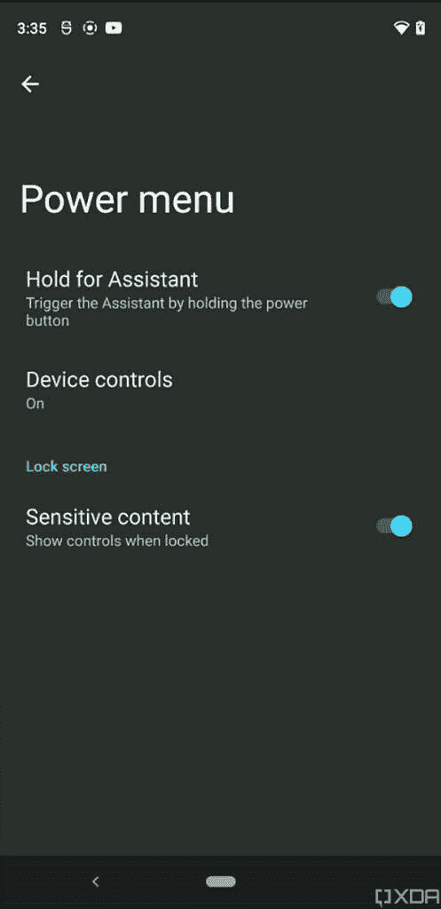

# 独家报道:Android 12 的新功能在早期实践中显露出来

> 原文：<https://www.xda-developers.com/android-12-beta-features-leak/>

距离谷歌发布第一个 [Android 12](https://www.xda-developers.com/android-12/) 开发者预览版已经过去了近 2 个月，我们期待第三个开发者预览版随时会落下。多亏了泄密、大量实践和代码挖掘，我们已经了解了许多关于即将到来的谷歌 Android 操作系统版本的*。尽管如此，随着每个新版本的发布，我们都学到了越来越多的东西，今天，我准备分享我在一个未发布版本的 Android 12 的实际预览中的发现。*

这个未发布的版本是由一个不愿意透露姓名的人给我们的。我们被要求不要重新发布这个版本，所以我们现在不能分享下载链接。这个版本比最新的开发者预览版 2 更新。X 发布了，但是非常不稳定，因此有很多半破损的特性。尽管如此，它还包含了我们已经发现的许多功能的更新代码，并且它还添加了一些以前在公共开发者预览版中没有看到的功能。这是我们目前发现的。

* * *

## 浏览这篇文章

1.  **[Android 12 中的功能变化](#android12leakfunctionalchanges)**
    1.  [滚动截图的改进](#android12leakscrollingscreenshots)
    2.  [应用程序对的更多进展](#android12leakapppairs)
    3.  [按住电源键呼叫谷歌助手](#android12leakpowerbuttonassistant)
    4.  [小工具选择器中的搜索栏](#android12leakwidgetsearchbar)
    5.  [平板电脑的双面板主屏幕](#android12leakdualpanelhomescreen)
    6.  [新表情符号](#android12leaknewemojis)
    7.  [新 Wi-Fi &互联网变革](#android12leakwifichanges)
    8.  [设备控制快速设置磁贴，卡片&通行证](#android12leaknewqstiles)
2.  **[Android 12 中的设计变化](#android12leakdesignchanges)**
    1.  [新音量面板 UI](#android12leaknewvolumeui)
    2.  [每个应用程序的闪屏](#android12leaksplashscreens)
    3.  [调整波纹和过卷效果](#android12leakrippleoverscroll)
    4.  [新 App 抽屉打开动画](#android12leakappdraweranim)
    5.  [新充电动画](#android12leakcharginganim)
    6.  [轻微调整较粗的亮度滑块](#android12leakbrightnesslider)
    7.  [“降低亮度”更名为“超暗”](#android12leakextradim)
    8.  [轻微调整对话窗口小部件选择器](#android12leakconversationpicker)
3.  **[Android 12 中的隐私功能](#android12leakprivacychanges)**
    1.  [剪贴板访问提示](#android12leakclipboardprompt)
    2.  [增强通知权限](#android12leakenhancednotifpermission)
    3.  [更好的位置许可对话框](#android12leaklocationdialog)
    4.  [对侧装应用的细微调整](#android12leaksideloading)
    5.  [媒体管理应用&报警和提醒权限](#android12leaknewpermissions)

* * *

## Android 12 的功能变化

对扩展截图的原生支持是一个很长时间的功能请求，看起来它终于要来到 Android 12 了。在公共开发者预览版中，它目前的形式很容易损坏，并且不是每个应用都支持它。虽然我收到的构建中的实现也不完整，但我们可以看到 Google 已经做了一些幕后改进。例如，在捕获视图时，开发中的扩展屏幕截图实现只是打开一个单独的活动，其中包含您想要捕获的页面的扩展视图，并要求您手动选择您想要捕获的区域，而不是向下滚动页面。

我不确定这是否是默认情况下滚动屏幕截图功能的工作方式，但我可以确认这个功能的代码存在于公开的开发者预览版中。它被称为“放大镜”视图，似乎是用户精确控制他们想要捕捉多少的一种方式。由于谷歌的滚动截图实现[实际上并不涉及将图像拼接在一起](https://www.xda-developers.com/android-11-ama-summary/)，Android 12 可以跳过向用户显示页面向下滚动的动画。这种“放大镜”视图让用户可以直接切入正题，并立即制作正确长度的扩展截图。唯一的问题是，它似乎不是在每个应用程序中都有效，但这可能只是我使用的错误预发布版本的问题。

### 应用程序对的更多进展

在 Android 12 发布之前，[我们听说](https://www.xda-developers.com/android-12-picture-in-picture-mode-bubbles-changes/)该公司正在改造 Android 的分屏多任务功能。在第一个和第二个开发者预览版中，我们设法部分启用了新的“应用配对”功能，但是[在目前的状态下还很不完整](https://www.xda-developers.com/android-12-app-pairs/)。虽然两个月前的相同错误仍然存在于当前的应用对实现中，但我们已经成功启用了之前泄露的功能之一:通过双击中心来交换每个应用的位置。

[video width = " 335 " height = " 681 " MP4 = " https://static 1 . xdaimages . com/WordPress/WP-content/uploads/2021/04/Android-12-App-Pair-Switch-apps . MP4 "]

有趣的是，最近的应用程序概览中的“分屏”按钮已经改为“固定在顶部”轻按此按钮会使当前应用程序占据显示屏的上 1/4，直到您在“最近使用的应用程序”概览中轻按另一个应用程序，从而使两个应用程序在屏幕上平均分开。我们不确定“固定到顶部”是否只是一个用户界面的变化，而不是多任务处理的更广泛变化的一部分，因为“固定到顶部”只在我在启动器的开发者设置中切换分屏标志后才出现。

### 按住电源按钮呼叫谷歌助手

在 Pixel 手机上启动谷歌助手有多种方式。如果你有 Pixel 2、Pixel 3、Pixel 3a 或 Pixel 4，你可以挤压手机；如果你使用全屏手势导航，你可以从底部向上滑动；如果你启用了语音访问，你可以说“嘿谷歌”；在 Android 12 中，[双击 Pixel 5 的背面](https://www.xda-developers.com/android-12-prepares-double-tap-back-gesture-pixel-5/)。看起来谷歌即将增加另一种启动助手的方式:按住电源按钮几秒钟。

## 

我们已经看到这个功能出现在中国原始设备制造商的 Android 皮肤中，看起来谷歌最终也在效仿。

谷歌在 Android 12 DP2 中调整了[启动器的小部件选择器，使其更加紧凑，默认情况下可以折叠。虽然后一种变化可以更容易地滚动和找到你想从中选择小部件的应用程序，但这也意味着如果你不完全确定你想添加什么小部件，你必须手动扩展每个卡片。如果你知道你在找什么小工具，那么在泄露的 Android 12 版本中添加到小工具选择器的新搜索小工具将是一个受欢迎的变化。](https://www.xda-developers.com/android-12-dp2-new-features/#twitter-widget-0:~:text=thing.-,New%20widget%20picker)

### 平板电脑的双面板主屏幕

我们在 Android 12 DP2 中发现的一个有趣的变化是为平板电脑等大屏幕设备提供了一个任务栏。启动器应用程序的另一个隐藏变化是一个新的双面板主屏幕视图。在大屏幕设备上，可以强制启动器并排显示两个页面。

### 新表情符号

上周，[我们分享了一个 mod](https://www.xda-developers.com/get-android-12-new-emojis-rooted-android-device/) ，它将表情符号 13.1 中包含的一些新表情符号带到了任何植根于 Android 的设备上。这些表情符号应该包含在 Android 12 中，并且已经由谷歌的在野外对它们进行了[测试。我可以确认这些表情符号存在于泄露的版本中，如下所示。](https://www.instagram.com/p/CMsuhssh0v5/)

### Wi-Fi 和互联网的新变化

我们在泄露的 Android 12 版本中发现了一些与连接设置相关的变化。首先，“Wi-Fi”现在只是叫“互联网”，快速设置和设置页面也做了相应的更名。在“网络详细信息”下，您可以看到您所连接的 Wi-Fi 网络类型的简化名称(如 Wi-Fi 5、Wi-Fi 6 等。).在 Wi-Fi 热点设置下，现在有一个“扩展兼容性”选项，“帮助其他设备找到这个热点。”此功能只是将热点的频率从 5GHz(默认)更改为 2.4GHz。

### 设备控制、卡和通行证的快速设置磁贴

Android 11 引入了一个名为“设备控制”的简洁功能，即[将智能家居控制放在电源菜单](https://www.xda-developers.com/android-11-power-menu-device-controls-smart-home-dream/)中。当然，这个功能在 Android 12 中仍然存在，但谷歌现在提供了另一种访问它的方式:快速设置磁贴。此外，他们还增加了一个快速设置磁贴来显示[卡&通行证](https://www.xda-developers.com/pixel-feature-drop-second-features-list/)菜单。正如我们之前解释的那样，我们假设这些已经被添加，以防用户选择改变电源按钮行为来启动谷歌助手。

* * *

## Android 12 的设计变化

### 新建卷面板用户界面

Android 的音量滑块正在重新设计，变得更厚。正如你在下面的截图中看到的，Android 12 中的音量面板有一个更厚的滑块，更加圆润，并与当前系统主题的强调色相匹配。

### 每个应用程序的闪屏

在第一个 Android 12 开发者预览版发布之前，我们在独家报道中详细介绍了许多即将到来的 UI 变化[。我们透露的一个小变化是为每个应用程序自动生成闪屏。在我们收到的 Android 12 版本中，似乎终于添加了这一功能。](https://www.xda-developers.com/android-12-ui-changes-material-next/)

[video width = " 326 " height = " 672 " MP4 = " https://static 1 . xdaimages . com/WordPress/WP-content/uploads/2021/04/Android-12-Splash-screens . MP4 "]

正如你在视频中看到的，当应用程序的主要活动加载时，会短暂显示一个闪屏，显示应用程序的图标，其背景与当前系统日/夜主题相匹配。在我们自己的 XDA 应用程序中，这个自动生成的闪屏显示在我们自己的闪屏之前。这看起来有点不和谐，我们不知道谷歌计划如何解决这些情况。每个应用程序都有一个闪屏会让应用程序启动体验感觉更加统一，但我希望最终的系统能够更好地检测底层应用程序是否已经有了自己的闪屏。(我甚至不确定这是否可能，因为许多应用程序使用自己的闪屏实现[，而不是 Android 版本的](https://www.xda-developers.com/android-oreo-splash-screen-api/)。)

门户之友发现 Android 12 中的两个变化是[新的过度滚动和波纹动画](https://www.xda-developers.com/android-12-dp2-hidden-features/#android12dp2overscrollripple)。当您滚动页面顶部或底部时，以及当您点击页面上的任何项目时，这些动画将分别播放。我们得到的泄露版本稍微调整了动画，在我看来，让他们感觉不那么不和谐。

[video width = " 320 " height = " 659 " MP4 = " https://static 1 . xdaimages . com/WordPress/WP-content/uploads/2021/04/Android-12-over scroll-and-Ripple-effect . MP4 "]

### 新应用程序抽屉打开动画

谷歌已经从三星[那里得到了单手易用](https://www.xda-developers.com/android-12-better-one-handed-use/)的启示，但看起来其他的设计理念也在延续。Android 12 的启动器应用程序中的一个较小的变化是一个新的打开应用程序抽屉的动画，如下图所示。应用程序抽屉可以快速打开，非常有弹性，并且不再跟踪你的手指。

[video width = " 335 " height = " 681 " MP4 = " https://static 1 . xdaimages . com/WordPress/WP-content/uploads/2021/04/Android-12-New-Launcher-App-Open-animation . MP4 "]

### 新充电动画

当你将手机连接到我获得的泄露的 Android 12 中的任何电源时，一个新的纹波动画会从底部开始向上扩展。这里使用了用于触摸的相同波纹效果。

[video width = " 320 " height = " 657 " MP4 = " https://static 1 . xdaimages . com/WordPress/WP-content/uploads/2021/04/Android-12-Charging-animation . MP4 "]

### 稍微调整一下更厚的亮度滑块

在第一个 Android 12 开发者预览版中，我们[启用了亮度滑块](https://www.xda-developers.com/android-12-new-lockscreen-notifications-design-leak/)的变化，使其比以前厚得多。那个更厚的亮度滑块仍然存在于我们获得的泄露版本中，但是它接受了一个轻微的调整，使它厚到当前的水平，薄到其余的水平。

[video width = " 335 " height = " 681 " MP4 = " https://static 1 . xdaimages . com/WordPress/WP-content/uploads/2021/04/Android-12-New-Brightness-slider . MP4 "]

Android 12 DP1 新增了一个名为“减少亮色”的设置，在 DP2 中[更名为“降低亮度”。这种辅助功能在屏幕顶部添加了一个深色覆盖层，使屏幕看起来比面板实际允许的更暗。在泄露的版本中，这个功能被重命名为“Extra dim”看起来 Google 还不能确定这个特性的名字，所以在未来的版本中它可能会被叫做别的什么。](https://www.xda-developers.com/android-12-dp2-new-features/#gallery-3:~:text=Turn%20screen%20darker%20settings)

Android 12 最令人期待的功能之一是一个[新部件](https://www.xda-developers.com/android-12-dp2-hidden-features/#android12dp2conversationwidget)来显示你最近与朋友和家人的对话。我们已经看到小部件在 DP1 和 DP2 中经历了各种变化，在这个版本中，小部件选择器 UI 得到了进一步的调整。然而，没有功能上的变化。

* * *

## Android 12 中的隐私功能

### 剪贴板访问提示

Android 10 中与隐私相关的重大变化之一是[在后台](https://www.xda-developers.com/android-q-blocks-background-clipboard-access/)阻止剪贴板访问。自 Android 10 以来，如果应用程序不在前台或没有被设置为默认键盘应用程序，它们就无法读取剪贴板的内容。但是，如果应用程序在前台，它可以像以前一样继续读取剪贴板。

在 Android 12 中，谷歌正在测试设置>隐私下的一个新的“显示剪贴板访问”开关，当启用时，每当应用程序读取剪贴板时，都会显示一条 toast 消息。这是一个很小的变化，但当你使用的应用程序正在访问剪贴板时，这将有助于提醒你。

### 增强的通知权限

公开的 Android 12 开发者预览版中的一个变化是“通知访问”下的“桥接应用”页面。没有对它做什么的描述，但是[我们最好的猜测是](https://www.xda-developers.com/android-12/#video-394907-2_html5:~:text=Choosing%20individual%20apps%20bridged%20to%20notification%20listeners,-%E2%80%8BNotification)它将让你挑选特定通知监听器服务可以拦截的应用程序通知。通知监听器是 Android 上的强大服务，有能力拦截设备上的所有通知，所以谷歌想要稍微控制它们是有道理的。

在我们泄露的 Android 12 版本中，我们在特定应用的通知访问页面下发现了一组新的切换。这些切换大概允许用户微调通知监听器对您的通知的访问级别。在“实时”、“对话”、“默认”或“静默”类别下有切换通知访问的选项。然而，我无法切换这些选项，因为没有一个应用程序被列为“支持增强设置”据推测，这意味着具有针对 API level 31 (Android 12)的通知监听器的应用程序将必须实现一些更改，以支持更细粒度的通知访问。

### 更好的位置许可对话框

Android 最近对第三方应用程序的位置访问方式进行了重大改变。现在，应用程序可以请求访问设备的精确或近似位置，并且必须[获得批准才能在后台收集位置数据](https://www.xda-developers.com/google-new-deadline-for-android-apps-to-request-background-location-access/)，而不是在后台永久授予应用程序对设备位置的 24/7 访问权限。Android 12 还是这样，不过现在看来，位置访问的权限对话框已经细化了一点。在我们收到的版本中，谷歌添加了图像，可以快速告知用户向应用程序授予其设备的精确或近似位置之间的区别。

### 轻微调整侧装应用程序

为了应对 Epic Games 的诉讼和来自立法者和媒体的越来越大的压力，谷歌最终将大多数开发者的 Play Store 服务费从 30%降至 15%。谷歌正在做出的另一个妥协是[让第三方应用商店](https://www.xda-developers.com/google-play-store-in-app-billing-clarity-android-12-third-party-app-stores/)更容易在 Android 12 中安装应用。虽然我们还没有看到这些变化会带来什么，但在 Android 12 中，侧装应用程序的工作方式有一点小小的改变。下载 APK 文件并授予下载应用程序“安装未知应用程序”权限后，应用程序的安装对话框会立即弹出，而不是在退出页面后弹出。这是一个非常小的变化，但在用户不得不再次手动启动安装会话的情况下，会导致更少的混乱。

[video width = " 341 " height = " 701 " MP4 = " https://static 1 . xdaimages . com/WordPress/WP-content/uploads/2021/04/Android-12-easy-to-install-apps . MP4 "]

在“特殊应用访问”下增加了两个新的权限:媒体管理和警报和提醒。我还没有对前者的描述，因为没有应用程序请求权限，但后者被描述为允许应用程序安排闹钟或其他基于时间的事件。只有预装的“无线紧急警报”应用程序在我的设备上请求此权限，这是有意义的，因为它总是需要能够为紧急情况安排警报。

* * *

目前为止，我粗略地看了一眼我收到的泄露的 Android 12 版本，就找到了这些。我将深入研究系统应用程序，看看是否有任何其他正在开发的功能，或者我是否可以找到更多信息来进一步阐述本文中描述的一些功能。如果你有兴趣了解我们在 Android 12 中发现的所有其他功能，[那么看看这篇文章](https://www.xda-developers.com/android-12/)。