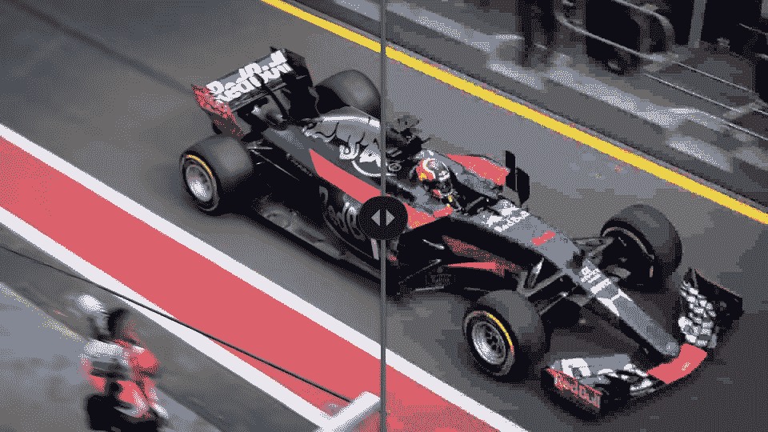

# Android 12 发布了第一个开发者预览版，并为开发者带来了很多改变

> 原文：<https://www.xda-developers.com/android-12-developer-preview-1/>

Android 操作系统已经存在多年了，它已经成为移动设备的主导操作系统。虽然 Android 作为一个平台已经成熟了很多年，但是仍然有改进的空间。谷歌现在正在发布其下一个升级版本的第一个版本，Android 12。Android 12 开发者预览版 1 已经发布，它带来了一些变化，使 Android 更直观、性能更好、更安全。

在我们继续之前，这里有一些需要重复的事情:这个开发者预览版，顾名思义，只面向开发者，以便他们可以尝试即将到来的操作系统，并测试他们的应用程序以适应引入的变化。这意味着这是一个非常粗糙的操作系统版本，正如预期的那样，但谷歌将在接下来的几个月里根据开发者的反馈对其进行完善。如果你是一个普通用户，你的 Android 12 更新不会在今年下半年之前到来。在那之前，我们建议你不要在手机上显示构建版本，只要阅读我们的报道就能了解 Android 的最新变化！

Android 12 以隐私、更好的用户体验和更好的性能为宗旨，其开发者预览版 1 引入了:

*   [信任和安全](#android12trustandsafety)
    *   WebView 中的现代 SameSite cookie 行为
    *   受限网络链接 MAC
    *   更安全地导出组件
    *   更安全地处理意图
*   [更好的用户体验工具](#android12betteruserexperiencetools)
    *   兼容媒体转码
    *   avi 图像支持
    *   前台服务优化
    *   丰富内容插入
    *   触觉耦合音频效果
    *   多声道音频
    *   手势导航的沉浸式模式改进
    *   通知 UI 更新
    *   更快、更具响应性的通知
    *   改进了 Binder IPC 调用
*   [应用兼容性](#android12appcompatibility)
    *   项目主线/ Google Play 系统更新:艺术和更多
    *   针对平板电脑、可折叠设备和电视进行优化
    *   更新了非 SDK 接口列表
    *   更容易的测试和调试更改
    *   平台稳定性里程碑
*   [如何下载](https://www.xda-developers.com/how-to-download-android-12/)和[如何安装 Android 12](https://www.xda-developers.com/how-to-install-android-12/) 开发者预览版 1

* * *

谷歌希望在保证安卓设备安全的同时，给用户更多的透明度和控制权。Android 12 带来了对可用于跟踪的标识符的新控制，应用程序组件的更安全的默认设置，等等。

### WebView 中的现代 SameSite cookie 行为

WebView 正在更新，以适应谷歌 Chrome 和其他浏览器在 SameSite cookie 行为方面的变化。这将提供额外的安全性和隐私性，并让用户对如何跨站点使用 cookies 有更多的透明度和控制。

### 受限网络链接 MAC

谷歌希望开发者迁移到保护隐私的可重置标识符。为此，它采取了多版本的努力，以方便设备范围的 Netlink MAC 的迁移。Android 11 将对设备范围的 Netlink MAC 的访问限制为 API 级别 30，而在 Android 12 中，该限制适用于所有应用程序，无论 targetSDK 级别如何。

### 更安全地导出组件

以前的 Android 版本上的应用程序可能会无意中导出活动、服务和接收者。谷歌正在改变安卓系统的默认处理方式；导出的属性在 Android 12 中更加明确。在 Android 12 中，声明一个或多个意图过滤器的组件现在必须显式声明一个*Android；导出的*属性。谷歌建议开发者检查清单中的组件，以避免与变更相关的安装错误。

### 更安全地处理意图

Android 12 要求应用为每个 PendingIntent 明确声明一个可变性标志，要么是 *FLAG_MUTABLE* 要么是新的 *FLAG_IMMUTABLE* 。这将使处理待定内容更加安全。

* * *

如果不对用户体验进行更多的改进，任何更新都是不完整的，Android 12 也不例外。

如今，大多数移动设备都带有 H.265 / HEVC 硬件编码，允许相机应用程序以 HEVC 格式进行捕捉，因为它在质量和压缩方面比旧的编解码器有了显著的改进。大多数应用程序支持 HEVC，但仍有少数不支持它。对于这些应用，谷歌正在推出与 Android 12 兼容的媒体转码。

通过这一功能，不支持 HEVC 的应用程序可以让平台自动将文件转码为 H.264 / AVC，这种格式具有更广泛的兼容性。正如人们所料，转码过程将需要一些时间，具体取决于视频和智能手机的硬件属性。谷歌提供了 Pixel 4(骁龙 855)的例子，它需要大约 9 秒来转码 1 分钟的 1080p 30fps 视频。

开发人员只需声明他们的应用程序不支持的媒体格式，就可以选择使用代码转换服务。谷歌强烈建议应用程序首先支持 HEVC，但如果这是不可能的，那么开发者应该启用兼容的媒体代码转换。该功能将在所有使用 HEVC 格式进行视频捕捉的设备上激活。

### avi 图像支持

Android 12 引入了对 AV1 图像文件格式的平台支持，允许更高的图像质量和更有效的压缩。AVIF 是使用 [AV1](https://www.xda-developers.com/av1-future-video-codecs-google-hevc/) 编码的图像和图像序列的容器格式。AVIF 利用视频压缩的帧内编码内容，与 JPEG 等旧图像格式相比，在相同文件大小的情况下，显著提高了图像质量。

 <picture></picture> 

Left: AVIF (18.2kB). Right: JPEG (20.7kB). Credits: [Image comparison](https://jakearchibald.com/2020/avif-has-landed/demos/compare/?show=f1&img=/c/f1-match-ff75e344.jpg) from AVIF has landed by Jake Archibald

### 前台服务优化

前台服务是一种执行一些用户可察觉的操作的服务，如播放音轨的音频应用程序，从而使用前台服务。这些服务是应用程序管理某些类型的面向用户的任务的重要方式。但当它们被过度使用时，会影响性能，甚至导致应用程序死亡。

以用户体验改善为由，谷歌将阻止针对新平台的应用程序从后台启动前台服务。为了让开发人员更容易从这种启动模式中过渡出来，Android 12 在 JobScheduler 中引入了一个新的加速作业，该作业获得了更高的进程优先级和网络访问权限，并且可以立即运行，而不管节电或休眠等功率限制。为了向后兼容，Google 还在最新发布的 Jetpack WorkManager 库中内置了加速作业。此外，谷歌还将一些前台服务通知的显示延迟了 10 秒。这使得短期任务有机会在显示通知之前完成，减少了用户的注意力分散。

### 丰富内容插入

我们很久以前就已经跨越了我们在电话上的交流仅仅依赖于简单的语音和文本的界限。如今，如果没有图片、视频和其他表达内容，大多数交流都是不完整的。然而，在应用程序内和应用程序间插入和移动这些丰富类型的内容并不容易。

为了让应用程序更容易接收丰富的内容，谷歌推出了一种新的统一 API，允许它们接受来自任何来源的内容:剪贴板、键盘或拖放。开发人员可以将一个名为 *OnReceiveContentListener* 的新接口附加到 UI 组件上，并在通过任何机制插入内容时获得回调。因此，这个回调成为应用程序代码处理所有类型内容插入的唯一位置，无论是纯文本、样式文本、标记、图像、视频或音频文件等等。

为了向后兼容，Google 在 Androidx 上添加了统一的 API。

### 触觉耦合音频效果

在 Android 12 中，应用程序可以通过手机的振动器提供音频耦合的触觉反馈。此外，振动强度和频率来自音频会话，允许开发人员创建更身临其境的游戏和音频体验。例如，呼叫应用程序也许可以通过触觉反馈使用自定义铃声来识别呼叫者，游戏可以在赛车游戏中模拟崎岖的地形。这里有相当多的可能性可以探索。

### 多声道音频

Android 12 包括了几个带有空间信息的音频增强功能。它在直通和卸载模式下增加了对 [MPEG-H](https://www.iis.fraunhofer.de/en/ff/amm/broadcast-streaming/mpegh.html) 回放的支持。混音器、重采样器和效果已经针对多达 24 个通道进行了优化(之前的最大值是 Android 11 上的 8 个)。

### 手势导航的沉浸式模式改进

Android 12 带来了一个表面上看起来非常重要的变化。在全屏或沉浸式应用程序体验中，Android 12 将允许用户默认通过一次滑动来导航手机。在这些全屏体验中，操作系统仍将保护应用程序免受意外手势的影响。我们将会拿到开发者预览版来弄清楚到底发生了什么变化，因为措辞并没有完全体现出变化。

### 通知 UI 更新

正如你可能已经在[泄露的 Android 12 截图](https://www.xda-developers.com/android-12-first-look-screenshots/)中发现的那样，通知将会得到一点润色，使它们更现代、更容易使用、功能更多。Google 提到从抽屉和控件到模板本身都有变化。过渡和动画也在优化，使它们更流畅。面向 Android 12 的应用程序也可以访问带有图标和其他变化的自定义内容的通知，以匹配所有其他通知。我们将在实践中仔细观察这些变化。

### 更快、更具响应性的通知

通知应该提供一个清晰快捷的路径来到达应用程序中的某个部分。出于这个原因，开发人员需要确保通知点击直接触发活动，而不是使用中间广播接收器或服务来启动活动(这种方法被谷歌称为通知蹦床)。通知蹦床会导致明显的延迟并影响用户体验，因此，Android 12 将通过阻止这些通知蹦床启动其目标活动来阻止它们。谷歌要求开发者放弃这种做法。这一变化仅适用于针对新平台的应用程序，但对于所有应用程序，谷歌将显示一个祝酒词，让开发者和用户都能看到蹦床。

### 改进了 Binder IPC 调用

Google 一直致力于通过优化延迟和工作负载分布来减少系统可变性，从而减少 99%百分比用例的平均体验。这导致了对系统绑定器调用的改进，增加了轻量级缓存策略，并专注于消除锁争用以改善延迟分布。谷歌声称，这在整体上使 Binder 调用的性能提高了约 2 倍，在特定调用上有显著改善，如*refContentProvider()*(47 倍改善)、*release wakelock()*(15 倍改善)，以及*job scheduler . schedule()*(7.9 倍改善)。

* * *

## Android 12 中的应用兼容性

在这一节中，Google 谈到了让开发者和用户的更新更快更流畅。面向应用的变化正在选择加入，以给开发者更多时间来适应新平台。

### 项目主线/ Google Play 系统更新:艺术和更多

正如我们去年发现的那样，谷歌正在将艺术转变为项目主线模块。这将允许谷歌提高运行时性能和正确性，更有效地管理内存核心，并使 Kotlin 操作更快——所有这些都不需要完整的系统更新。

此外，这篇新闻中提到的一些功能也将通过项目主线交付。例如，无缝转码功能正通过一个可更新的模块交付，这表明这很可能是 Android 的未来。

### 针对平板电脑、可折叠设备和电视进行优化

谷歌还发布了第一个 Android 电视的 Android 12 预览版。这样，你不仅可以在电视上获得最新的 Android 功能，还可以测试新的[谷歌电视](https://www.xda-developers.com/new-google-tv-interface-replace-android-tv-ui/)体验。

### 更新了非 SDK 接口列表

在这个版本中，谷歌[限制了额外的非 SDK 接口](https://developer.android.com/about/versions/12/non-sdk-12)。

### 更容易的测试和调试更改

随着 Android 11 的推出，谷歌允许通过选择加入切换开发者选项或 ADB 单独呈现的更改来更容易地测试和调试更改。

### 平台稳定性里程碑

就像去年一样，谷歌正计划在这个版本中达到平台稳定性里程碑，让开发人员对最终的 SDK/NDK API 和所有最终的内部 API 以及他们需要准备应用程序的面向应用程序的系统行为有具体的了解。谷歌预计在 2021 年 8 月达到 Android 12 平台的稳定性。

* * *

## 下载并安装 Android 12 开发者预览版 1

你可以从我们的专门文章中的链接轻松下载最新的 Android 12 开发者预览版。

Google 正式发布了这个开发者预览更新:

此外，我们为 Android 12 开发者预览版 1 提供了[安装说明，用于上述 Pixel 设备的常见安装路径，如 Recovery、ADB 和 Fastboot，并通过 GSI 用于所有其他 Project Treble 兼容设备。](https://www.xda-developers.com/how-to-install-android-12/)