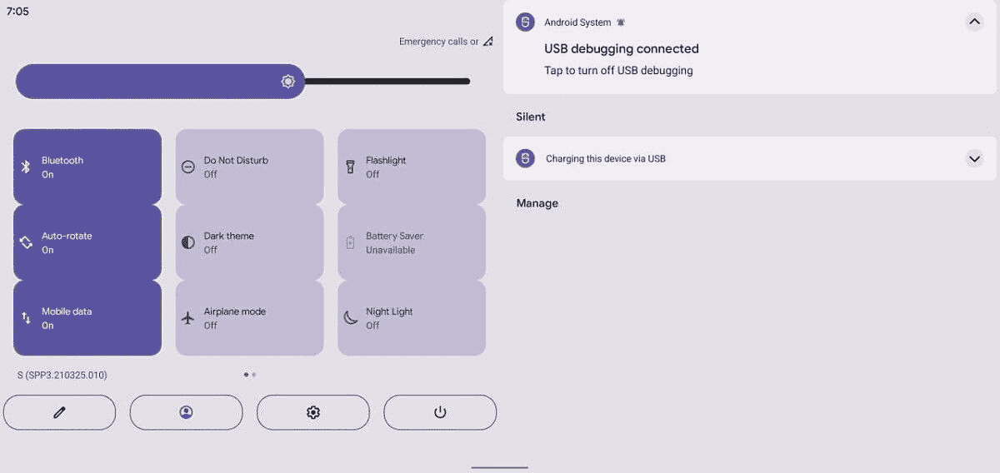
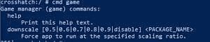

# Android 12 DP3 解析:这里是所有隐藏的功能！

> 原文：<https://www.xda-developers.com/android-12-dp3-hidden-features/>

不到一个月，谷歌将在谷歌 I/O 上揭开 Android 12 的神秘面纱，但在此之前，我们刚刚得到了 T2 第三次开发者预览 T3。DP3 包含了一些新的 API 和[明显的面向用户的变化](https://www.xda-developers.com/android-12-dp3-features/)，但是和往常一样，它也包含了大量隐藏的变化。我们一直在挖掘该版本，以了解即将到来的 Android 12 的所有内容，这里是我们在开发者预览版 3 中发现的内容的总结。

快速说明:今天的 DP3 版本实际上比我们上周详述的[泄露的 Android 12 版本](https://www.xda-developers.com/android-12-beta-features-leak/)更老。我们在泄露的版本中发现的一些功能现在对所有用户都是[可用的，但是他们中的许多是不可用的。事实上，我们发现的一些隐藏功能的代码——比如用于应用程序 UI 翻译的](https://www.xda-developers.com/android-12-dp3-features/)[框架](https://www.xda-developers.com/android-12-app-ui-translation/)——甚至还没有被添加到 DP3 中。相反，有一些功能，如改进的游戏面板和新的快速设置面板设计，我们将在下面详细介绍，我们无法在泄露的版本中激活。我不会重复我们之前在泄露的版本中发现的 DP3 中的每一个隐藏的变化，但我会记录下证实我们在泄露的版本中发现的变化。

现在这个问题已经解决了，下面是我们对 Android 12 开发者预览版 3 的分析。特别感谢开发者 kdrag0n 与我们合作，并在聊天中分享他们的许多发现！

APK 拆卸通常可以预测应用程序未来更新中可能出现的功能，但我们在这里提到的任何功能都可能不会出现在未来的版本中。这是因为这些特性目前还没有在实时构建中实现，并且可能会被开发人员在未来的构建中随时引入。

* * *

## 浏览这篇文章

* * *

## Android 12 DP3 中隐藏的功能

### 工程中的主要快速设置重新设计

我们已经隐约感觉到 Android 12 将会有一个重大的 UI 革新，但是随着每一个新的开发者预览版的发布，我们已经意识到 UI 的改变将会比我们预期的更加剧烈。在 Android 12 DP1 中，我们[启用了新的快速设置面板设计](https://www.xda-developers.com/android-12-new-lockscreen-notifications-design-leak/)，有不透明的背景、更厚的亮度滑块和无标签的磁贴。在泄露的版本中，我们[发现](https://www.xda-developers.com/android-12-beta-features-leak/#android12leakbrightnesslider)谷歌正在调整隐藏的厚亮度滑块，使厚的部分反映当前的亮度水平。

现在在 Android 12 开发者预览版 3 中，开发者 kdrag0n 发现了一种完全不同的快速设置面板设计，它采用了相同的亮度滑块，但将小而圆的快速设置磁贴变成了更大的矩形磁贴。这些较大的图块包含标签和子标签(如果有)。这些单幅图块排列成 4 行，每行包含 3 个单幅图块，在一个页面上总共有 12 个快速设置单幅图块。内部版本号现在显示在编辑按钮的上方，该按钮现在被包围在一个椭圆形中。设置重心也被包围在一个椭圆形中，但被移到了中心。最后，右下角现在有一个电源按钮，当按下时，应该会打开一个“精简”版本的电源菜单。目前这还不行，但这是我们基于代码分析得出的结论。

快速设置面板中电源按钮的出现终于回答了我们在使用泄露的 Android 12 版本后的问题:如果你[启用新的“等待助手”手势](https://www.xda-developers.com/android-12-beta-features-leak/#android12leakpowerbuttonassistant)，如何打开电源菜单？在该版本中，启用“等待助手”手势劫持了电源按钮，因此它将启动谷歌助手。然而，你没有办法进入电源菜单，这就是为什么谷歌还为设备控制和钱包添加了[两个新的快速设置磁贴](https://www.xda-developers.com/android-12-beta-features-leak/#android12leaknewqstiles)(它们都显示在电源菜单中)。使用 QS 面板中的新电源按钮，无论您是否使用“等待助理”手势，您都可以随时访问电源菜单。(顺便说一句，DP3 中有“等待助手”的代码，但该功能在默认情况下是不可用的。)

在平板电脑等大屏幕设备上，用户界面分为两个窗格:一个包含改进的快速设置设计，另一个是通知。很高兴看到谷歌做出更多对平板电脑友好的设计改变。值得注意的是，该公司还在为平板电脑开发一个[双窗格主屏幕，以及一个尺寸可调的锁定屏幕(下文将详细介绍后者)。](https://www.xda-developers.com/android-12-beta-features-leak/#android12leakdualpanelhomescreen)

 <picture></picture> 

Credits: kdrag0n

### 闹钟和钱包的快速设置磁贴

如果你注意到上面的一个截图，有一个标题写着“Google Pay ”,下面写着“Ready”。这就是我所说的“钱包”快速设置磁贴，它所做的只是启动[快速访问钱包](https://www.xda-developers.com/android-10-11-developer-preview-quick-access-wallet-google-pay/)功能，让您快速更改默认的支付卡。我们推测它从快速设置磁贴变得可访问的原因是为即将到来的“等待助手”手势做准备。

另一个正在变成快速设置磁贴的功能是状态栏中即将到来的警报指示器。正如你在上面看到的，如果设置了下一个闹铃，这个图标只是显示下一个闹铃响起的时间。

### 游戏模式增加游戏优化设置

在 Android 12 的第一个开发者预览版中，我们发现了一个[新游戏工具栏](https://www.xda-developers.com/android-12-hidden-gaming-mode-toolbar/)的工作，它漂浮在屏幕上，有一个用于捕捉屏幕记录的按钮和另一个未知用途的按钮。我们后来发现，这个游戏工具栏是谷歌正在为其 Pixel 设备开发的更广泛的“游戏仪表板”功能的一部分。[我们在游戏仪表盘上的第一眼](https://www.xda-developers.com/android-12-dp2-hidden-features/#android12dp2gamedashboard)显示了一个不完整的用户界面，上面有一些不起作用的按钮和一个 YouTube 直播快捷方式。

Android 12 开发者预览版 3 通过使按钮功能化和添加新的“游戏优化”卡，继续在游戏仪表板上工作。点击时，按钮会向浮动工具栏添加一个新图标。这些按钮可让您截屏、录制屏幕、显示当前 FPS 或切换“请勿打扰”模式。与此同时，游戏优化菜单允许你在游戏中设置设备的性能模式。您可以选择“性能”来最大化帧速率，“标准”来平衡电池寿命和性能，以及“电池节电”来降低帧速率和减少功耗。目前还不清楚这些选项究竟如何影响性能、帧速率和电池寿命，但我们将在未来的 Android 12 版本中关注该功能的进展。

虽然我们无法让 FPS 计量器工作，但开发者 kdrag0n 与我们分享了几张截图，显示了 FPS 在“我们中间”的开始屏幕中的变化

 <picture></picture> 

Credits: kdrag0n

我们还确认了游戏仪表板有一个附带的命令行界面，可以通过在 shell 中运行“`cmd game`”来访问。CLI 相当简单，只包含一个命令来“缩小”分辨率，以强制应用程序以指定的缩放比例运行。例如，将“ [DevCheck](https://www.xda-developers.com/devcheck-hardware-system-information-app/) ”应用程序缩小到 0.5 的缩放比例会导致它认为我的 Pixel 3 XL 的显示分辨率是 1480 x 720，而不是 2960 x 1440。分辨率的改变可能会迫使一些游戏选择更低分辨率的纹理和渲染设置，从而提高性能和电池寿命。在 shell 中运行“`wm size`”命令也可以完成同样的事情，但是新的“`cmd game`”实现是基于每个应用程序的，而不是影响每个应用程序的显示 UI。

 <picture></picture> 

Credits: Mishaal Rahman

### 平板电脑单手锁屏

我们之前提到过，谷歌正在为平板电脑做一些受欢迎的设计改变。现在，我们已经了解了另一个应该会让平板电脑用户高兴的 Android 12 UI 变化:单手友好的 PIN/图案锁屏。启用时，引脚/图案视图会移至左侧或右侧，而不是位于中间。显然，大多数平板电脑都不能用一只手握着，但这一变化意味着你在输入 PIN 码或图案时，不必费力地用双手握着平板电脑。

### 更好的基于壁纸的深色壁纸主题

Android 12 新的基于壁纸的主题系统将为你应用的每一个新壁纸涂上一层新的油漆。颜色是基于当前壁纸动态生成的，但正如我们在之前的版本中看到的，它仍然是一个正在进行中的工作。虽然新的主题系统在系统的亮模式打开时看起来很棒，但在系统的暗模式打开时看起来就不那么精致了。例如，设置纯黑色壁纸导致应用深紫色主题，这是相当不匹配的颜色。然而，现在设置黑色壁纸会导致应用深灰色主题，这与较深的壁纸颜色非常匹配。

提醒一下，这个基于壁纸的主题系统，代号为“莫奈”，默认情况下仍然没有启用。谷歌仍在调整框架，让自定义颜色应用于 UI 的更多部分，我们也看到了颜色选择算法的增强。很明显，谷歌希望在稳定的 Android 12 发布之前得到它。

### 应用程序休眠从未使用的应用程序中释放空间

我们上周发现的一个令人惊讶的流行功能也出现在 Android 12 DP3 中:应用程序休眠。如果一个应用程序几个月没有使用，该功能将自动撤销权限，暂停通知，并删除临时文件。这些临时文件来自应用程序的缓存或编译工件。

### 下一个 Pixel Stand 会有风扇？

在分析最新的 SystemUI APK 时，我们发现谷歌已经将其特定像素的无线充电实现更新到 1.3 版本。新的类引用了一个“风扇模式”，带有类似“currentRpm”、“maximumRpm”和“minimumRpm”的参数。“风扇模式”可以是“内置的”或“固定的”。在我看来，这听起来像是谷歌准备为一个带风扇的无线充电配件添加支持。如果是这样的话，我们可以看到发生这种情况的唯一原因是无线充电器可以传输更多的电力，即。这样更快。不过，我们没有更多的证据，所以我们暂时不考虑任何进一步的猜测。

### 杂项隐藏更改

*   充电的新涟漪效应。Android 12 DP3 有一个波纹动画的隐藏代码，当你插上充电器时就会播放。这已经被 kdrag0n 证实并激活，但它与我们上周在泄露的版本中发现的内容完全一致。
*   定制时钟即将推出。kdrag0n 告诉我们系统现在支持时钟主题化。模拟时钟可以有小时、分钟和秒针颜色。我们之前发现的证据表明，谷歌正在为 Android 12 开发一个像素专属的定制时钟插件,这一最新发现只是增加了这一说法的可信度。
*   “材料下一个”命名返回。kdrag0n 在 Android 12 DP3 的框架代码中发现了更多关于“Material NEXT”代号的引用，证实了我们之前发现的 Android 下一代 UI 变化的名称。

* * *

这就是我们到目前为止挖掘 Android 12 开发者预览版 3 发现的所有隐藏变化。如果我发现更多细节，我会在[这个 Twitter 帖子](https://twitter.com/MishaalRahman/status/1384929554997841929)中分享。kdrag0n 还保持着一个运行中的 [Twitter 线程](https://twitter.com/kdrag0n/status/1385003171714531328)，你可以关注它以获得更多发现。

*感谢 PNF 软件为我们提供了使用* *[JEB 反编译](https://www.pnfsoftware.com/?aid=xdadev)* *的许可，这是一款针对 Android 应用的专业级逆向工程工具。*