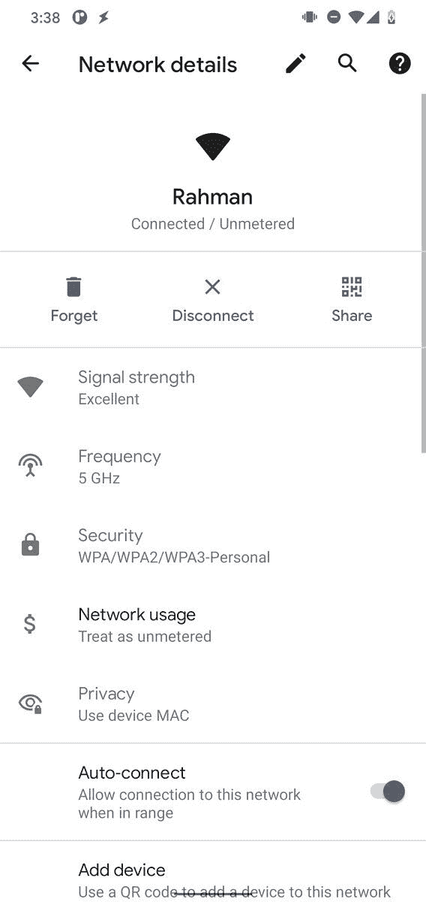

# Android 12 可能会让你和附近的任何人分享你的 WiFi 密码

> 原文：<https://www.xda-developers.com/android-12-nearby-share-wifi-password/>

当你想和很多人分享你的 WiFi 密码时，这样做很快就会变得很乏味。告诉人们密码是一种选择，但这让你无法控制谁和什么设备可以连接到你的网络(这也促使你使用更简单的密码)。自己输入是另一种选择，但是你可以想象在几十个设备上输入它会有多烦人。如果你有一部运行 Android 10 的手机，你可以很容易地以二维码的形式分享你的 WiFi 密码[。由于 Wi-Fi Easy Connect 协议，通过扫描二维码登上 WiFi 设备成为可能，尽管这是一种更简单、更安全的添加新设备的方式，但仍有一些缺点。令人欣慰的是，谷歌正在研究一种更简单的方法来分享你的 WiFi 密码，它可能会在即将到来的](https://www.xda-developers.com/android-q-beta-changes-google-pixel/#gallery-10:~:text=Wi%2DFi%20network%20sharing%20via%20QR%20codes) [Android 12](https://www.xda-developers.com/android-12/) 发布中首次亮相。

 <picture></picture> 

Sharing your WiFi password on Android 10+ is easy. All you have to do is go to the network details page for a WiFi network and tap "share" to bring up a QR code that others can scan, or you can tap "add device" to scan the QR code on another person's device to add it to the network.

通过二维码提供设备的问题是，它要么涉及到物理地举起一个人的手机扫描另一个手机上的二维码(想象一下在一个挤满人的拥挤房间里这样做)，要么涉及到扫描打印出来的二维码(这使得更难控制谁可以访问)。)幸运的是，谷歌正在开发一种解决方案，让你可以使用该公司的附近分享功能，更容易地与他人分享生成的二维码。(是的，你可以截取“共享 Wi-Fi”页面的截图，然后通过附近的 Share 发送过来，但对于许多发送者来说，这样做可能并不明显，而且还需要接收者知道如何使用谷歌镜头之类的东西来扫描二维码。)

谷歌工程师阿贝尔·特斯法伊向 AOSP 提交了一份新的申请，试图修改“共享 Wi-Fi”页面，实现一个附近的共享按钮。当点击时，默认的附近共享组件就会启动(这是[谷歌在所有认证的 Android 设备上的附近共享](https://www.xda-developers.com/google-nearby-share-file-sharing-airdrop-clone-android-rolling-out/)，因此用户可以与任何附近的同行共享二维码。由于 Nearby Share 在很近的地方工作，但不需要物理接触或扫描任何代码，这意味着您可以在房间的另一端共享您的 WiFi 密码。另外，共享任何文件都需要发件人和收件人的同意，所以我们假设共享 WiFi 凭据也是如此。

由于这个提交还没有合并，我们还不能确定这个功能是否会出现在 Android 12 中。像这样的功能可能还有时间进入下一个 Android 版本，但增加新功能的窗口正在关闭。第一个 Android 12 开发者预览版可能会在下个月的某个时候上线，尽管现在的合并可能意味着我们要等到第二个或第三个开发者预览版才能看到这个功能。如果这个提交被合并，如果它出现在正式的 Android 12 版本中，或者如果它被废弃，我们将更新这篇文章。

*特色图片:使用二维码在 Android 11 上分享您的 WiFi 密码*