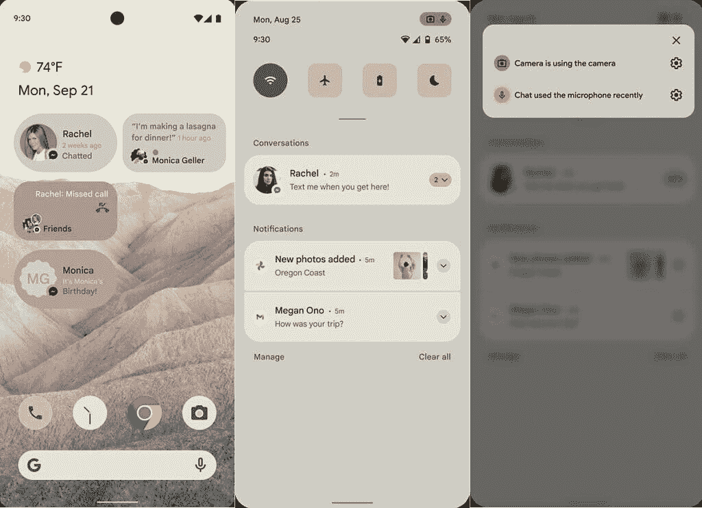
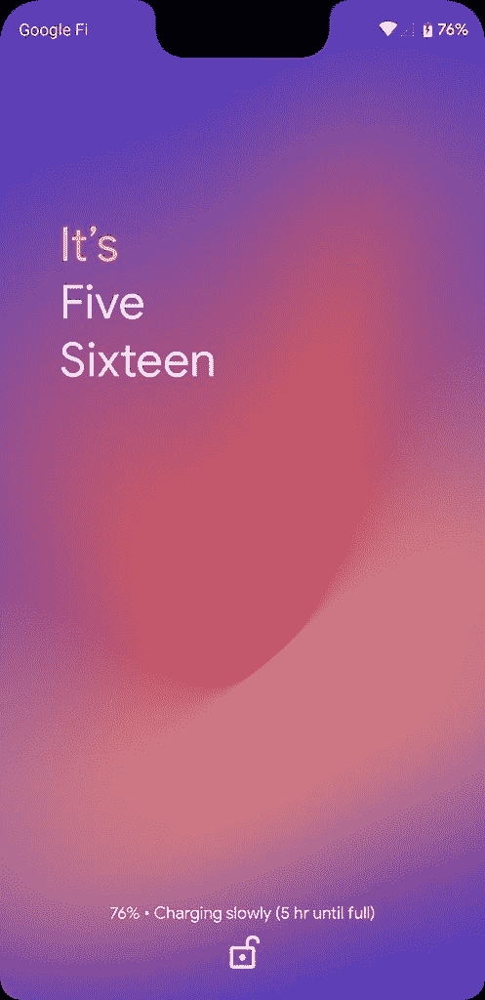

# Android 12 可能会在“下一步”引入许多 UI 更改

> 原文：<https://www.xda-developers.com/android-12-ui-changes-material-next/>

上周，我们发布了一些图片，描绘了谷歌下一个 Android 操作系统版本 [Android 12](https://www.xda-developers.com/android-12/) 的主要 UI 变化。这些图片来自谷歌与其 OEM 合作伙伴分享的一份文件，可能是旨在展示 Android 12 增强的主题功能的实体模型。在[我们获得的几张图片中](https://www.xda-developers.com/android-12-first-look-screenshots/)，我们只瞥见了通知面板 UI、主屏幕、隐私设置和谷歌相机应用。虽然我们假设任何用户界面的改变都是新主题化系统的结果，但似乎还会有更多的用户界面的改变。

展示 Android 12 部分用户界面的早期设计模型。

首先，我们已经了解到谷歌已经在内部将其通知用户界面的一些变化称为“下一步材料之路”的开始。自最初推出以来，谷歌的材料设计指南已经发生了显著的变化。最近，指导方针发展到鼓励公司在材料设计上采用他们自己的身份。比如谷歌的应用一般都遵循公司的[“素材主题”设计](https://www.xda-developers.com/material-design-revamp-material-theming-tool/)。虽然我们不知道“NEXT”的设计材料会有什么变化，但考虑到我们在上周的 Android 12 泄露中看到的情况，这些变化可能会很大。我们怀疑材料“下一步”将是新设计指南的实际名称；毕竟，谷歌从未对外称其材料主题变化为“材料设计 2.0”，尽管我们知道[内部是这么称呼的](https://www.xda-developers.com/chromium-gerrit-material-design-2-colors/)。我们也不知道材料的下一个变化是否将包括不仅仅是通知。然而，我们知道谷歌在 Android 12 中有更多的用户界面变化。

比如谷歌准备在 Android 12 中调整 Always on Display 和锁屏的布局。一些正在开发的更改包括移动“始终显示”的通知图标，使它们不再位于新布局的中心，移动时钟视图和智能空间以与顶部对齐，将底部注销按钮和所有者信息移动到锁定屏幕的底部而不是键盘守卫视图中，并将像素的当前播放文本添加到锁定屏幕上的旋转文本中。也可能会有新的 AOD/锁屏转换，但我们不知道他们会是什么样子。然而，这些布局和过渡变化可能不会出现在 Android 12 开发者预览版中，因为谷歌正准备使用“GX”(Google Experience？)叠加。

Android 12 还有几个其他的锁屏 UI 变化正在开发中。据说谷歌最终调整了用于锁屏的模式锁的用户界面。他们还在努力将 [Android 的设备控制功能](https://www.xda-developers.com/android-11-power-menu-device-controls-smart-home-dream/)集成到锁定屏幕的一个对话框中，可以通过键盘底部的“启示”进入。

*左:安卓的锁屏模式 UI。右图:Android 的设备控制 UI。*

谷歌也可能最终在 Android 12 中启用额外的锁屏时钟选项，这一功能自 Android 10 以来一直在开发中。in-development 特性中最显著的变化之一是为 TypeClock 表面添加了一种渐变颜色，这种颜色根据硬编码的时间进行调整。

 <picture></picture> 

Text lock screen clock

正如我们在上周泄露的 Android 12 图片中看到的，通知面板正在进行重大更改。最显著的变化来自于新的基于壁纸的主题系统，代号为“莫奈”泄露的图片中展示的特定主题可能被称为“丝绸”，它可以作为谷歌对 Android 12 的增强主题系统的代表。“丝绸之家”在内部的多个地方出现，似乎这个主题是“SilkFX”应用程序的一部分。新的“丝绸”风格也将兼容用于电视的 Android(即[谷歌电视/安卓电视](https://www.xda-developers.com/new-google-tv-interface-replace-android-tv-ui/)，尽管我们不知道它在电视上会是什么样子。我们了解到，谷歌也在测试 UI 的变化，如通知面板中更厚的亮度滑块；减少水平边距、填充和分隔线高度；和可能的两列通知阴影。我们还没有展示这些变化的图片。

谷歌也在测试对快速设置面板的改变，这可能会引起争议。在 Android 12 中，谷歌正准备将 QS 磁贴标签移到一边。这项功能的原型开发始于 12 月下旬，但似乎这项功能在本月初就已经准备好了。启用后，QS 单幅图块仅显示在两列中。我们不确定这看起来会怎么样，但是 [Android 11 对快速设置密度](https://www.xda-developers.com/android-11-media-controls/)的改变已经引起了争议——任何在单个页面上显示的快速设置磁贴数量的进一步减少无疑会更有争议。

Android 11 在通知阴影中引入了媒体播放器，减少了展开状态下显示的 QS 磁贴数量。

接下来，我们看到谷歌正在试验的“信箱”功能。这些“信箱”似乎是将应用程序放入框架/窗口的一种新方式，它们将有可调的圆角和可配置的背景颜色。不过，我们并不完全确定这将被用来做什么。

对于没有[自带闪屏](https://www.xda-developers.com/android-oreo-splash-screen-api/)的第三方应用，Android 12 可能会根据当前的 DayNight 主题设置生成一个或亮或暗的默认闪屏窗口。这可能是改善应用程序启动体验的更广泛努力的一部分。

最后，为了提高 Android 的系统级主题化能力，Android 的运行时资源覆盖(RRO)特性得到了重大升级。传统上，rro 是需要安装在设备上才能激活的 APK 包，但 Android 12 现在可以动态生成非 APK rro。看看如何使用它会很有趣，但我们猜测这将开放生成大量自定义主题的能力，这些主题不需要作为系统级应用程序安装。目前，大多数使用 RRO/OMS API 的主题包都作为静态包安装在只读分区中。动态生成 RRO 包可能会让 Android 12 的新“monet”主题系统成为可能。