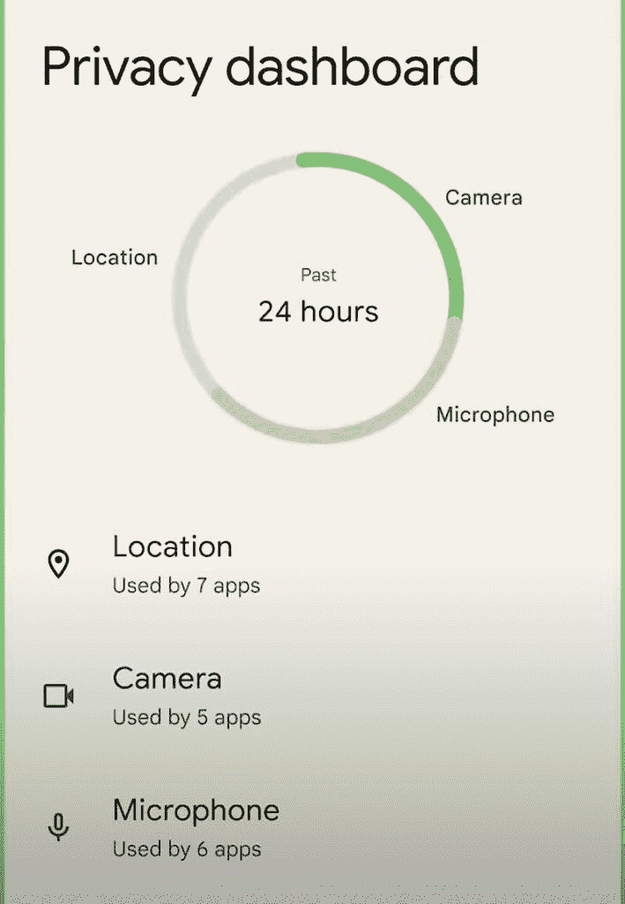
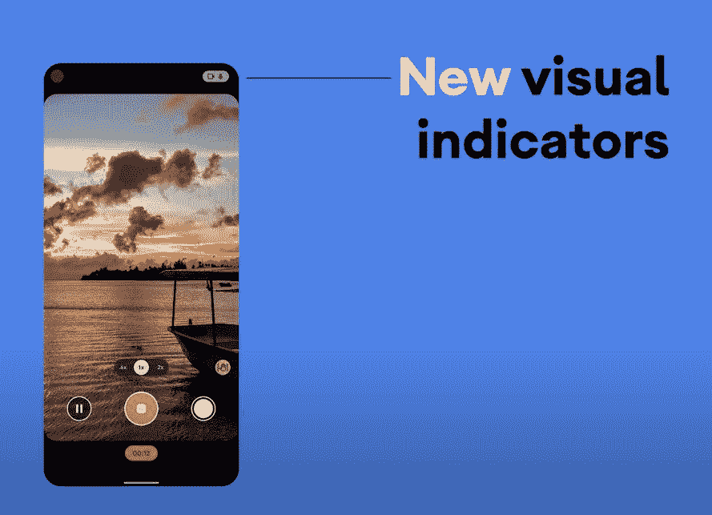
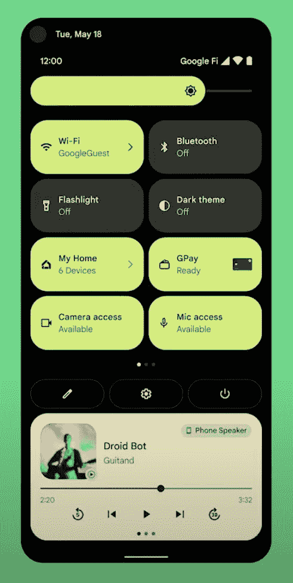

# Android 12:关于谷歌新的大更新，你需要知道的一切！

> 原文：<https://www.xda-developers.com/android-6-0-marshmallow-comes-along-with-final-developer-preview/>

Android 是世界上最受欢迎的智能手机操作系统，在超过 30 亿部智能手机上运行。因此，即使是操作系统中最微小的变化也有可能影响数百万用户。但由于 Android 更新的发布方式，这些变化是否真的有所不同还存在争议。尽管如此，我们一直期待着下一个大的 Android 更新，希望它能带来重大变化。说到这里，Android 12 现在以其稳定的形式从 [Pixel 6 和 Pixel 6 Pro](https://www.xda-developers.com/google-pixel-6/) 开始正式发布。如果你错过了我们之前的报道，这里是我们知道的关于 Android 12 的每一件事。

* * *

## Android 12 真的叫“雪锥”吗？

Android 12 被称为...安卓 12。谷歌在 Android 10 中抛弃了甜点主题的名字。所以我们得到的只是 Android 12。简单明了，易于理解。

也就是说，谷歌继续在其内部代码库中使用甜点主题的名称。Android 10 在内部被称为 Quince Tart，Android 11 是红色天鹅绒蛋糕，我们知道 [Android 12 在内部被称为 Snow Cone](https://www.xda-developers.com/android-12-snow-cone-dessert/) 。

## Android 12 什么时候发布的？

谷歌早些时候分享了 Android 12 的开发者预览版、测试版和稳定版的大致时间表。2021 年 10 月 4 日，谷歌正式推出 Android 12。然而，从 10 月 19 日开始，它可以安装在 Pixel 手机上，这是 Pixel 6 发布的同一天。目前体验 Android 12 的最佳方式是通过 Pixel 设备。如果你正在寻找一款新手机，你可以看看我们的 [Pixel 6 Pro 评测](https://www.xda-developers.com/google-pixel-6-pro-review/)，看看谷歌在 2021 年的旗舰手机上有什么。

Android 12 开发者预览计划从 2021 年 2 月开始运行，直到 10 月 4 日向 AOSP 和原始设备制造商最终公开发布。

### Android 12 开发者预览版

Android 12 [通过第一个开发者预览版](https://www.xda-developers.com/android-12-developer-preview-1/)首次亮相，于 2021 年 2 月 18 日开始推出。谷歌随后[发布了一个小补丁](https://www.xda-developers.com/android-12-developer-preview-1-1-google-pixel/)，解决了用户在使用第一个开发者预览版时遇到的几个错误和问题。 [Android 12 开发者预览版 2](https://www.xda-developers.com/android-12-developer-preview-2/) 于 2021 年 3 月 17 日上线，而 [Android 12 开发者预览版 3](https://www.xda-developers.com/google-android-12-developer-preview-3-features/) 于 2021 年 4 月 21 日上线。

顾名思义，Android 12 开发者预览版允许开发者开始平台迁移，并开始应用程序的适配过程。谷歌在预览中详细介绍了所有主要的平台变化，以告知整个 Android 生态系统即将到来的变化。

开发者预览版仍然很不稳定，并且不适合普通用户。Google 也保留在此阶段添加或删除功能的权利，因此如果您看到第一个开发者预览版中的某个功能在后续版本中缺失，请不要感到惊讶。开发者预览也仅限于受支持的谷歌 Pixel 设备。

### 安卓 12 测试版

在几个开发者预览版发布之后，我们进入了 Android 12 测试版，第一个测试版将于今年 5 月 18 日发布，作为 Google I/O 2021 公告的一部分。这些测试版更加完美，让我们对最终的操作系统版本有了一个大致的了解。在测试版之间也有一些小版本，主要是修复任何关键的错误。第二个测试版于 6 月 9 日发布，第三个测试版于 7 月 14 日发布，第四个测试版于 8 月 11 日发布。

除了支持谷歌 Pixel 设备，Android 12 Beta 1 还以 GSI 的形式推出，可以在更广泛的设备上播放。原始设备制造商也加入了这个派对，你可以在以下手机上 flash Beta 1:

第一个测试版本是基于 AOSP 的。然后，原始设备制造商开始将他们的 UX 皮肤移植到 Android 12 的测试版，并随后开始为他们自己的“预览”程序招募人员。同样，这些预览版程序中的错误是意料之中的，因此，它们只推荐给开发人员和高级用户。

我们针对不同品牌的多个定制用户界面测试了 Android 12 的测试版。可以看看我们对 [Realme UI 3.0](https://www.xda-developers.com/realme-ui-3-hands-on/) 、 [ColorOS 12](https://www.xda-developers.com/oppo-coloros-12-hands-on/) 、 [OxygenOS 12](https://www.xda-developers.com/oxygenos-12-open-beta-oneplus-9-series/) 、 [One UI 4](https://www.xda-developers.com/one-ui-4-beta-features-overview/) 的第一印象。随着更多品牌发布基于 Android 12 的定制皮肤测试版，我们将继续增加这个列表。如果你有三星或一加设备，你也可以在我们的[三星 Android 12 更新跟踪器](https://www.xda-developers.com/samsung-one-ui-4-android-12-update-tracker/)和[一加 Android 12 更新跟踪器](https://www.xda-developers.com/oneplus-oxygenos-12-android-12-update-tracker/)上保持标签，以了解新版本的 UI 何时推出。

### 平台稳定的 Android 12 测试版

在大约三个测试版发布后，Android 12 达到了平台稳定状态，与 8 月 11 日发布的测试版共存。平台稳定性意味着 Android 12 SDK、NDK API、面向应用的表面、平台行为，甚至对非 SDK 接口的限制都已经敲定。

因此，Android 12 的行为方式或 API 在后续测试中的功能不会发生进一步的变化。在这一点上，开发人员可以开始更新他们的应用程序，以针对 Android 12 (API 级别 31)，而不必担心任何意外的变化会破坏他们的应用程序行为。

### Android 12 候选版本

Android 12 发布候选版本于 9 月 8 日以 Beta 5 的形式提供下载。这个版本尽可能接近稳定版本，但不完全是稳定版本。这个版本的基本目标是在向消费者推出之前，捕捉到目前为止尚未发现的任何关键问题。

### Android 12 稳定版

在发布候选版本构建之后，谷歌于 10 月 19 日推出了第一个 Android 12 稳定版。谷歌的 Pixel 设备率先获得了 [Android 12 稳定版](https://www.xda-developers.com/android-12-stable-rollout-google-pixel/)。

对于非像素手机，我们希望在这个阶段看到更广泛的公共测试版。同样的确切时间表将取决于您的手机及其原始设备制造商的计划。一个很好的经验是旗舰机将优先更新，所以如果你有一部价格较低的手机，你可以期待几周或几个月后收到更新。

## 我的设备会得到 Android 12 吗？

问题“我的设备会得到 Android 12 吗？”很大程度上取决于你的设备。

谷歌已经正式向这些设备提供了更新:

这些受支持的谷歌 Pixel 设备在整个发布周期的第一天就获得了 Android 12 更新。谷歌 Pixel 6 和 Pixel 6 Pro 也推出了开箱即用的 Android 12。

对于不支持的谷歌 Pixel 设备和非 Pixel 设备，答案相当复杂。不受支持的像素不会从谷歌获得这些更新，但他们应该可以在发布时安装 GSI。非像素设备完全由原始设备制造商决定，以及它如何存在于他们的产品系列中。有理由认为，像华硕的 Zen UI 这样更轻的 UX 皮肤将首先将他们的旗舰产品升级到 Android 12 基础。相比之下，较重的 UX 皮肤，如三星的 One UI 和小米的 MIUI，往往需要更长的时间来重新调整皮肤。

然而，情况并非总是如此，因为浅色的 UX 皮肤被接受的速度同样缓慢，如果不是更慢的话。因此，预测非像素的 Android 12 更新时间表在现阶段非常困难。您可以查看下面的一些更新跟踪器以了解更多信息:

## Android 12 定制 rom

如果你的手机没有得到官方支持，或者你的 OEM 没有为你的智能手机推出 Android 12 更新，你可以随时在 [XDA 论坛](https://forum.xda-developers.com/)上查看是否有针对你的设备的 [Android 12 定制 ROM](https://www.xda-developers.com/android-12-custom-rom/) 。如果你的智能手机没有官方更新，定制 rom 是体验最新安卓版本的好方法。这种情况通常发生在你的手机稍微有点旧的时候，或者如果它是一款中档或预算导向的智能手机，制造商不想为其提供扩展的软件支持。

## Android 12 从哪里下载？

对于受支持的谷歌 Pixel 设备和 GSI，谷歌在其网站上提供了官方软件包。你可以在我们的专门文章中找到 Android 12 的[最新下载链接。](https://www.xda-developers.com/how-to-download-android-12/)

## 如何安装 Android 12

我们有适用于 Android 12 的[安装说明，用于上述受支持的 Pixel 设备的常见安装路径，如 Recovery、ADB 和 Fastboot，以及通过 GSI 用于所有其他不受支持的 Project Treble 设备。](https://www.xda-developers.com/how-to-install-android-12/)

* * *

## Android 12 有什么新功能？

去吃点东西吧，也许是一个甜筒，因为 Android 12 有很多大大小小的变化。所有 Android 版本的颠簸带来了重大变化。虽然过去几年的变化没有 Android 早期的巨大变化那么彻底——这是该平台多年来成熟的标志——但 Android 12 是一个例外。这个版本的 Android 被描述为自 Android 5.0 Lollipop 以来最大的 UX 变化。

我们专注于每个开发者预览版和测试版带来的所有新变化，然后强调我们在泄漏和代码提交中看到的，但在实际构建中尚未看到的变化。

### 关于以前开发者预览的信息。单击以展开部分。

## Android 12 开发者预览版 1 的新功能

你可以在下面找到我们所有的 Android 12 开发者预览版 1 的报道:

*   Android 12 开发者预览 1 -开发中功能:

## Android 12 开发者预览版 1.1 的新功能

如前所述，开发者预览版 1.1 更多的是一个 bug 修复更新。除了解决最初版本中出现的一些 bug 之外，在功能方面似乎没有任何重大变化。该版本还提升了 Android 安全补丁级别。如需了解更多信息，请阅读本文。

## Android 12 开发者预览版 2 的新功能

你可以在下面找到我们所有的 Android 12 开发者预览版 2 的报道:

## Android 12 开发者预览版 2.1 的新功能

Android 12 开发者预览版 2.1 又是一次 bug 修复更新。除了解决最初版本中出现的一些 bug 之外，在功能方面似乎没有任何重大变化。如需了解更多信息，请阅读本文。

## Android 12 开发者预览版 2.2 的新功能

Android 12 开发者预览版 2.2 是另一个 bug 修复更新。功能方面似乎没有什么大的变化。如需了解更多信息，请阅读本文。

## Android 12 泄露的开发者版本有什么新内容

我们得到了一个泄露的版本，它比开发者预览版 2.2 更新，但是还没有发布。你可以在我们对泄露版本中发现的[即将到来的特性的专门报道中读到关于这个版本的所有新变化。](https://www.xda-developers.com/android-12-beta-features-leak/#android12leaksideloading)

## Android 12 开发者预览版 3 的新功能

你可以在下面找到我们所有的 Android 12 开发者预览版 3 的报道:

## Android 12 Beta 1 的新功能:所有已宣布的功能

Android 12 Beta 1 是谷歌发布的最新 Android 版本，与之前的开发者预览版相比，它更接近于我们可以期待看到的下一个 Android 版本。

谷歌的官方声明对具体细节知之甚少，但我们在这个阶段已经看到了太多太多的东西。有趣的事实- [谷歌甚至有一个内部笑话](https://youtu.be/D2cU_itNDAI?t=124)，XDA 主编米沙·拉赫曼偶然发现了一个泄露的 Android 12 版本，并发现了比谷歌当时打算披露的更多的东西。

**[安卓 12 Beta 1 上手:安卓](https://www.xda-developers.com/android-12-beta-1-hands-on/)** 来了个彻底的重新设计

### 物质的你

[料你](https://www.xda-developers.com/material-you/)是 Android 12 上最大的变化之一。泄露过去的[为材料下一个](https://www.xda-developers.com/android-12-ui-changes-material-next/)，材料你就是材料设计的下一个迭代。这种设计语言不会局限于 Android，将会出现在更广泛的谷歌服务中。但对于 Android 来说，这是该操作系统几年来最大的视觉革新之一。它非常注重颜色和定制，允许用户选择自己的颜色样本、对比度、元素大小、线宽等等。

**[这个第三方库把 Android 12 的素材你主题化到任何 app](https://www.xda-developers.com/android-12-material-you-dynamic-theming-library/)**

### 基于壁纸的 UX 主题

与 Material You 齐头并进的是 Android 12 中基于壁纸的 UX 主题引擎。这个功能之前被泄露为“莫奈”，是 OMS 和 RRO 在 Android 平台上多年工作的高潮。

Android 12 现在会根据手机当前壁纸中使用的颜色，在系统 UI 中自动选择一组相关的调色板。颜色将统一应用于锁屏、快速设置、通知面板等元素，甚至新添加的[自适应小工具](https://www.xda-developers.com/google-android-12-widgets-overhaul/)。

谷歌表示，颜色提取系统使用材料颜色目标的聚类算法来确定主色和次主色，然后应用与壁纸匹配的色调。丰富的 5 种颜色(2 种中性色和 3 种强调色)和 12 种材料色可用于确定与用户壁纸最接近的色调。然后应用程序可以从索引中抓取 Android 的系统颜色到调色板中，并以许多不同的微妙方式使用它。小工具甚至可以使用颜色提取功能来与用户在主屏幕上的主题相协调。

这个特性目前还不容易被最终用户使用，但是当它出现在构建中时，你可以通过一些小改动来启用它。不过，Beta 2 中已经提供了这个特性。

**[Android 12 的素材你主题化系统被一个开发者重新创建了](https://www.xda-developers.com/android-12-material-you-theming-system-recreated/)**

### 隐私仪表板

谷歌通过 Android 12 的[隐私仪表盘](https://www.xda-developers.com/android-12-privacy-private-compute-core-privacy-dashboard/)和其他相关变化重新关注隐私。隐私仪表盘将向您显示应用程序何时访问您手机的摄像头、麦克风或设备位置的时间线。Android 12 还将包括新的指示器，以显示手机的摄像头或麦克风何时正在使用。

 <picture></picture> 

New Privacy Dashboard in Android 12

**[这款应用将 Android 12 的隐私仪表盘带到了老手机上](https://www.xda-developers.com/android-12-privacy-dashboard-app-for-older-phones/)**

对于需要位置数据的应用程序，Android 12 也将提供一个新的设置，让你与应用程序分享你的大致位置，而不是你的精确位置。此设置将显示在您可能已经熟悉的位置权限弹出窗口中。

 <picture></picture> 

New visual indicators for camera and microphone in Android 12

Android 12 将在快速设置中包括新的切换，以帮助您通过简单的点击快速禁用所有应用程序的摄像头和麦克风访问。这些开关最初将仅限于 Pixel 设备，但很快就会应用到其他手机上。

 <picture></picture> 

New quick settings toggles for camera and microphone access in Android 12

请注意，这些特性是 Beta 1 发布的一部分(包含在代码中，可以通过软件技巧来实现)。它们是在 Beta 2 中面向公众推出的。

### 私有计算核心

Android 12 还将配备一个私人计算核心，它将为几个人工智能驱动的功能保持你的信息隐私，如实时字幕、正在播放和智能回复。对于这些机器学习功能，私有计算核心将是操作系统中的一个安全分区，类似于用于密码和生物数据的分区。

为数据建立一个单独的分区将使操作系统更容易保证数据的安全，同时仍然保持数据对系统级功能可用。这意味着上述功能的敏感音频和语言处理只能在您的设备上进行。

### 应用程序休眠

Android 12 还引入了一个名为 [App 休眠](https://www.xda-developers.com/app-hibernation-android-12-beta/)的新功能。应用程序休眠允许您将应用程序置于“休眠”状态，如果它们没有被经常使用。进入休眠状态的应用程序将优化其存储使用，其权限将被撤销。

几个月不使用的应用程序将进入这种“休眠”状态，尽管用户可以快速打开和关闭这一功能，如果他们不想让他们不使用的应用程序进入休眠状态。要让一个应用程序从休眠中醒来，你只需要正常运行它。

### 从手机解锁汽车

谷歌宣布，它正在与几家智能手机公司合作，建立一个行业标准，帮助你用手机解锁汽车。

Android 12 中的车钥匙功能的一种工作方式是通过 NFC，你可以简单地用智能手机在车门上点击来解锁。对于超宽带手机，如三星 Galaxy S21 系列，你不用从口袋里拿出手机就能解锁汽车。该功能还允许用户在借车时与朋友和家人分享这些虚拟车钥匙。

### 更平滑的音频过渡

Android 12 将在应用程序间引入更平滑的音频过渡。当应用程序失去音频焦点时，其音频会自动淡出，从而在播放音频的应用程序之间提供更平滑的过渡，并防止应用程序相互播放。这在可折叠和多屏 Android 环境中尤为重要。

### 设备性能等级

有各种各样的 Android 设备。对于应用程序开发人员来说，这种多样性意味着没有快速可靠的方法来估计特定设备可能提供的性能水平。这意味着应用程序开发人员可能无法调整他们的应用程序性能，以匹配预期的设备性能水平，关闭某些设备的设置，这些设备的性能可能不如旗舰产品，但也可能不是入门级产品。

Android 12 为设备引入了[“性能等级”，本质上是定义了一组超出 Android 基线要求的功能。满足性能等级要求的设备可以支持更苛刻的使用情形，并提供更高质量的内容。应用程序开发人员可以在运行时检查设备的性能等级，然后定制应用程序，以提供充分利用设备性能的体验。](https://www.xda-developers.com/android-12-performance-class/)

每个版本的 Android 都有自己对应的性能类。性能等级将在特定 Android 操作系统版本的兼容性定义文档(CDD)中定义(注意:Android 12 的 CDD 尚未公开)，设备是否实际满足该性能等级由兼容性测试套件(CTS)强制执行。

虽然 Android 12 引入了性能类的概念，但谷歌表示，它也将为 Android 11 定义一个性能类。

虽然谷歌没有分享 Android 12 的性能类要求的确切细节，但我们做了一些挖掘，发现了一些要求。它们包括:

*   至少 6GB 的内存。
*   至少 400dpi 和 1080p 分辨率。
*   至少 150MB/s 顺序写入、250MB/s 顺序读取、10MB/s 随机写入和 40MB/s 随机读取速度。
*   对并发视频解码器和编码器会话的最大数量、低编解码器初始化延迟、低回放帧丢失量等的其他要求。

## Android 12 Beta 1 的新功能:未经宣布的更改

除了主要公告之外，还发现了其他一些变化。这些要么在 Beta 1 上，要么在 Beta 1 中公开介绍给平台。

谷歌终于通过重新设计 [Widgets API](https://developer.android.com/guide/topics/appwidgets/overview) 来改进不同平台、Android 皮肤和启动器的用户体验，从而彻底改变 Android 上的 widgets 。我们现在看到 Google Sans 字体、扁平图标和内聚的调色板的一致传播，所有这些一起给了小部件更现代的外观。

Android 12 中的小部件获得了新的动态控件，允许你在不进入应用程序的情况下与复选框、单选按钮和开关进行交互。窗口小部件选择器现在也将为不同大小的窗口小部件提供响应预览。新的 API 还增加了对动态着色的支持，作为你的主题引擎的一部分，允许小部件适应壁纸，就像其他视觉元素一样。

### 剪贴板访问警报

谷歌在 Android 12 中引入了一项设置，即[在每次应用程序访问你的剪贴板](https://www.xda-developers.com/android-12-copies-ios-14-with-new-clipboard-access-alerts/)时显示一个弹出窗口——即使它在前台。

### 用于视频录制的 AV1 编解码器

谷歌长期以来一直建议使用[免版税的 AV1 编解码器](https://www.xda-developers.com/av1-future-video-codecs-google-hevc/)进行视频编码，但很少有硬件产品支持 AV1 编码的硬件加速。另一方面，还有 H.265/HEVC，这是一种视频编解码器，不是免费的，但过去几年发布的大多数高端 Android 设备都支持硬件加速编码。

相比 H.264/AVC，即。谷歌表示，H.265/HEVC 可以以相同的质量录制视频，但比特率只有一半，从而大大减小了文件大小。

谷歌表示，从 Android 12 开始，更多的原始设备制造商将采用 HEVC 作为视频采集的默认格式。通过将 HEVC 作为默认的视频捕获格式，用户可以减少视频录制在本地或云存储中占用的空间。此外，较小的文件大小将减少用户在社交媒体和其他平台上上传视频的时间。

### 免定位蓝牙扫描

在 Android 12 之前，扫描附近蓝牙或 Wi-Fi 设备的能力是与 Android 更广泛的“位置”权限捆绑在一起的。这种情况的原因是有道理的。通过推断附近或当前连接的蓝牙设备或 Wi-Fi 网络，您肯定可以跟踪设备。因此，即使一个应用程序只是扫描蓝牙设备，不利用 GPS 或其他跟踪技术，它仍然需要相同的位置权限。

现在在 Android 12 中，[谷歌增加了新的专用蓝牙权限](https://www.xda-developers.com/android-12-location-scan-nearby-bluetooth-devices/),不同于应用程序可以请求的位置权限。被授予这些权限后，应用程序可以扫描附近的设备，而不需要位置权限。然而，只有针对 Android 12 的应用程序才能声明这些权限。

### 来自替代应用商店的更新

为了应对来自 Epic Games 和政府监管机构的越来越大的压力，谷歌承诺在 Android 12 中做出改变，让人们更容易在他们的设备上使用其他应用商店，而不会损害安全措施。

随着 Android 12 的推出，[谷歌让替代应用商店](https://www.xda-developers.com/android-12-alternative-app-stores-update-apps-background/)更容易在设备上提供良好的体验。谷歌已经更新了 Android 的 *PackageInstaller。SessionParams* 类带有一个名为 *setRequireUserAction* 的新方法。此方法指示在允许应用程序安装之前是否需要用户操作。对于任何拥有 REQUEST_INSTALL_PACKAGES 权限的应用程序，它默认为“true ”,这是任何应用程序在启动安装会话以从 Google Play 或设备上任何预装的应用程序商店下载应用程序之前所必需的。

### 谷歌助手的快捷方式 API

应用程序快捷方式已经成为 Android 的一部分有一段时间了，允许用户在按住应用程序图标时显示一些受欢迎的操作。随着 Android 12 的推出，[谷歌正在引入新的快捷方式 APIs】，这将允许用户找到应用支持的所有谷歌助手查询。如果开发者建立了一个 Android 快捷方式，它会自动显示在助手快捷方式库中，因此用户可以选择在你的应用程序中设置个人语音命令，当他们说“*嘿谷歌，快捷方式*”时。谷歌还推出了一种新的 Android 快捷方式，称为动态快捷方式，专门为谷歌助手设计。](https://www.xda-developers.com/android-12-will-help-google-assistant-find-and-use-app-shortcuts/)

### 蓝牙 LE 音频 API

Android 12 正在为蓝牙 LE Audio 添加一个 [API，这是一个重要的声明，将极大地增强终端用户使用蓝牙耳机和其他音频设备的体验。虽然 Bluetooth LE Audio 的新 LC3 编解码器本身不会对提高音频质量有太大帮助，但它将有助于提高电池寿命和信号强度。这将为大多数用户带来更好的用户体验。](https://www.xda-developers.com/android-12-bluetooth-le-audio-api/)

### 并行点对点和互联网连接

从 Android 12 开始，支持[并发点对点和互联网连接](https://www.xda-developers.com/android-12-concurrent-peer-to-peer-internet-connection/)的设备可以保持两种连接。换句话说，在设置智能家居设备时，你的手机不应该与你的家庭 Wi-Fi 断开连接。只有针对 API 级别 31 及更高的应用程序才会启用此功能。针对早期版本 Android 的应用程序将无法利用并发连接，并将受到传统行为的影响，这意味着在连接到对等设备之前，您的设备将与 Wi-Fi 网络断开连接。

### 阻止第三方应用程序替换共享表

Android Sharesheet 是一个菜单，当你点击应用程序中的分享按钮时，它会从底部弹出，列出所有可能的分享选项。但是你可能已经注意到了，Android Sharesheet 的用户界面在不同的应用程序之间看起来会有很大的不同。这是因为谷歌没有强制 share sheet 的 UI 一致性，而是允许第三方应用和原始设备制造商根据自己的意愿定制它。

Android 用户可以完全绕过 Android Sharesheet 的方法之一是使用第三方应用程序，如 Sharedr，它提供了更一致、更简单的用户界面，也取消了直接共享，这在一些设备上可能会很慢——尽管在 Android 11 中[获得了显著的性能提升](https://www.xda-developers.com/android-10-share-menu-faster-quantified/)。但看起来，在 Android 12 中使用第三方共享表来取代 Android 共享表并不容易。

在 Android 12 中，Google [不再允许第三方应用将自己设置为默认的共享表](https://www.xda-developers.com/android-12-blocks-third-party-apps-from-replacing-the-share-sheet/)。谷歌已经证实这是有意的行为，因为他们从未打算让应用程序取代共享对话框。

### 闪屏 API

Android 12 通过 Splashscreen API 为每个 app 默认引入自动生成的 Splashscreen。开发人员可以通过动画化闪屏的元素来进一步定制。为了让开发者更容易定制闪屏，Google 还[发布了 Core splash screen 1 . 0 . 0 版本](https://www.xda-developers.com/android-12-splash-screen-api-backport/)。

这是一个新的 Jetpack 支持库，允许开发人员向他们的应用程序添加闪屏，不仅与 Android 12 中新的闪屏 API 兼容，还向后兼容到 API 级别 23，或 Android 6.0 棉花糖。

## Android 12 Beta 2 的新功能:所有已宣布的功能

[Android 12 Beta 2 于 6 月 9 日](https://www.xda-developers.com/android-12-beta-2/)发布，此次发布的亮点是谷歌在谷歌 I/O 的主活动中宣布的隐私和 UX 功能。它们现在终于可供用户自由访问。这包括以下功能:

*   隐私仪表板。
*   麦克风和摄像头开关和指示器。
*   剪贴板读取通知。
*   基于壁纸的 UX 主题。
*   新的通知面板设计。
*   对话小工具。

### 更新的 Wi-Fi UX 体验

第二个 Android 12 测试版在状态栏、快速设置和设置之间增加了更简单、更直观的连接体验。“当您长按互联网快速设置磁贴时，会弹出一个新的互联网面板(该磁贴在早期版本中曾被命名为‘Wi-Fi’)。此面板可帮助您快速切换网络和解决问题，而无需深入设置。

## Android 12 Beta 2 的新功能:未经宣布的更改

除了所有的声明，Android 12 Beta 2 还带来了一些未经宣布的变化。

Android 12 Beta 2 中对电源菜单进行了全面检查。它现在看起来像一个小得多的浮动窗口，而不是占据整个屏幕。默认显示三个选项——“紧急”、“关机”和“重启”，尽管你可以在“面部和指纹解锁”设置下添加第四个选项——“锁定”。虽然选项本身没有变化，但它们现在有了圆形图标，而不是方形。

由于这个电源菜单小了很多，“设备控制”和“快速访问钱包”模块已经从电源菜单中移除，它们的设置不再是**设置>系统>手势>电源菜单**的一部分。

在 Android 12 Beta 2 中，现在可以通过告诉谷歌“*关机*”来调用电源菜单。最后，Android 12 Beta 2 还允许你通过同时按下电源按钮和音量增加按钮来访问电源菜单，但这与“防止响铃”手势相冲突，如果启用的话。

### 钱包和设备控制的新快捷方式

由于“快速访问钱包”和“设备控制”功能已经从电源菜单中删除，Android 12 Beta 2 为它们添加了快速设置磁贴，因此它们仍然可以访问。此外，如果你设置好了的话，你会在锁屏上看到一个浮动的“快速访问钱包”按钮。

### 快速点击手势

自从 Android 11 以来，双击背部功能就一直在工作中，现在终于在 Android 12 Beta 2 中实现了。最初被称为[双击](https://www.xda-developers.com/android-12-prepares-double-tap-back-gesture-pixel-5/)，Android 12 Beta 2 将该功能重命名为快速点击，并且可以在运行 Beta 2 版本的某些 Pixel 手机上的**设置>系统>手势**下找到。不过，该功能似乎只适用于最新的 Pixel 4a 5G 和 Pixel 5，因为除非在其他 Pixel 设备上搜索，否则该功能无法使用。

一旦激活，Quick Tap 可以让你双击手机背面来触发谷歌助手，截图，播放或暂停媒体，或打开你选择的应用程序。

### 更薄的音量面板

许多用户对 Android 12 Beta 1 的超大音量控制面板[不满意，随着更薄更高的新音量面板的引入，这一问题在 Beta 2 中得到解决。](https://www.xda-developers.com/android-12-beta-1-hands-on/)

### 整合的电池优化设置

Android 12 Beta 2 还将“后台限制”和“电池优化”设置放在一个页面中。这可以从应用程序的信息页面访问，然后转到“电池”在早期版本中，“*不优化*”和“*优化*”选项出现在与“受限”设置不同的单独页面上，该设置只能在“特殊应用程序访问”页面下访问。

Android 11 最显著的变化之一是快速设置面板中的[媒体播放器。这项功能仍然存在于 Android 12 中，但自上次测试以来，谷歌已经对设计进行了一些调整。与 Beta 1 相比，Beta 2 中的媒体播放器更薄，将应用程序图标从左上角移动到专辑封面下方，并将媒体控件移动到右下角，而不是标题/专辑下方。媒体播放器的背景也继承了“莫奈”生成的调色板中的颜色](https://www.xda-developers.com/android-11-media-controls/)

### 正在进行的呼叫的状态栏指示器

Android 12 Beta 2 在状态栏中为正在进行的呼叫引入了[新的芯片指示器。这个功能还在开发中，用户还不能使用，但是我们设法让它给用户一个外观。](https://www.xda-developers.com/android-12-call-chip-view/)

正如你在上面的截图中看到的，当一个呼叫正在进行，并且用户离开主呼叫屏幕时，Android 12 会在状态栏中显示一个突出的芯片，显示呼叫的持续时间。Android 11 目前不在状态栏显示你正在进行的通话时长。要检查通话持续时间，您必须返回到主通话屏幕或下拉通知托盘。

Android 12 Beta 2 中的 Conversations widget 显示联系人的个人资料图片、姓名以及上一条消息的图标或内容。但人们发现，消息中的某些文本可以触发对话小工具背景的[变化。当用户收到包含两个或更多感叹号的消息时，小部件的背景突然变成充满半透明的感叹号。](https://www.xda-developers.com/android-12-conversations-widget-background-change/)

我们确认了当消息包含两个或更多感叹号时，Conversations 小部件确实会改变其背景。我们还发现，当信息中包含两个或更多问号时，或者如果有问号和感叹号的混合，背景会发生变化，当重复使用表情符号时，背景也会发生变化。

深入研究 Android 12 Beta 2 的 SystemUI，我们了解到 PeopleTileViewHelper 类使用正则表达式来检查特定模式的消息。如果有两个或更多感叹号，两个或更多问号，问号和感叹号的混合，或者两个或更多相同的表情符号，那么该文本/表情符号将应用于小工具的背景。

### 用于设置应用程序的新 x 轴过渡动画

在分析 APK 的设置时，米莎尔发现谷歌在一个功能标志后面设置了一个新的页面转换动画。该标志一旦启用，将改变过渡动画以使用共享的 x 轴动画，详见[谷歌的材料设计指南](https://material.io/design/motion/the-motion-system.html#shared-axis)。此动画目前仅适用于设置应用程序，不适用于设备上安装的任何其他系统或第三方应用程序。

### 杂项变更

Beta 2 中较小的变化包括为索尼 PlayStation 5 添加关键布局文件，在最近的应用预览中实时预览应用，等等。你可以查看我们对 [Android 12 Beta 2 功能](https://www.xda-developers.com/android-12-beta-2-features/)的专门报道中的所有变化。

## Android 12 Beta 2.1 有什么新功能

Android 12 Beta 2.1 于 6 月 23 日发布，与单点发布一样，此次发布的亮点是大部分错误修复。

* * *

## Android 12 Beta 3 的新功能:所有已宣布的功能

[Android 12 Beta 3 于 7 月 14 日](https://www.xda-developers.com/android-12-beta-3-changes/)发布，此次发布的亮点是围绕实用和可用的功能，如:

*   滚动截图。
*   更好、更快的自动旋转。
*   设备上搜索。

### 边下载边玩又名增量

[“下载即玩”是 Google Play 提供的一项新服务](https://www.xda-developers.com/android-12-play-as-you-download/),*将允许用户在几秒钟内进入游戏，同时在后台下载游戏资产。*“谷歌开发这个新的“边下载边播放”功能的原因很简单“*用户想马上开始玩游戏，但是随着游戏质量的不断提高，他们的尺寸越来越大，导致漫长而乏味的下载，*”谷歌解释道。

谷歌表示，所有通过 Play Store 发布应用和游戏的开发者都可以使用“下载即玩”，一旦实现，游戏的打开速度将比以前至少快两倍。在某些情况下，这种改进可能是相当引人注目的，谷歌表示，400MB 大小的游戏只需 10 秒钟就可以加载，而不是几分钟。

只有运行最新版本 Android 的设备才能利用这一新功能，原因是该功能“*内置于 Android 12 的核心。”*谷歌向 XDA 证实，私下里，“边下载边玩”使用了[安卓的增量文件系统](https://www.xda-developers.com/google-incremental-file-system-android-big-games/)，这是一个“*专用的 Linux 虚拟文件系统，允许在程序的二进制文件和资源文件仍在网络上被缓慢下载的时候执行程序。”*

谷歌还鼓励启动器开发者增加对 Incremental 的支持，Incremental 是“边下载边玩”的内部名称，当应用程序被增量下载时，会在主屏幕上显示一个承诺图标和下载进度指示器。如果用户点击图标，但它还没有准备好启动，那么启动器应该将用户导航到应用程序在谷歌 Play 商店上的登录页面。

一旦部分下载的应用程序准备好启动，启动器应该用常规应用程序图标替换承诺图标，但应该显示反映应用程序下载状态的下载进度指示器。单击应用程序图标现在应该会启动应用程序，当应用程序下载完成时，下载进度指示器应该会被移除。

### 基于 Android 12 的 Android TV 的原生 4K UI 和刷新率切换

这不是手机的功能，而是电视的功能。用于电视的 Android 12 Beta 3 最重要的新功能是引入了原生 4K UI 渲染和动态刷新率切换。

虽然 Android TV 一直支持 4K 内容播放，但 Android 12 将首次在 4K 呈现用户界面。以前，用户界面以最大 1080p 渲染，然后升级以适应您的 4K 电视。这应该有望使主屏幕界面、设置和其他系统表面看起来更清晰。

通过动态刷新率切换，Android TV 现在支持无缝和非无缝刷新率切换。应用程序可以集成这些设置，以最佳帧速率播放内容，并可以检查电视是否支持无缝帧速率切换。NVIDIA 的 SHIELD TV 有自己的版本已经有一段时间了，但很高兴终于看到它在平台层面上被添加到所有 Android 电视设备上。

## Android 12 Beta 3 的新功能:未经宣布的更改

除了所有的声明， [Android 12 Beta 3 还带来了一些未宣布的变化](https://www.xda-developers.com/android-12-beta-3-features/)。

### 设置不再使用彩色图标

多彩的设置菜单图标已被静音。在旧版本的 Android 操作系统中，图标通常是这样的，所以在 Android 12 中看到它们的回归可能会有点奇怪。然而，谷歌可能想让图标更加一致，这样它们就不会与你的壁纸上的“莫奈”主题相冲突。

### 你的动态主题现在可以自定义了

更有趣的是，Android 12 Beta 3 让“莫奈”更加可定制。在 Beta 2 中，一旦你选择了壁纸，“莫奈”会自动为你生成一个主题，但你不能改变调色板。谷歌在谷歌 I/O 上取笑了这个调色板选择功能，现在，Beta 3 增加了更新的壁纸选择器应用程序，增加了这个功能。

在 Android 12 Beta 3 中应用壁纸后，可以返回更改系统主题颜色。你可以选择你从壁纸中动态生成的调色板选项，或者你可以选择一个“基本”的颜色作为整个系统的主题。根据你的墙纸的复杂程度，你可以从四个调色板选项中挑选。

有趣的是，在你应用壁纸之前，壁纸预览屏幕本身就会改变，以反映 Android 12 将从你的壁纸中生成什么样的调色板。这将让你看到 Android 将动态生成什么主题，而不需要改变你的壁纸。当然，如果你不喜欢 Android 生成的调色板，你可以像我们之前提到的那样改变系统主题颜色。

**[Gboard 新的动态颜色主题与你在 Android 12 上的壁纸同步](https://www.xda-developers.com/gboard-dynamic-color-theme-android-12/)**

**[第一批使用 Android 12 素材的你主题化的应用在这里](https://www.xda-developers.com/the-first-apps-using-material-you-theming-are-here/)**

### 主题图标

在壁纸&风格应用程序(又名壁纸选择器)中，有一个新的“主题图标”开关。这个开关暴露了[在 Beta 2](https://www.xda-developers.com/android-12-beta-2-features/#android12beta2_icontheming) 中隐藏的功能。当您启用此选项时，大多数 Google apps 的图标将跟随您的系统主题。不是每个谷歌应用都受此影响——在我们的设备上，聊天、查找我的设备、玩游戏和任务的图标没有动态主题——但绝大多数谷歌应用都受此支持。

不幸的是，看起来动态主题化的应用图标列表是硬编码的。目前没有第三方应用遵循这一主题，尽管一旦你的素材库发布，开发者将能够改变他们自己应用的图标。主题应用程序图标也只显示在主屏幕上，而不显示在应用程序抽屉、设置或最近的应用程序概述中。这当然是一个很好的特性，但是如果你的主屏幕上只有一个图标不跟随你的系统主题，而其他的都跟随，那就太不和谐了。

### 从最近的应用程序概览中快速复制链接

Pixel 手机上的设备个性化服务应用程序提供了一些漂亮的功能。值得注意的是，该应用程序使用 OCR 从最近应用程序概述中的任务中提取文本和图像。

从 Android 12 Beta 3 开始，在最近的应用概述中发现了一个新动作。当你关注一个包含 URL 的任务时，比如谷歌 Chrome 或微软 Edge，Android 会显示一个链接图标，点击它，你就可以复制或分享 URL。

我们还没有确定该功能的具体工作原理，但它似乎不是基于 OCR 的。它能够获得完整的网址，即使整个网址没有显示在最近的应用程序概览中。一位用户[告诉我们](https://www.xda-developers.com/google-pixel-6-xl-ultra-tele-camera-rumor/)它在 Reddit 上对他们有效，所以它可能以某种方式从 WebView 中提取 URL。

### 禁用推送以调用助手手势

如果你曾经不小心通过从手机底部向上滑动来调用谷歌助手，那么你会很高兴知道 Android 12 Beta 3 引入了一个开关来禁用这个手势。可以在**设置>系统>手势>系统导航>手势导航**中找到(点击 cog 图标。)

在 Android 11 中，谷歌将媒体播放器从通知面板移到了快速设置面板下面的专用空间。在 Android 12 中，这个媒体播放器经过了改进，现在看起来比以前更加集成。每当用户暂停媒体播放时，Android 会继续在快速设置面板下显示媒体播放器，以便用户可以快速恢复播放。用户可以通过进入**设置>声音&振动>媒体**来禁用此行为。

现在在 Beta 3 中，这个“媒体”设置页面又增加了一个选项:“显示媒体推荐”。这项功能实际上还没有发挥作用，因为它与即将推出的“Live Space”功能捆绑在一起。一旦上线，“Live Space”小工具将在连接耳机等音频附件时显示媒体建议。

### “一目了然”现在是“生活空间”

说到“Live Space”，在 Android 12 Beta 3 中，谷歌已经将“一览”小工具重命名为“Live Space”。目前，这只是一个品牌重塑，因为没有添加新功能。然而，新的“Live Space”小工具[将获得一些目前“一览”小工具中没有的新功能](https://www.xda-developers.com/live-space-widget-replace-at-a-glance/)。这些功能包括“在商店”切换到表面购物清单和 Google Pay 奖励卡，当你在商店时，媒体推荐切换，以及与股票、体育和生日相关的信息。

左边的第一个截图来自 Beta 3，而右边的两个截图来自我们之前关于“Live Space”小部件的文章。

### 存储设置显示垃圾存储使用

你手机的存储设置现在会显示你手机的垃圾占用了多少存储空间。嗯，从技术上讲，它会告诉你所有标记为垃圾的文件在你的设备上占用了多少存储空间，因为 Android 从技术上讲没有一个垃圾目录。

几个月前，[我们了解到](https://www.xda-developers.com/android-12-recycle-bin/)谷歌可能最终会让用户管理他们手机的回收站，这一新增功能似乎与此有关。Android 上的垃圾项目目前对大多数文件管理器都是隐藏的，因为它们以“.”开头在它们的文件名中，这是 Android 理解文件应该被认为是隐藏的方式。这些隐藏的垃圾文件存储在它们原来所在的目录中，而不是移动到系统范围的回收站/垃圾桶文件夹中。当你点击存储设置中的“垃圾”项时，你会被谷歌应用重定向到文件的[垃圾活动。](https://www.xda-developers.com/files-by-google-trash-folder-nearby-share/)

### 你现在可以从“互联网”面板关闭 Wi-Fi

第二个 Android 12 测试版[通过将 Wi-Fi 和移动数据磁贴合并为一个名为“互联网”的磁贴，简化了连接体验](https://www.xda-developers.com/android-12-beta-2-features/#android12beta2_internetsettings)当你在快速设置中点击新的“互联网”图标时，它会在屏幕底部启动“互联网”面板，让你改变 Wi-Fi 网络或切换移动数据。然而，这种简化有点过头了，因为你不能*关闭* Wi-Fi 而不点击你当前网络上的设置齿轮来深入设置。

然而，在 Android 12 Beta 3 中，你不再需要进入设置来关闭手机的 Wi-Fi，因为现在互联网面板的左下角有一个名为“关闭 Wi-Fi”的开关。

在 Android 12 Beta 3 中关闭 Wi-Fi 仍然需要比 Android 11 多一个步骤，所以如果你想直接从快速设置面板中关闭 Wi-Fi，你可以使用 Tasker 这样的应用程序[进行自己的 Wi-Fi 切换](https://www.xda-developers.com/bring-back-wifi-toggle-quick-settings-android-12-tasker-project/)。

### 气泡和 PIP 窗口具有重新设计的关闭体验

当你在 Android 12 Beta 3 中拖动气泡或画中画窗口时，你可能会注意到一些变化。首先，近距离目标(底部的“X”)现在要大得多。第二，当气泡或画中画窗口接近关闭目标时，有一个整洁的捕捉动画。您可以在下面嵌入的屏幕记录中看到这两者的运行。

[video width = " 303 " height = " 624 " MP4 = " https://static 1 . xdaimages . com/WordPress/WP-content/uploads/2021/07/Android-12-Beta-3-Bubble-closing . MP4 "]

### 全新的安装体验

如果你重置了你的手机或者买了一个新的 Pixel，你会看到 SetupWizard 应用程序。这个应用程序会引导你连接到互联网，添加你的谷歌帐户，并设置一些功能，在 Android 12 Beta 3 中，它有一个更令人愉快的设计，与其他以你为主题的系统应用程序相一致。

### 游戏设置

在谷歌游戏开发者峰会上，谷歌终于为 Android 12 推出了期待已久的[游戏仪表盘](https://www.xda-developers.com/android-12-game-dashboard-gaming-mode-apis/)功能。一旦该功能推出，您将能够访问带有关键实用程序的仪表板，如屏幕记录器、屏幕捕捉快捷方式、FPS 计量器和勿扰开关。仪表盘还有一个 YouTube 直播的快捷方式、一个 Google Play 游戏小工具和一个游戏优化菜单。

在 Beta 3 中，游戏仪表盘技术上还没有对用户开放，但我们发现了一个新的“游戏设置”页面，在那里你可以全局切换游戏仪表盘和游戏免打扰功能。

### 单手模式和“滑动通知”手势的整合

在 Android 12 DP2 中，谷歌[增加了](https://www.xda-developers.com/android-12-dp2-new-features/#:~:text=New%20Notification%20swipe-down%20gesture)一个新的“滑动通知”手势，让你在任何屏幕底部附近向下滑动，下拉通知栏。这与 Android 12 的单手模式相冲突，该模式也是在 DP2 中添加的[，因为两种手势的触发方式相同。在 Beta 3 中，谷歌取消了“滑动通知”手势的独立设置页面，而是将其移至单手模式页面。](https://www.xda-developers.com/android-12-dp2-new-features/#:~:text=s%20dark%20theme-,One-handed%20mode,-As%20devices%20get)

### 杂项变更

*   辅助功能设置下的“文本和显示”子菜单增加了一个实验部分。这里实际上没有什么新东西——只是谷歌方面的重新安排。
*   一个可选的功能标志启用位置指示器警报，很像摄像头和麦克风。然而，考虑到像 Google Play Services 这样的应用程序访问该位置以便为其他应用程序提供位置服务的频率，该指标更令人讨厌，而不是提供信息。
*   隐藏的“高级安全性”活动列出了“安全性设置”页面中的各种设置。看起来谷歌可能会通过将一些不常用的选项移到一个专门的页面来减少主安全设置页面中显示的内容。
*   电源菜单设置页面现在可以在“系统”下找到，而不是“**系统>手势**”
*   由于设备控制和快速访问钱包功能[不再是电源菜单](https://www.xda-developers.com/android-12-beta-2-features/#android12beta2_powermenu)的一部分，Android 12 Beta 3 为用户显示了一个提示，告诉他们当他们第一次打开电源菜单时，这些功能被移动到了哪里。
*   Android 12 将对 widgets 进行重大革新，尽管大部分改进后的谷歌应用 widgets 尚未推出。为了让用户了解新的小部件，Pixel Launcher 现在会在用户第一次打开小部件选择器时显示一个帮助提示。
*   通知设置已重新排列。“常规”部分现在位于顶部，“应用程序设置”让您可以快速管理应用程序的通知。
*   Pixel 手机[搭载了谷歌相机 8.3.252](https://www.xda-developers.com/google-pixel-6-xl-ultra-tele-camera-rumor/) ，支持素材你的动态主题化。

### 表情符号更新

虽然新的表情符号更新与系统更新分离的工作正在进行中，谷歌也已经在 Android 12 中更新了近 1000 个表情符号。所有支持 *Appcompat* 库的应用都会自动从谷歌获得最新的表情符号。无论你的手机有多旧，或者你的应用程序需要多长时间才能更新，从 Android 12 开始，你将在使用 Appcompat 的应用程序中获得最新的表情符号。

## Android 12 Beta 3.1 有什么新功能

Android 12 Beta 3.1 于 7 月 26 日发布，主要包括 bug 修复。

* * *

## Android 12 Beta 4 的新功能:所有已宣布的功能

[Android 12 Beta 4 于 8 月 11 日](https://www.xda-developers.com/android-12-beta-4/)发布，它标志着平台稳定性的里程碑。这意味着谷歌已经完成了 Android 12 的 API 和面向应用的行为。因此，开发者可以自由地开始他们的最终兼容性测试，并为最终发布做好应用和游戏准备。除此之外，该版本主要包括错误修复和实现今年早些时候承诺的广告 ID 更改。

### Google Play 服务广告 ID

Google Play services 为选择加入广告个性化或基于兴趣的广告的用户创建了一个广告 ID。这个 ID 有助于谷歌向用户推送相关广告，也有助于分析和欺诈防范。早些时候，当用户选择退出广告个性化时，Google Play 服务只是停止使用该 ID 进行广告个性化，而是保留它用于其他目的。第三方应用程序仍然可以看到广告 ID。

但在 Android 12 Beta 4 中， [Play Services 将在用户关闭广告个性化时用一串零替换广告 id](https://www.xda-developers.com/google-play-services-delete-ad-id-opt-out-personalization/#update1) ，并通知所有可以访问该 ID 的应用程序删除任何现有数据。

## Android 12 Beta 4 的新功能:未经宣布的更改

除了主要的公告，一个令人兴奋的变化已经被发现。

### 安卓 12 复活节彩蛋

谷歌在每个主要的 Android 版本中都包括一个复活节彩蛋，Android 12 复活节彩蛋在今年 7 月被泄露[。该公司最终发布了 Beta 4 版本。Android 12 的复活节彩蛋是一个时钟小部件，你可以旋转它，直到双手都指向 12。一旦你这样做了，五颜六色的泡泡就会爆发出来，充满屏幕。您当前的壁纸决定了这些气泡的颜色。这是一个很好的方式来展示你的材料和它的动态颜色。](https://www.xda-developers.com/android-12-easter-egg-material-you/)

## Android 12 Beta 4.1 有什么新功能

[Android 12 Beta 4.1 于 8 月 25 日](https://www.xda-developers.com/android-12-beta-4-1-changelog/)发布，和之前的点发布一样，主要包括了一堆 bug 修复。

* * *

## Android 12 Beta 5 有什么新功能

[Android 12 Beta 5 于 9 月 8 日](https://www.xda-developers.com/android-12-beta-5/)发布，本质上是最终的测试版，更普遍的说法是 Android 12 的发布候选。这意味着 Beta 5 之后将是 Android 12 的最终稳定版本。与每个测试版一样，Beta 5 带来了一些新功能和变化，同时也修复了一些错误。由于这是一个候选版本，第一个稳定版本实际上也是一样的，假设没有重大错误。

以下是 Android 12 Beta 5 的所有新功能。

### 已解决的问题

*   修正了旋转设备后媒体控制有时不会出现的问题。
*   修复了导致 Android 系统智能间歇性崩溃的问题。
*   修复了当首选移动网络类型改变时，设置应用程序将停止响应的问题。
*   修复了在某些情况下阻止设备在物理 SIM 和 eSIM 之间切换的问题。
*   修正了一个问题，在某些情况下，在将设备更新到下一个测试版本后，每当二级用户启动谷歌地图时，它都会崩溃。
*   修复了多用户设备的一个问题，在某些情况下，在将设备更新到下一个测试版本后，当试图切换到第二个用户时，设备会崩溃并重新启动。

### 谷歌时钟和日历与你重新设计的材料

[Material You](https://www.xda-developers.com/material-you/) 是谷歌在 Android 上前进的新设计语言。Material You 根据您的壁纸为设备的 UI 元素和应用程序添加主题。它从壁纸中挑选出主色，并创建一个调色板，然后用于应用程序的主题。时钟和计算器应用程序是最新的获得你用 Android 12 Beta 5 重新设计的材料的应用程序。重新设计还带来了许多新的部件，看起来很现代，比旧的时钟部件好得多。

### 锁屏上的设备控制快捷方式

在 Android 12 Beta 5 上，你可以通过锁屏上的快捷方式快速访问所有连接的设备。虽然这个选项出现在 Android 11 的电源菜单中，但现在它被移到了锁屏中，这是一个受欢迎的附加功能，有助于保持电源菜单的整洁。

### 像素启动器上更快的搜索栏

Pixel Launcher 底部的搜索栏现在显示所有搜索结果的速度比以前快得多。它不仅列出了你的应用程序，现在还可以作为一个通用搜索栏，显示你的联系人，设置，快捷方式等。

### 私有计算核心

Android 12 Beta 5 上的设置>隐私页面现已更名为*私人计算核心*。您可以从这里关闭键盘建议，甚至禁用其他使用设备上机器学习的功能。

当你在 Beta 5 上将一个对话标记为优先时，Pixel launcher 会询问你是否想在主屏幕上添加一个小部件，指向那个特定联系人的对话。

### 谷歌“实时翻译”

Android 12 有一个全新的[“实时翻译”功能](https://www.xda-developers.com/android-12-beta-2-google-live-translate-feature/)，可以在设备上实时将口语句子从一种语言翻译成另一种语言。这个“实时翻译”功能到底是做什么的？基本上，它就像是 Live Caption 的扩展，目前只能将语音转录为同一种语言的文本。谷歌翻译应用已经能够进行实时翻译，但在 Android 12 上的实现更好。

在这项功能正式宣布之前，我们已经独家了解了谷歌在 Pixel 6 上的实时翻译功能，包括设置过程的截图。

* * *

## Android 12L 已经宣布对可折叠部分进行了改进

谷歌宣布了继 Android 12 之后的下一个版本 Android 12L。Android 12L 对可用性进行了一些重大改进，并针对可折叠设备、平板电脑和 Chromebooks 优化了 Android。这是否意味着谷歌正在研发一款[可折叠像素](https://www.xda-developers.com/google-foldable-pixel-reportedly-launching-this-year/)？希望我们很快就能知道！不幸的是，我们一直在听到关于[像素折叠被取消](https://www.xda-developers.com/google-pixel-fold-reportedly-canceled/)的报道，所以我们可能需要等待更长时间才能看到谷歌的可折叠手机。

## Android 12L 特性

与此同时，我们现在已经详细介绍了所有的[功能](https://www.xda-developers.com/android-12l-smartphone-changes/)以及由*斯珀*提供的安卓 12L 的 [UI 变化，这里总结一下安卓 12 的新更新会给你的智能手机带来什么。Android 12L 更新预计将于 2022 年初的某个时候到来。](https://www.xda-developers.com/android-12l-new-features-ui-changes/)

### 重新设计的系统元素

Android 12L 是专门为可折叠手机和平板电脑制造的。本质上，大屏幕的设备。因此，谷歌的股票应用程序，如文件、Gmail、消息等。已更新为显示分屏视图。这也可以在其他 UI 元素中看到，如主屏幕、通知阴影、最近应用等。Android 在可折叠方面的优化很差，这意味着人们无法真正充分利用巨大的空间。Android 12L 旨在通过在此类设备上显示更多信息来解决这一问题。

### 主屏幕和锁屏自定义

Android 12L 锁屏上的默认时钟将占据屏幕的中心，就像在 Android 12L 上一样。但是，如果用户有未决的通知，时钟将移到屏幕的左侧，为通知在右侧填充让路。如果出现三个以上的通知，它们将被组合成一个溢出卡。通知横幅看起来与 Mac 电脑上显示接收通知的方式非常相似。

用户还可以选择在锁屏上显示额外的按钮。您可以在多个配置文件之间切换，访问 Google Pay，或控制连接的设备。PIN 输入屏幕也将根据用户在锁屏上滑动以访问它的区域而移动。这将使单手操作该设备变得更加容易。

至于主屏，Android 的开源启动器 Launcher3 将能够同时显示两个主屏，以利用更大的显示屏。大多数 OEM 库存发射器都是基于 Launcher3 的，因此这应该适用于来自不同制造商的设备。

### 改进的通知中心和快速切换

Android 12L 不会在屏幕的整个宽度上显示通知区域，而是在两个窗格中同时显示通知和快速切换。显示的开关数量也更多，每个开关的尺寸也更大，更容易点击。

### 新的最近应用程序屏幕

与之前版本的 Android 不同，最近概览中的每个窗口的大小在 Android 12L 中并不统一。只有最新的应用程序会显示在放大视图中，其他应用程序显示为较小的窗口。最近的概览现在被转换成一个两行的网格，类似于我们在 iPadOS 上看到的。还有一个新的*分割*按钮，使分屏多任务处理更容易。

### 更好的多任务任务栏

[video width = " 1178 " height = " 828 " MP4 = " https://static 1 . xdaimages . com/WordPress/WP-content/uploads/2021/11/Android-12L-Taskbar-Demo-compressed . MP4 "]

三星在 Galaxy Z Fold 3 上推出了持久任务栏，使大屏幕上的多任务处理变得更容易。嗯，看起来 Android 12L 也会有类似的功能。在 600dp 以上的屏幕上，可以看到一个可以容纳五个应用程序并在其他应用程序之间保持持久的 dock。它几乎就像一个浮动码头，你可以从那里拖放应用程序，以分屏视图启动它们。

### 分屏浏览通知

当你在 Android 12L 上收到新的通知时，你将能够执行一个手势来打开你通过分屏视图接收通知的应用程序。当您正在观看视频或电影，或者正在玩游戏，并且收到需要回复的通知时，这将非常有用。您可以在分屏视图中打开应用程序，而不会中断您正在做的事情。但是，值得注意的是，这个特性在默认情况下是不启用的，您需要 root 权限才能启用它。随着正式发布的临近，这种情况可能会有所改变。

### 引导动画中的动态颜色

[料你](https://www.xda-developers.com/material-you/)是 Android 12 的亮点功能之一。然而，它是 Pixel 系列的专属，不是 AOSP 的一部分。在 Android 12L 中，材质和动态颜色现在是 AOSP 的默认部分。从本质上讲，改变手机上的壁纸也会相应地改变 UI 元素的颜色。此外，Android 12L 还为开机动画启用了动态颜色，这听起来很酷！

### 电源按钮长按持续时间

Android 12L 会给你选项来改变长按电源按钮的持续时间来触发一个动作。目前，您可以选择长按助手或触发电源菜单。然而，这是一个固定的持续时间。Android 12L 现在可以让你改变持续时间。这很有帮助，因为很多人觉得目前的持续时间长得令人恼火。

### 主屏幕上的壁纸预览

如果你想改变任何版本的 Android 上的壁纸，你必须按住主屏幕的一部分，然后进入壁纸选择器。在 Android 12 中，按住主屏幕的一部分会弹出一个上下文菜单，你可以从 5 种快捷壁纸中进行选择，而无需打开壁纸选择器。

### 37 个新表情符号

[Unicode 14.0](https://www.xda-developers.com/new-emoji-unicode-14/) 将为 Android 12L 带来 37 个新表情符号，其中包含大量新字符。理想情况下，这应该与 Android 12L 同时推出。

### 覆盖方向首选项

某些应用程序在当前版本的 Android 上启动时需要特定的方向。从 android 12L 开始，制造商可以忽略这些方向偏好，这对可折叠等替代形式的因素很有用。

### 音频空间化 API

多亏了苹果，空间音频最近变得非常受欢迎。然而，也有几款 Android 手机支持空间音频。音频空间化 API 正在 Android 12L 中实现，以提供一种统一的方式来包含该功能。这将有助于应用程序确定手机是否支持空间音频，然后根据响应触发沉浸式音频体验。

* * *

## 功能泄露，但尚未在 Android 12 中运行

甚至在 Android 12 开发者预览版 1 到达我们手中之前，我们已经对 Android 12 有了一个公平的想法。但是操作系统开发是一个复杂的周期，经常泄露的内容可能会也可能不会在发布中出现。我们仍然处于 Android 12 的测试阶段，所以有可能一些泄露的变化最终会进入稳定版本——或者不会。它可以双向进行。

### 反跟踪功能

虽然这一功能尚未泄露，但[谷歌确实表达了为](https://www.xda-developers.com/google-app-tracking-transparency-android/)[苹果的应用程序跟踪透明度功能](https://www.xda-developers.com/facebook-apple-spar-upcoming-app-tracking-transparency-feature-ios-14/)打造一个“不太严格”版本的意图。谷歌希望在隐私和广告支持的生态系统之间取得平衡。因此，谷歌版本的功能可能没有那么严格，可能不要求开发者获得用户的许可来跟踪他们的数据。

谷歌可能对 Android 采取的方法可能类似于为 Chrome 网络浏览器计划的方法。谷歌此前宣布计划在两年内逐步淘汰 Chrome 中的第三方 cookies。取而代之的是，浏览器将使用一种替代方案，允许通过不太具体的数据收集进行一些广告定位。广告商将能够瞄准有相似兴趣的人群，但不是个人。

### Android 的运行时资源覆盖(RRO)改进

Android 的运行时资源覆盖(RRO)功能得到了重大升级。传统上，rro 是 APK 包，需要安装在设备上才能激活，但 Android 12 应该能够动态生成非 APK rro。看看如何使用它会很有趣，但我们猜测这将开放生成大量自定义主题的能力，这些主题不需要作为系统级应用程序安装。

目前，大多数使用 RRO/OMS API 的主题包都作为静态包安装在只读分区中。动态生成 RRO 包可能会让 Android 12 的新“monet”主题系统(如上所述)成为可能。

### 信箱特征

我们看到[提到了谷歌正在试验的一个“信箱”功能](https://www.xda-developers.com/android-12-ui-changes-material-next/)。这些“信箱”似乎是将应用程序放入框架/窗口的一种新方式，它们将有可调的圆角和可配置的背景颜色。虽然我们不完全确定这将被用来做什么。

### 受限网络模式

谷歌被发现正在为 Android 12 开发一个新的受限网络模式功能，尽管它可能不是你所希望的系统级防火墙。

当此新的受限网络模式打开时，只有持有 CONNECTIVITY _ USE _ RESTRICTED _ NETWORKS 权限的应用程序才被允许使用网络。由于此权限只能授予特权系统应用程序和/或 OEM 签名的应用程序，因此用户安装的所有应用程序的网络访问都将被阻止。

实际上，这意味着您仍将收到来自使用 Firebase 云消息(FCM)的应用程序的推送通知，因为这些通知是通过拥有必要权限的特权 Google Play 服务应用程序路由的。尽管如此，除了少数其他系统应用程序，没有其他应用程序可以在后台发送或接收数据。

没有迹象表明谷歌将开放这项功能，让用户制作自己的应用程序允许列表或阻止列表。

### 用于已连接蓝牙控制器的 API

谷歌还将新的蓝牙 API 整合到 Android 12 中，这将让游戏检测连接的蓝牙控制器的电池电量。这将让游戏在你的控制器即将死亡时通知你，让你有时间找到一个地方暂停，然后给你的控制器充电。

### 游戏控制器震动支持

Android 目前对振动连接的输入设备仅提供最低限度的支持，限制它们的开关，无法控制振动的幅度或产生自定义的振动效果。但这可能会随着 Android 12 而改变，因为对输入设备隆隆声支持的[改进正在进行中](https://www.xda-developers.com/android-12-better-game-controller-rumble/)。提交给 AOSP 的代码增加了对振幅控制的支持，并为生成自定义振动效果铺平了道路。

但是，请记住这些提交并没有被合并。因此，他们可能无法及时赶上最终的 Android 12 发布。

### 超宽带 API

三星是第一家采用超宽带(UWB)技术的 Android OEM 厂商，该技术有助于智能家居设备的精确室内定位和高速点对点数据传输。小米也计划加入 UWB，我们可以肯定地预计许多其他 Android OEMs 也会加入进来。为了应对这项新技术，谷歌给 AOSP 增加了一个 API 来支持 UWB。

*Galaxy S21+和 Galaxy S21 Ultra [支持超宽带](https://www.xda-developers.com/galaxy-s21-digital-key-audi-bmw-ford-genesis/)，用于查找和解锁选定的汽车。*

该 API 已经及时添加到 Android 12 中，但它是否真的被纳入还有待观察。请记住，UWB APIs 现在被标记为 SystemAPIs，因此第三方应用程序无法访问它们，尽管我们不确定为什么会有这种限制。

### “安装提示”,以加快在新的 Android 手机上安装重要应用程序的速度

迁移到新的 Android 手机是一种痛苦，这几年来这种痛苦几乎没有减轻。[谷歌被发现正在开发“安装提示”](https://www.xda-developers.com/google-install-hints-speed-up-installing-important-apps-new-android-phone/)功能，让应用商店决定批量安装新应用时使用哪个编译器过滤器，从而更快地安装新手机。该功能主要面向应用商店，即本文中的谷歌 Play 商店，以获得从旧设备中优先排序最常用应用的能力，并更快地将它们安装到新手机上。

### Linux 内核中的 WireGuard VPN 支持

[WireGuard 是下一代 VPN 协议](https://www.xda-developers.com/wireguard-vpn-project-support-android-roms/),采用现代加密标准，拥有安全、可审计的代码库。在包含在 [Linux 内核 5.6](https://www.xda-developers.com/wireguard-vpn-linux-kernel-5-6/) 、[之后，谷歌又在 Android 12 的 Linux 内核 4.19 和 Linux 内核 5.4 树](https://www.xda-developers.com/google-adds-wireguard-vpn-android-12-linux-kernel-5-4/)中加入了对该协议的支持。这意味着 WireGuard 的内核加速将在装有 Linux 内核 4.19 和 5.4 的设备上的 Android 12 中得到支持。然而，谷歌是否会添加 API 来与内核模块接口仍有待观察。

### 自动将应用程序翻译成本国语言

这是我们在开发者预览版 2 和开发者预览版 3 之间的 Android 12 泄露版本中发现的更令人兴奋的变化之一。这个泄露的版本包含了许多关于一个功能的线索，我们认为这个功能会自动将应用程序翻译成本国语言。综合这些线索，我们认为该功能旨在直接翻译应用程序用户界面中的文本，取代内嵌文本，使翻译感觉更自然。

这个特性将极大地惠及用户和开发者。不常用语言的用户更有可能遇到缺少必要翻译的应用程序，因此像这样的功能将使应用程序对这些用户可用。同样，没有资源将其应用程序翻译成多种语言的开发人员现在可以依靠操作系统来提供机器翻译。虽然结果并不完美，但总比没有翻译好。

### 让用户管理隐藏的回收站

泄露的 Android 12 版本还暗示[谷歌可能会推出 Android 的隐藏回收站功能](https://www.xda-developers.com/android-12-recycle-bin/)。使用 MediaStore API 的应用程序可以利用 Android 11 中添加到 API 中的垃圾功能。垃圾箱在概念上类似于著名的 Windows“回收站”，文件从视图中删除，但在被永久删除之前，仍可以恢复一段时间。虽然 Android 11 缺乏这个垃圾桶的系统视图，但线索表明，对垃圾文件具有编辑权限的应用程序或需要用户同意的应用程序可以显示隐藏的回收站中的项目。

谷歌正在努力为**设置>存储**添加一个新条目，以显示所有被丢弃的项目占用了多少存储空间。点击这个条目将启动一个片段，显示已被丢弃的文件的数量，并让用户清空垃圾箱，但由于 Google 将其硬编码为 false，该入口点通常是不可访问的。虽然用户可以从这里清空垃圾，但我们不知道用户是否也能够通过这个入口点恢复它们。这项功能也可能会出现在谷歌的文件中。

### 将截图保存在图片>截图中，而不是保存在 DCIM 中

Android 设备有两个文件夹用于存储照片和视频。“图片”文件夹是应用程序存储他们下载的媒体的地方(例如，从 Twitter 保存的图片放入**图片> Twitter** )，默认情况下，Android 将截图存储在“截图”子文件夹下的图片中。在 Android 内部存储器的根目录下还有一个“DCIM”文件夹，可以存储你拍摄的任何照片或录制的任何视频。“DCIM”这个名字来自数码相机的设计标准，它代表“数码相机图像”

然而，一些原始设备制造商，如三星、小米、OPPO、Realme 等，将截图存储在 DCIM 文件夹中。这导致谷歌照片等应用程序将它们与相机图像一起备份。有了 Android 12，谷歌可以在操作系统层面强制要求[在**图片>截图**中存储截图，而不是在 DCIM 文件夹](https://www.xda-developers.com/android-12-stop-screenshots-backing-up-google-photos/)中。请注意，Android 12 CDD 尚未最终确定，因此包含这一要求还不是板上钉钉的事情。

* * *

**你对 Android 12 有什么想法？你最感兴趣的功能是什么，除了上面提到的功能，你还想看到什么？请在下面的评论中告诉我们！**