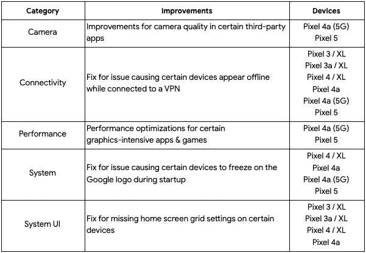

# Android 2021 年 4 月的安全更新公告现已发布

> 原文：<https://www.xda-developers.com/android-april-2021-security-update/>

这是新的一个月的第一个星期一，这意味着是时候发布另一个 Android 安全更新公告了。今天，谷歌发布了 2021 年 4 月的安全更新公告，并开始推出支持 Pixel 手机的新更新。

## 2021 年 4 月安全更新公告

2021 年 4 月的 Android 安全公告(可在此处查看)详细列出了严重程度从高到严重的多个安全漏洞。这些漏洞影响开源组件，如 Android 框架、Android 媒体框架、Android 系统和 Android 的 Linux 内核分叉，但它们也影响高通和联发科等供应商的一些闭源组件。开源 Android 组件的补丁(无 Linux 内核补丁)包含在 2021-04-01 安全补丁级别中，而其余受影响组件的补丁包含在带有 2021-04-05 安全补丁级别的版本中。关于每月安全更新程序如何工作的更多细节，请查看我们的[解说](https://www.xda-developers.com/how-android-security-patch-updates-work/)。

许多被披露的漏洞没有附带额外的文档来解释受影响的内容以及补丁如何解决问题，但我们可能会看到更详细地探讨这些漏洞的文章，因为它们已经在最新的公告中得到解决。

## 像素更新公告/功能更新

除了一般 Android 安全更新公告中概述的漏洞之外，还有几个针对谷歌 Pixel 手机的漏洞。这些在 2021 年 4 月的像素更新公告中有所概述，可以在这里查看。这些漏洞被归类为“中度”漏洞，会影响 Android 框架和特定于 Pixel 手机的高通定位/GPS 实现。

最后，谷歌还在 Pixel 手机的最新更新中修复了几个面向用户的错误。一些修复改进了第三方应用程序中的相机质量，为那些错过它的人带回了 Pixel Launcher 的网格大小定制，并修复了启动期间冻结的问题。

 <picture></picture> 

Source: [Google](https://support.google.com/pixelphone/thread/105130965)

2021 年 4 月的安全更新现已针对具有以下内部版本号的 Pixel 设备推出:

*   全球:

    *   像素 3 (XL): RQ2A.210405.005

    *   像素 3a (XL): RQ2A.210405.005

    *   像素 4 (XL): RQ2A.210405.005

    *   像素 4a: RQ2A.210405.005

    *   像素 4a (5G): RQ2A.210405.005

    *   像素 5: RQ2A.210405.005

*   加拿大:

**[像素工厂图像](https://developers.google.com/android/images)**| |**|[像素 OTA 图像](https://developers.google.com/android/ota)**

## 像往常一样，许多三星 Galaxy 设备已经获得了更新

三星已经再次开始向多个 Galaxy 设备推出新的更新，携带 2021 年 4 月的安全补丁级别。三星的 [Galaxy S21、Galaxy Z Fold 2、Galaxy Note 10](https://www.xda-developers.com/samsung-galaxy-s21-galaxy-z-fold-2-note-10-april-2021-security-patches/) 、 [Galaxy A52、Galaxy S20 FE、Galaxy S20、Galaxy Tab S6](https://www.xda-developers.com/samsung-galaxy-a52-s20-fe-s10-tab-s6-april-2021-security-patch-update/) 、 [Galaxy Fold、Galaxy S9](https://www.xda-developers.com/samsung-galaxy-fold-s9-april-2021-security-patch-update/) 率先获得更新。