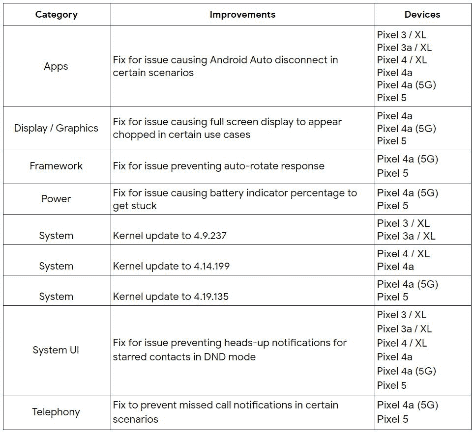

# Android 的 2021 年 3 月安全更新从今天开始推出

> 原文：<https://www.xda-developers.com/android-march-2021-security-update/>

今天是 3 月 1 日星期一，这意味着是时候进行另一次安全补丁更新了。按照计划，谷歌发布了 2021 年 3 月的 Android 安全公告。他们还发布了最新的 Pixel 更新公告，详细介绍了今天推出的更新中支持的 Pixel 手机的最新功能更新。与此同时，多部三星 Galaxy 手机已经收到了 2021 年 3 月的安全更新。

## 2021 年 3 月安全更新公告

在 2021 年 3 月的 [Android 安全公告](https://source.android.com/security/bulletin/2021-03-01)中，谷歌披露了几个影响 Android 运行时、框架、系统和媒体框架等组件的安全漏洞。如果您的设备运行的是 2021-03-01 安全修补程序级别，则披露的漏洞会得到修补。像往常一样，谷歌还披露了闭源供应商组件和底层 Linux 内核中的几个漏洞。如果您的设备运行 2021-03-05 安全补丁级别，这些漏洞将会得到修补。仅仅因为这些漏洞是今天披露的，并不意味着它们是今天发现的——事实上，这些漏洞的补丁已经在工作中至少几周甚至几个月了。如果你有兴趣了解更多关于每月 Android 安全更新过程的信息，请点击这里查看[我们的指南](https://www.xda-developers.com/how-android-security-patch-updates-work/)。

## 像素更新公告/功能更新

谷歌还披露了针对其 Pixel 设备的漏洞。在 2021 年 3 月的 [Pixel 更新公告](https://source.android.com/security/bulletin/pixel/2021-03-01)中，谷歌披露了几个影响框架、媒体框架、系统、内核组件和高通组件的高严重性和中严重性漏洞。在 Pixel 社区论坛上，谷歌还分享了 2021 年 3 月安全更新的功能改进列表。这些改进包括:

 <picture></picture> 

Source: [Google](https://support.google.com/pixelphone/thread/100309551?hl=en)

2021 年 3 月的安全更新现已针对具有以下内部版本号的 Pixel 设备推出:

*   全球:

    *   像素 3 (XL): RQ2A.210305.006

    *   像素 3a (XL): RQ2A.210305.006

    *   像素 4 (XL): RQ2A.210305.006

    *   像素 4a: RQ2A.210305.006

    *   像素 4a (5G): RQ2A.210305.006

    *   像素 5: RQ2A.210305.006

*   维珍英国:

Pixel 手机的最新更新还包括[最新的 Pixel 功能 Drop](https://blog.google/products/pixel/march-2021-feature-drop/) ，它增加了一个更可共享的记录器、水下照片捕捉、新壁纸、Gboard 中的智能合成以及 Pixel 支架的新就寝时间表。如果你不能等待更新(或不能正常更新，因为你的手机是根)，你可以下载工厂图像或完整的 OTA 图像现在使用下面的链接。

**[像素工厂图像](https://developers.google.com/android/images)**| |**|[像素 OTA 图像](https://developers.google.com/android/ota)**

## 几款三星 Galaxy 设备已经收到了更新

三星最近一直在提供更新，这一点突出表现在他们最近承诺向各种 Galaxy 设备提供 4 年的安全更新。虽然这些更新不能保证每个月都能到达大多数设备，但三星确实会迅速为其最受欢迎的设备推出最新的安全补丁。例如，[三星 Galaxy S21 系列](https://www.xda-developers.com/samsung-galaxy-s21-a8-2018-march-2021-security-patch-update/)、[三星 Galaxy Tab S7 系列](https://www.xda-developers.com/samsung-galaxy-tab-s7-series-major-s-pen-feature-update/)、 [OG Galaxy Fold、Galaxy S10、Galaxy Note 10](https://www.xda-developers.com/samsung-galaxy-fold-galaxy-note-10-one-ui-3-1/) 都已经收到了更新。