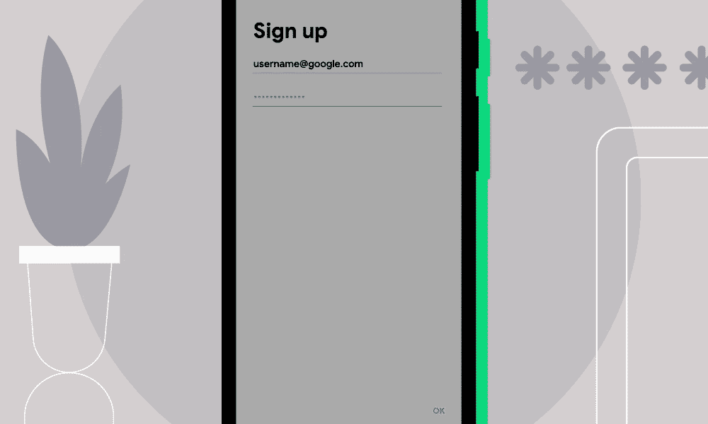
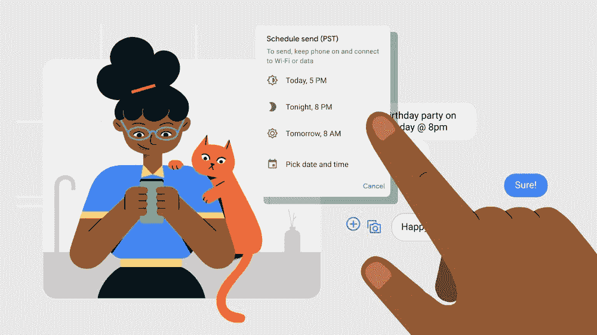
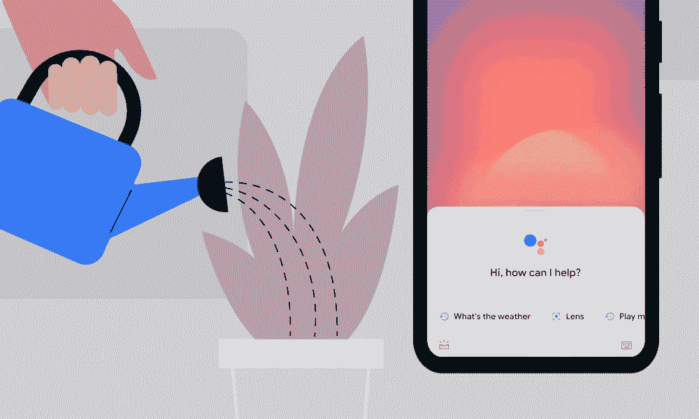

# Android 获得密码检查、预定消息等功能

> 原文：<https://www.xda-developers.com/android-password-checkup-scheduled-messages/>

谷歌最近发布了 Android 12，这是搜索巨头今年晚些时候的下一个重大移动更新。在此之前，谷歌已经公布了将在未来几天或几周内推出的 Android 新功能。

### 安卓系统的密码检查

首先是密码检查，谷歌正在将它集成到 Android 9 和更高版本中。该功能将让用户知道他们使用的密码之前是否被泄露过。如果有，密码检查将为用户提供如何做的步骤。

该功能通过检查使用谷歌自动填充输入的密码来工作。如果你的凭证与已知密码列表上的相符，谷歌会提醒你。要使用该功能，请打开手机的设置>系统>语言和输入>高级。轻按“自动填充服务”,然后轻按“Google”以确保该设置已启用。

谷歌表示，Android 上的密码检查使用了与 Chrome 相同的隐私保护 API，因此用户可以放心，他们的信息是安全的。

### 安排您的消息

我们可以安排电子邮件。为什么不是信息？在 Android 7 及更高版本上，用户可以在发送前在谷歌信息应用中安排信息。谷歌表示，这项我们之前在测试中发现的功能可能会在向不同时区的爱人发送信息时派上用场。

谷歌在一篇博客文章中说:“有了 schedule send，你可以在方便的时候提前编写一条信息，并安排在合适的时间发送。”只需像平常一样写下您的信息，然后按住“发送”按钮，选择发送信息的日期和时间

### TalkBack 获得更新

谷歌还更新了 TalkBack，这是一项为盲人或看不清手机显示屏的用户提供的辅助功能。据谷歌称，它与盲人和低视力群体密切合作，在 TalkBack 中加入了一些最受欢迎的功能，包括:直观的手势，统一的菜单，新的阅读控制菜单等。

谷歌表示，它已经添加了十几个简单易学、易于使用的多手指测量方法，可用于运行 One UI 3 和更高版本的最新版本的 Pixel 和 [Galaxy 设备。一个例子就是用两个手指双击屏幕就可以开始和停止播客。](https://www.xda-developers.com/google-talkback-screen-reader-galaxy-s21/)

为了让用户熟悉最新版本的 TalkBack，谷歌表示，它创建了一个新的教程。有一个练习新手势的垫子。最新版本的 TalkBack 现已上市。

### 手机锁定时的谷歌助手

Google Assistant 通过简单的语音命令轻松控制您的设备。最新的更新使助手更加强大，而无需紧挨着它。

谷歌表示，即使你的设备被锁定或你在房间的另一边，Assistant 现在也能更好地工作。为了使用新功能，谷歌说要在助手设置中打开锁屏个人结果。然后说，“嘿谷歌，设置一个闹钟。”

### 黑暗主题降临谷歌地图

谷歌表示，谷歌地图中的黑暗主题将很快扩展到全球所有安卓用户。该功能之前在测试中被[过。](https://www.xda-developers.com/google-maps-preparing-add-dark-mode-menus-settings/)

进入应用程序的“设置”>“主题”>“始终使用深色主题”,即可获得最新功能。新模式旨在帮助缓解屏幕疲劳，并节省电池寿命。

说到谷歌地图，这家搜索巨头表示，它还将为 Android Auto 添加一些新功能，包括像 Jeopardy 这样的声控游戏。这些功能紧随 [Android Auto 的壁纸功能](https://www.xda-developers.com/android-auto-wallpaper-assistant-shortcut/)而来，后者允许用户从少量壁纸中进行选择，为他们的体验增添一些风格。正如我们之前解释的那样，Android Auto 还允许你添加谷歌助手命令的快捷方式，你可以直接从汽车的仪表板上启动它。