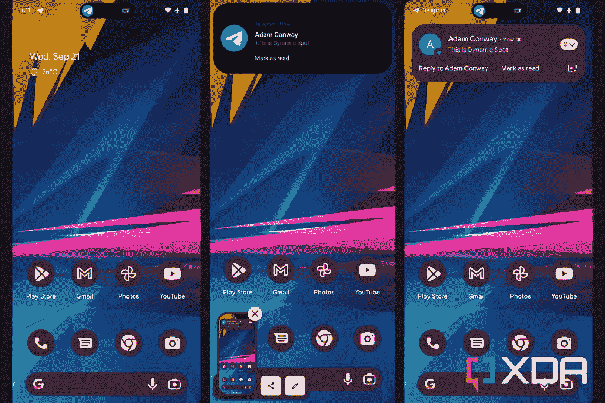

# DynamicSpot 将苹果的动态岛放在你的安卓手机上

> 原文：<https://www.xda-developers.com/android-phones-now-have-a-dynamic-island-known-as-dynamicspot/>

苹果的 [iPhone 14 Pro](https://www.xda-developers.com/apple-iphone-14-pro/) 和 iPhone 14 Pro Max 不仅提供了更新的硬件，还为顶级 iPhone 带来了一张新面孔。自发布以来，动态岛受到了赞扬，也受到了[的批评](https://www.xda-developers.com/apple-dynamic-island-editorial/)，由于它只是一个软件，它出现在 Android 手机上只是一个时间问题。现在，多亏了 Jawomo 的 dynamicSpot，你也可以在你的智能手机上有一个聪明的通知体验。

开发者的最新应用目前处于测试阶段，它拥有苹果动态岛的一些最好的部分，但也提供了一些定制选项。使用 dynamicSpot，您将能够设置在屏幕上显示何种通知。此外，你可以选择改变动态斑点的外观，比如改变它的位置，大小，以及边缘看起来有多圆。甚至有一个选项，让它显示两个弹出通知，当他们进来。

 <picture></picture> 

dynamicSpot notification on the left, standard notification on the right.

如果你想要更多的功能，这款应用确实有一个 pro 选项，价格为 4.99 美元。付费版本将解锁新功能，例如让用户能够在锁定屏幕上显示动态点，并获得单次点击和长按操作的权限。Jawomo 是一名长期开发者，他还负责三星和一加设备的 AOD 通知灯应用程序，以及 Bixby 按钮重新映射。

再说一次，此时此刻，这个应用程序还在测试阶段，所以并不是一切都是完美的。开发者分享说，动画可能不会一直流畅，也可能有一些应用程序兼容性的问题。但是在大部分情况下，经过测试，情况看起来不错，通知出现在 dynamicSpot 上，持有时扩展为预览，等等。如果你感兴趣，你也可以尝试通过谷歌 Play 商店获得的测试版。该应用程序是免费的，没有广告，但它是一项正在进行中的工作，所以如果你看到一些可能不太好的东西，留下反馈可能是一个好主意。

dynamicSpot 是一款由 XDA 资深会员 [Jawomo](https://forum.xda-developers.com/m/jawomo.5759008/) 制作的 app。你可以通过访问[专门的应用论坛](https://forum.xda-developers.com/t/app-dynamicspot-iphone-14-pro-dynamic-island-multitasking-for-android-early-access.4496049/#post-87468329)或者点击下面的下载链接找到更多关于这个应用的信息。