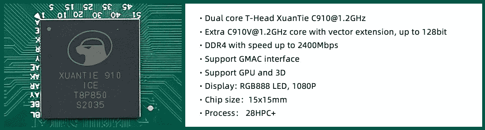

# Android 已经被移植到 RISC-V 板上

> 原文：<https://www.xda-developers.com/android-risc-v-port/>

谷歌的 Android 操作系统目前支持少数指令集架构(ISA)家族，包括 ARM 和 x86。今天，运行 Android 的绝大多数智能手机、平板电脑、电视和智能手表都采用了基于 ARM 的芯片组设计，因为英特尔早就放弃了其手机 CPU，而随着 NDK 修订版 17 的推出，对 MIPS 的支持也停止了。虽然谷歌没有正式提供在基于开放的 RISC-V ISA 的硬件上编译 Android 的支持，但几个开发团队正在 RISC-V 硬件上运行 AOSP。其中一项努力由阿里巴巴专门从事半导体业务的商业实体 T-Head 牵头，该实体今天宣布，他们已经成功将 Android 10 移植到其内部 RISC-V 硬件上。

几个月前，PLCT 实验室[在 QEMU 中模拟的 64 位 RISC-V 内核上成功地将](https://plctlab.github.io/aosp/create-a-minimal-android-system-for-riscv.html) Android 引导到命令行界面。该团队在 GitHub 上启动了一个项目，他们称之为“RISC-V 的 AOSP[，并且仍然处于交叉编译 AOSP 和引导到 GUI 的早期阶段。与此同时，T-Head 用其内部基于 RISC-V 的](https://github.com/aosp-riscv/working-group)[铁铉 C910 内核](https://occ.t-head.cn/vendor/cpu/index?id=3806788968558108672)设计了 ICE SoC，已经[成功启动了具有工作图形和触摸的 Android 10](https://occ.t-head.cn/development/series/index?id=3872715572777455616&type=kind&softPlatformType=8#sticky) 。

 <picture></picture> 

The ICE chip from T-Head with 3 XuanTie C910 (RISC-V 64) CPU cores.

它运行得很慢，正如你在下面的视频中看到的，但鉴于这个端口的状态和它运行的硬件，这是意料之中的。在视频中，启动了几个股票 AOSP 应用程序，包括时钟应用程序、联系人应用程序和邮件应用程序。更复杂的应用程序，如游戏，没有在这个原型上展示，因为这些应用程序可能需要重新编译以适应 RISC-V。

https://occ-oss-prod.oss-cn-hangzhou.aliyuncs.com/registerUrl/undefined/1611216336818/normal_video121.mp4

这个 Android 10 移植基于 AOSP 的 android10-release 分支，T-Head 开发的源代码可以在公司的 GitHub 页面找到[。](https://github.com/T-head-Semi/aosp-riscv)

对于开放硬件社区来说，这是一个令人兴奋的发展。由于 RISC-V 是一个免费开放的 is a，任何人都可以自由地基于它设计芯片，而无需支付任何许可费或版税。这并不妨碍公司通过定制指令集扩展来扩展 RISC-V——毕竟，RISC-V 拥有许可许可证——但它确实大大降低了寻求设计自己芯片的新公司的准入门槛。希望制造廉价物联网产品的供应商将有兴趣使用 RISC-V 开发低成本芯片，而寻求减少对竞争对手或外国实体依赖的公司也将表达兴趣。随着[英伟达收购 ARM](https://www.xda-developers.com/nvidia-officially-buying-arm-promise-maintain-neutral-open-licensing-model/) 和美国政府迫使 ARM 切断与华为的联系，我们无疑会看到世界各地的科技公司对 RISC-V 越来越感兴趣。不幸的是，实际上很难判断 RISC-V 获得了多大的吸引力，因为没有要求供应商公开它的使用情况。