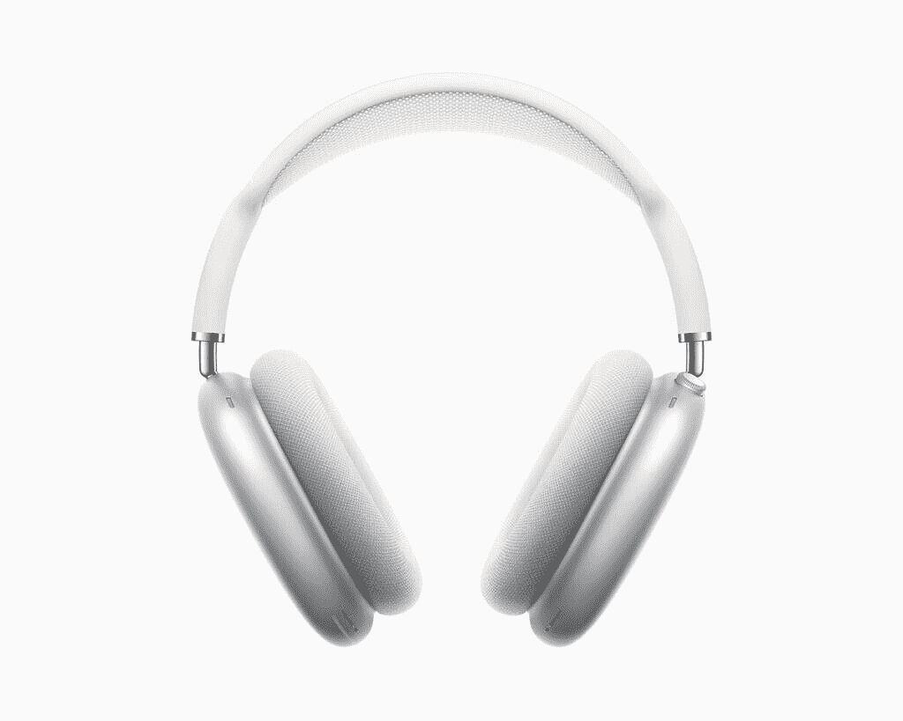

# 苹果 AirPods Max 是最新的优质耳挂式耳机，带有 ANC，价格为 549 美元

> 原文：<https://www.xda-developers.com/apple-airpods-max-launch-premium-over-ear-headphones-anc/>

苹果 AirPods [可能不是市场上最好的耳机](https://www.xda-developers.com/huawei-freebuds-pro-review/)，但它们肯定是世界上最受欢迎和最受认可的 TWS 耳塞。苹果在移除耳机插孔时赚了大钱，因为这个新问题的解决方案继续为苹果在未来几年的一些惊人数字做出贡献。该公司希望再次重复这种魔力，因为苹果现在已经推出了新的 AirPods Max，这是一套具有主动降噪功能(ANC)的优质耳挂耳机，价格为 549 美元。

首先，让我们解决房间里的大象。苹果 AirPods Max 是[苹果官方产品](https://www.apple.com/newsroom/2020/12/apple-introduces-airpods-max-the-magic-of-airpods-in-a-stunning-over-ear-design/)，也是第一款带有苹果标志的耳挂式耳机。仅这一点就使该产品有把握获得高价。这个溢价是否值得分开，是你作为一个消费者根据你对奢侈品的个人衡量来决定的。这些耳机正在与 Bose、Sony、Sennheiser、AKG 等高端耳机品牌竞争。

 <picture></picture> 

Apple AirPods Max

正如苹果所说，AirPods Max 将 AirPods 的魔力带到了高保真声音的耳挂设计中。这些耳机带有“定制声学设计”，包括带有透气针织网罩的不锈钢头带、伸缩头带臂和耳罩上的记忆泡沫。这种组合声称可以为您提供一副舒适、坚固、耐用的耳机，通过分散压力在耳朵周围形成密封。还有一个受 Apple Watch 启发的数字表冠，用于控制音量、控制播放、接听和结束电话以及激活 Siri。还有一个专用按钮用于在主动噪声消除(ANC)和透明模式之间切换。

AirPods Max 采用了苹果设计的 40 毫米动态驱动器，每个杯子中都有苹果设计的 H1 芯片。这使得苹果公司声称，即使在最大音量下，整个听觉范围内的总谐波失真也不到 1%。其他功能包括自适应均衡器、主动噪声消除、透明模式和空间音频。这些耳机还声称可以提供 20 小时的电池寿命，并启用高保真音频、ANC 和空间音频。请记住，这些是通过苹果的 Lightning 连接器(而不是 USB-C)充电的，并且带有蓝牙 5.0。也没有关于防水的信息，所以我们建议不要在泳池附近穿这些。

另一个更大的吸引力是产品上的苹果标志，是苹果生态系统内更深层次的整合。用户在 iOS 中使用 AirPods 和 AirPods Pro 以及使用苹果硬件所体验到的一切，也将扩展到 AirPods Max。这意味着您可以轻松地进行一键设置，自动与同一 iCloud 帐户内的所有设备配对，等等。

耳机还可以检测何时戴在用户头上，并可以在用户提起一个耳罩时暂停音频(当位置恢复时继续)。如果你接到电话，它们还可以自动在 iphone、iPads 和 MAC 电脑之间切换。当然，还有 Siri。

## 定价和可用性

苹果 AirPods Max 有五种颜色:太空灰、银色、天蓝色、绿色和粉色。在美国，从今天开始[可以预订，从 12 月 15 日开始全面上市，价格为 549 美元。在印度，₹59,990.将从 12 月 15 日开始发售](https://www.apple.com/shop/buy-airpods/airpods-max)

这些耳机还配有智能外壳，可以在不使用时将它们置于超低功耗状态，以保持电池电量。

* * *

**你对 AirPods Max 有什么想法？请在下面的评论中告诉我们！**