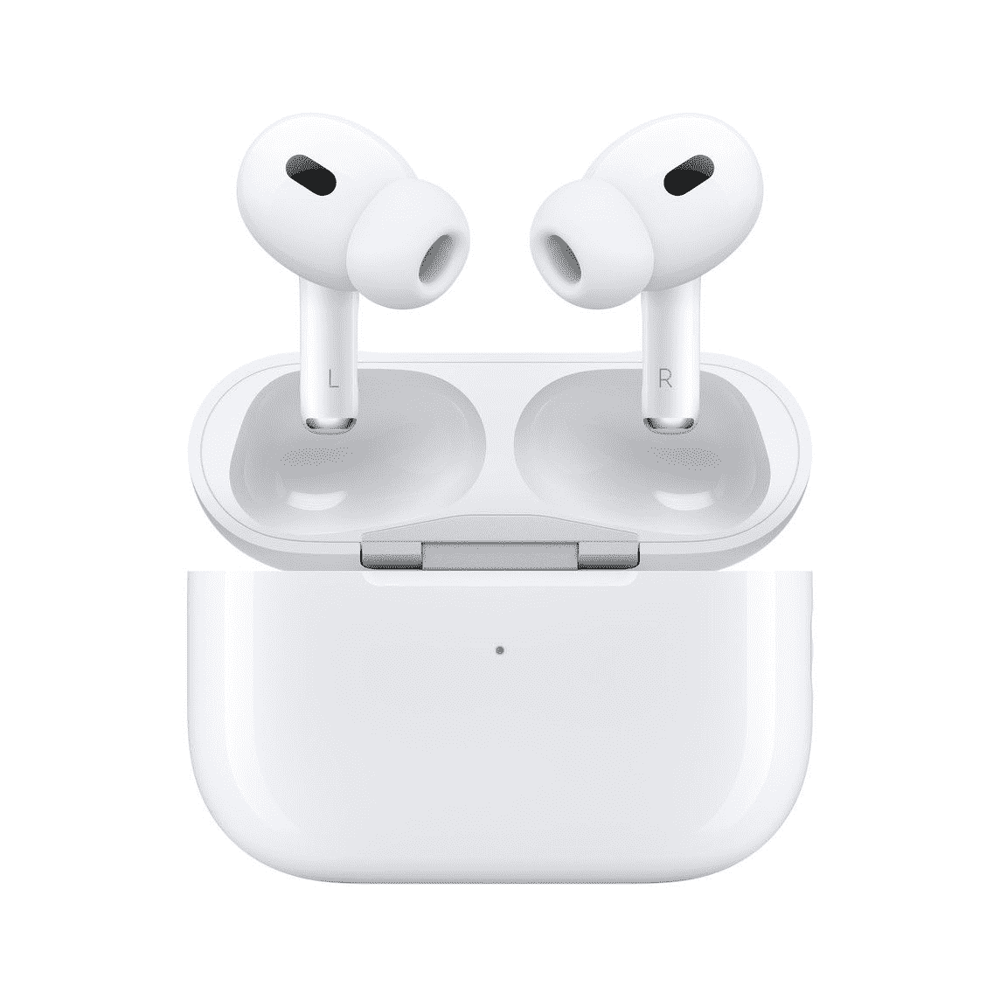
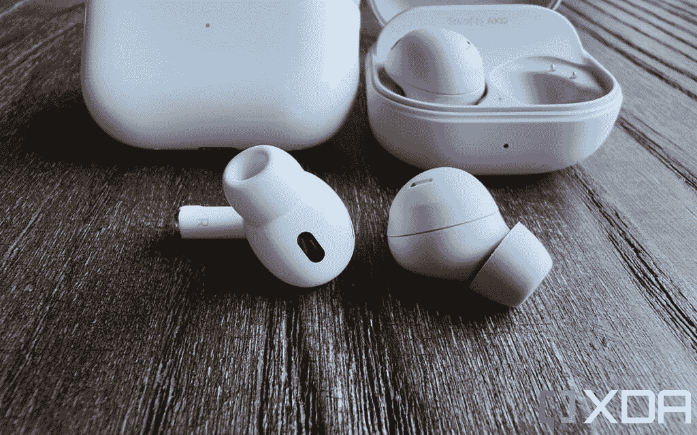
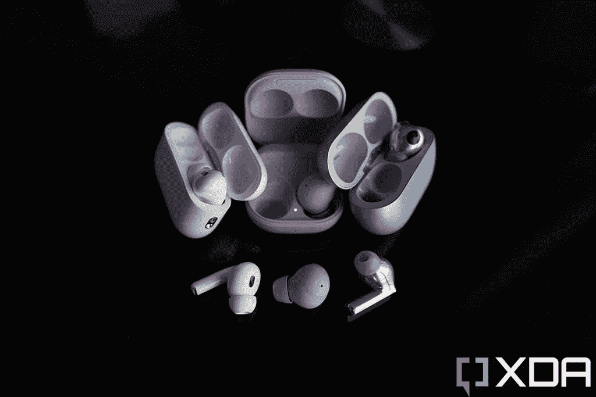

# AirPods Pro 2 评论:它们无处不在是有原因的

> 原文：<https://www.xda-developers.com/apple-airpods-pro-2/>

苹果没有发明无线耳塞——在 AirPods 于 2016 年底首次亮相之前，有几个品牌推出了真正的无线耳塞长达一年。但苹果让无线耳塞成为主流，不管是好是坏，AirPods 在首次亮相后立即严重影响了无线耳塞的设计。

但老实说，最初的 AirPods 看起来很丑，听起来也不怎么样。一刀切的提示也意味着它们根本不适合一些耳朵。在我看来，直到 2019 年的 AirPods Pro，苹果才推出了一对真正伟大的无线耳塞。但这些也很快被竞争对手超越。到 2021 年，我认为华为的 Freebuds Pro 或三星的 Galaxy Buds Pro 会发出明显更饱满的音频，并具有更好的主动降噪功能。

新的 AirPods Pro 2 是苹果的反击。它们带来了更好的音频和主动噪音消除，以及略长的电池寿命。对于那些从两年前的 AirPods Pro 跳出来的人来说，音频方面的改进是显著的。但无线耳塞领域，就像智能手机领域一样，已经变得过于成熟和竞争激烈，苹果显然无法夺回宝座。

AirPods Pro 2 几乎在每一个方面都非常出色——合身、舒适、结构和音质。但我可以对三星的 Galaxy Buds 2 Pro 和华为的 FreeBuds 2 Pro 说同样的话，这两款手机都是几个月前上市的。就连 249 美元的定价也差不多。但是 AirPods Pro 2 有一个重要的锦囊妙计:它是苹果的产品，所以它是苹果生态系统的正式组成部分。仅此一点就能确保几乎所有 iPhone 用户都选择这些手机，比如三星的 buds。世界上有很多 T4 的 iPhone 用户。AirPods Pro 2 几乎肯定会取得巨大的销售成功。

 <picture></picture> 

Apple AirPods Pro 2

##### apple airpods for 2

第二代 AirPods Pro 带来了改进的音频和噪音消除，以及更长的电池寿命。

## 苹果 AirPods Pro 2:规格

| 

规格

 | 

apple airpods for 2

 |
| --- | --- |
| **尺寸&重量** | 

*   外壳:45.2 x 60.6 x 21.7mm 毫米(每个)
*   芽:30.9 x 21.8 x 24mm 毫米

 |
| **电池和充电** | 

*   未指定电池大小
*   Case 为 AirPods Pro 2 充电五次
*   闪电端口充电
*   Qi 无线充电
*   MagSafe 充电

 |
| **扬声器和麦克风** | 

*   11 毫米驱动器
*   气孔
*   三个麦克风

 |
| **连通性** |  |
| **传感器和其他特征** | 

*   主动噪声消除
*   透明模式
*   空间音频
*   IPX4 防水性

 |
| **颜色** | 怀特（姓氏） |

***关于这次评测:**孔给我提供了一对 AirPods Pro 2 进行评测。苹果公司在这次审查中没有任何投入。*

* * *

## 苹果 AirPods Pro 2:价格和可用性

AirPods Pro 2 可在各零售商处购买，从 2022 年 9 月 23 日开始，售价为 249 美元。

* * *

## 苹果 AirPods Pro 2:硬件、设计和适配

*   看起来几乎与最初的 AirPods Pro 相同
*   硅尖有四种尺寸，包括一个新的“XS”，适合更广泛的范围
*   现在可以直接在耳塞上调节音量

AirPods Pro 2 的外观没有太大变化。耳塞本身看起来几乎相同，每个耳塞上都有一个额外的通风孔，这是区别因素。这个箱子的整体形状相同，但有一些新的硬件，包括一个扬声器(如果你在房子里找不到它，它会发出嘟嘟的声音)和一个用于挂绳带的小环形槽。内部有一个更新的 H2 芯片，在处理音频和主动噪声消除(ANC)方面更强大，但这显然不是一个可见的变化。

就像以前的 AirPods Pro 一样，硅耳塞是可拆卸的，苹果今年包括四种尺寸(而不是像大多数其他耳塞一样只有三种)。这意味着耳塞将适合更大范围的耳道尺寸。

使用小尺寸的硅胶对我来说很舒适，但我发现耳塞从我的耳朵伸出太多了，我不喜欢。是的，这不是什么新鲜事，AirPods 一直都是这样突出的。但其他耳塞，即使是像华为的 FreeBuds Pro 2、Bose 的 QuietComfort 2 或 Nothing's Ear 1 这样的耳塞，也不会从侧面突出那么多。AirPods Pro 的茎弯曲得更宽、更圆。如果我同时戴着 AirPods Pro 2 和三星的新款 Galaxy Buds 2 Pro，对着镜子看，AirPods Pro 要显眼得多。

 <picture></picture> 

I'm wearing the AirPods Pro 2 in my left ear and Galaxy Buds 2 Pro in the right.

AirPods Pro 2 采用白色也于事无补。我认为，即使给它涂上黑漆，也会让耳塞看起来更时尚、更低调。但我很确定，在苹果总部，AirPods Pro 如此引人注目是一个特点，而不是一个缺陷。就像在他们的手机和笔记本电脑背面贴上一个巨大的标志一样，苹果希望它的产品被看到和识别，我想许多消费者也喜欢这样。我不知道。

stems 确实进行了硬件升级——电容式触摸板现在支持滑动动作，用于调节音量。点击传感器仍然会带来非常令人满意的触觉反馈，感觉比我测试过的任何其他耳塞都好。

 <picture></picture> 

The AirPods Pro 2 (left) and the Samsung Galaxy Buds 2 Pro.

### 电池和充电

虽然耳塞和外壳内的电池容量保持不变，但电池寿命得到了提高，AirPods Pro 2 一次充电可以玩六个小时。这是在 ANC 或透明模式一直打开的情况下(您必须使用这两种模式中的一种)。如果你使用空间音频，苹果公司声称 buds 可以使用五个小时，但我的设备消耗速度更快。我认为四个小时差不多了。这个案子又增加了五项指控。

* * *

## 苹果 AirPods Pro 2:设置、音质、功能

*   使用苹果设备进行设置就像打开盖子一样简单；在 Android 或 Windows 设备上，需要按一个按钮
*   出色、均衡的声音
*   可以通过语音听写来回复短信，包括 WhatsApp

设置 AirPods Pro 2 用我的 [iPhone 14 Pro Max](https://www.xda-developers.com/apple-iphone-14-pro-max-review/) 简直易如反掌。当我把 AirPods 从盒子里拿出来打开盖子的时候，配对屏幕已经在我的 iPhone 上弹出来了。我只需要轻点一个按钮就可以确认这些是我的 AirPods，在那之后，buds 也可以与我的 MacBook 和 iPad 无缝合作(因为它们都与我的 iPhone 共享相同的 Apple ID)，而无需再次手动配对。

与其他一些耳塞不同，如果你想对 AirPods 有更多的控制权，苹果不需要你安装额外的应用程序。你可以在 iPhone 的设置中这样做。这些设置更像是辅助功能。在很大程度上，苹果不希望你像三星的耳塞一样摆弄开关和设置。

然而，我并不总是使用 iPhone。这几天我其实已经把 SIM 卡放回了[小米 12S Ultra](https://www.xda-developers.com/xiaomi-12s-ultra-review/) 里面，配对还是很容易的。我只需长按外壳上的按钮，告诉 AirPods 进入配对模式，并通过我的 Android 手机的蓝牙菜单进行连接。之后，我在音频质量或音频播放方面没有遇到任何问题。然而，我错过了一些 iPhone 特有的功能，比如让别人给我读新来的通知的功能，以及回复的功能。稍后将详细介绍。

苹果不希望你像其他制造商希望的那样摆弄开关和设置

### 音频质量

虽然 AirPods Pro 2 仍然使用与上一代 AirPods Pro 相同的 11mm 驱动器，但苹果重新设计了放大器和驱动器，加上 AirPods Pro 2 使用了苹果新的 H2 芯片(相对于原版中的 H1)，音频输出有了很大的改善。它们明显更饱满、更有活力。我确实认为 Galaxy Buds 2 Pro 和华为 FreeBuds Pro 2 在某些曲目中具有明显更强的低音，但我认为 AirPods Pro 2 的声音平衡良好，既有利于口语，也有利于乐器。与华为的 earbuds 或 Beats by Dre 的音频产品(讽刺的是，这些产品也属于苹果公司)相比，无论是听 Outkast 还是播客，音频质量都更加一致。

 <picture></picture> 

The AirPods Pro (left) next to the Galaxy Buds 2 Pro (middle) and Huawei FreeBuds 2 Pro (right).

与竞争对手相比，AirPods Pro 2 在音频质量上更具一致性，无论我是在听 Outkast 还是播客

### 主动噪声消除

在苹果 9 月份的发布会上，它声称新的 AirPods Pro 的主动噪音消除(ANC)是原来的两倍，我认为它不负众望。这里的 ANC 非常好，如果我在一个房间里，它几乎能够完全提供安静，并且在阻挡极其嘈杂的香港街道方面做得非常好。

我认为在阻挡声音方面，这里的 ANC 与华为 FreeBuds Pro 2 并驾齐驱，比 Galaxy Buds 2 Pro 好一点。然而，Bose 的新耳塞，我没有测试过，显然有更好的 ANC，可以比之前的任何耳塞更好地静音。

不像其他耳塞给你选择使用 ANC，透明模式，或都不，苹果只做 ANC 或透明。这对我来说很好，因为我发现中间的选项(关闭)有点无意义。在 ANC 和透明模式之间切换只需长按阀杆即可。效果很好。在透明模式下，我可以轻松地进行对话，并完美地听到另一端的声音，即使我正在播放音乐，前提是音量不要太高。

苹果的另一个小技巧是正确的:当你从 ANC 模式切换到透明模式或反之亦然时，过渡是渐进的，这意味着环境噪声将淡出或淡入，而不是突然被切断或像其他无线耳塞一样开始。这些更小的细节有助于让体验变得更好，而不仅仅是各个部分的总和。

### 电话呼叫和回复通知

苹果公司重新定位了 AirPods Pro 2 的麦克风，它们对我来说工作正常。这些天我几乎从不打电话，但几次测试电话都很顺利，对方说他们能听到我的声音。如果我在外面非常嘈杂的街道上接电话，AirPods Pro 2 会对我的声音应用 ANC，这使我听起来有点数字化，但它很有效。再说一次，香港是世界上最嘈杂的地方之一，所以如果我可以在这里打电话，我肯定可以在加州或柏林打电话而没有问题。

AirPods Pro 的一个很酷的功能是能够让 Siri 口述收到的文本信息，我可以通过语音回复，无需触摸任何东西。我必须说“回复”，然后是我想说的话。在我用 WhatsApp 进行的测试中，它运行得非常好。让手机给我发短信并在耳机上回复的功能并不是一项新功能，尽管我刚刚才发现这一点，因为我很少使用 iPhone。我其实拥有一对日常使用的 AirPods Max，但我通常会将其与我的 MacBook 或 Android 手机配对。

### 空间音频

iPhone 用户的另一个独有功能是空间音频，AirPods Pro 将跟踪你的头部运动，因此如果你转头，音频将四处移动以保持音频方向，就好像你真的坐在音频源前面一样。这个特性像宣传的那样有效，尽管我发现它有时有点噱头。

* * *

## 该不该买苹果 AirPods Pro 2？

**你应该买 AirPods Pro 2 如果:**

*   您想要一对小巧的无线耳机，拥有出色的音质和主动降噪功能
*   你已经沉浸在苹果的生态系统中，想要一个能与其中所有东西都和谐相处的耳塞

**你不应该购买 AirPods Pro 2，如果:**

*   你已经拥有了最初的 AirPods，并且发现音频和 ANC 质量非常好
*   您的预算越来越紧张
*   你希望耳塞在你的耳朵里看起来更低调一点

有了 AirPods Pro 2，苹果并没有试图做表面的改变。相反，他们选择专注于改善重要的事情，如电池寿命和音频质量。即使是很小的事情，比如 AirPods Pro 外壳发出哔哔声的能力，也是让它们如此容易使用的小细节。

如果你能挥霍，AirPods Pro 2 太棒了

如果你拥有一部 iPhone，并且想要你的第一副无线耳塞，AirPods Pro 2 很容易推荐，只要 249 美元的价格可以接受。更大的问题是，那些拥有标准 AirPods 或第一代 AirPods Pro 的人是否应该考虑升级。

我想说，这真的取决于你对现有的 AirPods 或 AirPods Pro 有多满意。如果你发现你目前的设备在音频或 ANC 质量方面有所欠缺，AirPods Pro 2 带来了足够的改进，足以证明升级的合理性。

AirPods 以及后来的 AirPods Pro 在全球各大城市无处不在，这是有原因的。当然，部分原因是它们是 iPhone 用户的默认耳塞，但也因为它们真的真的非常好。

 <picture></picture> 

Apple AirPods Pro (2nd generation)

##### apple airpods for 2

第二代 AirPods Pro 在所有重要的方面都有所改进