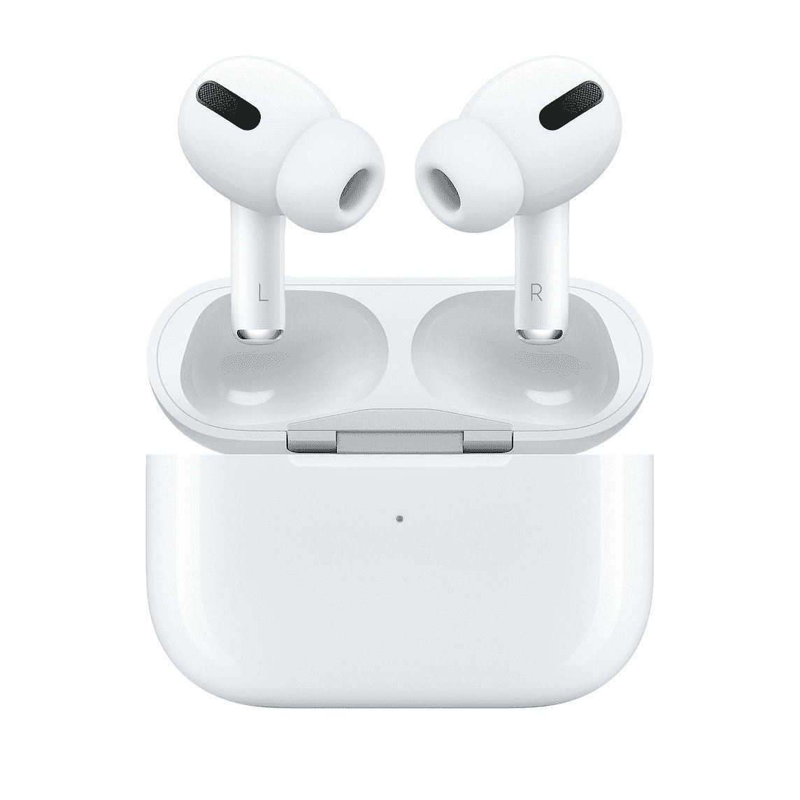

# 只需 194 美元，即可获得免费次日送达的苹果 Airpods Pro！

> 原文：<https://www.xda-developers.com/apple-airpods-pro-deal-staples/>

苹果 Airpods Pro 是一对受欢迎且功能强大的耳塞。虽然是苹果品牌，但耳塞可以连接到任何支持蓝牙的设备，因此安卓用户也可以体验 Airpods。Airpods 能够无缝地听音乐、接电话和做任何你需要做的事情，一直是那些寻找下一代耳塞的人的首选。

现在，在 Staples，你只需 194 美元就能买到苹果 AirPods Pro！通常是 249 美元，这比零售价整整低了 55 美元。此外，Staples 提供免费的第二天送货服务，所以不像其他零售商在 Airpods Pro 上提供这个价格，你可以安全地在网上购买这些东西，明天就可以拿到，而不需要离开房子。在这种时候这真的很重要！

如果你附近有订书钉，你可以去捡。基本上，第二天送货真的很快很方便，但如果你尽快需要它们，你最快可以在一个小时内拿到你的新苹果 AirPods Pro。

如果你还不是 AirPods 用户，你可能想知道这有什么大惊小怪的。大多数消费者都知道，苹果可以因其品牌名称而对其设备收取溢价，但苹果 AirPods Pro 是值得门票价格的优质设备。AirPods Pro 包含一个 H1 芯片，可以确保低音频延迟，并且防汗防水。非常适合户外健身！一次充电可以获得超过 24 小时的收听时间，当它们耗尽时，它们会在外壳中快速充电，无线或有线。

还有更多的东西可以进入，但是在 Staples 的商店页面上看看规格和细节可能会更好！细节包括音频方面的深度分解，我无法开始理解。但是，我知道这是一项相当可靠的音频技术！

 <picture></picture> 

Apple AirPods Pro

##### 苹果 AirPods Pro

节省 55 美元并获得免费次日送达？你还在等什么？苹果 AirPods Pro 是一套高质量的耳塞，你可以在 Staples 以很好的折扣买到它们。

当你在看苹果产品的时候，为什么不去本的 iPhone 12 Mini 现场体验一下呢？手机这么小，真可爱！