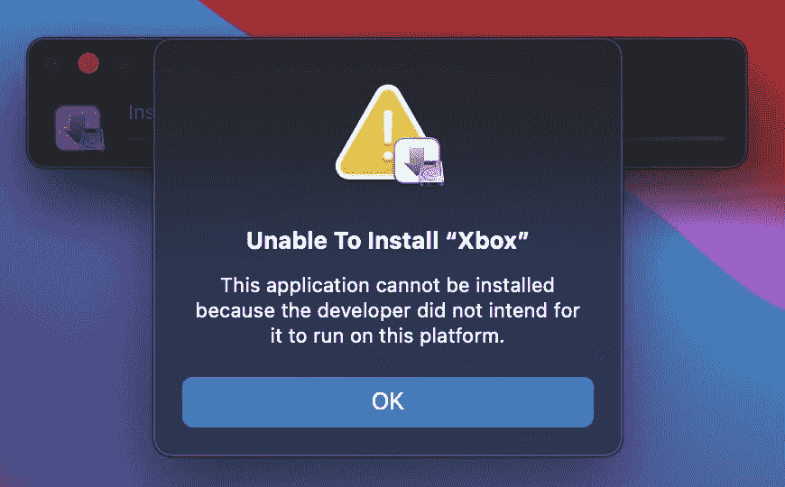

# 苹果禁止用户在 M1 MAC 电脑上下载 iOS 应用

> 原文：<https://www.xda-developers.com/apple-blocks-users-from-side-loading-ios-apps-on-m1-macs/>

苹果[发布 M1 MAC](https://www.xda-developers.com/apple-macbook-air-macbook-pro-13-mac-mini-m1-arm-soc/)后不久，发布了一款工具，允许用户下载不支持的 iOS 应用程序。几个月后，苹果公司封锁了这一变通办法。

到目前为止，用户能够下载工具 iMazing 和安装不支持。IPA 文件。这意味着用户可以运行网飞和 Instagram 等 iOS 应用程序，而这些应用程序无法在 M1 的 MAC 电脑上下载。但是苹果公司的服务器端更新使得这变得更加困难，如果不是不可能的话。

“这种改变本身就是对应用商店系统的改变。IPA 文件，它是苹果 API 的一部分，管理操作系统的 DRM(数字版权管理)保护，”*9 到 5Mac* [解释](https://9to5mac.com/2021/01/15/apple-blocks-m1-mac-iphone-app-side-loading/)。"因此，将来不太可能出现变通办法."

 <picture></picture> 

Credits: 9to5Mac

当用户试图在运行 macOS Big Sur 11.2 beta 的 M1 Mac 上侧装 iPhone 或 iPad 应用程序时，会显示一条错误信息。弹出窗口解释说，侧装的 iOS 应用程序不能安装，因为“开发者并不打算让它在这个平台上运行。”运行 macOS Big Sur 11.1 的用户也会遇到一条错误消息。

当 M1 芯片推出时，它为 iPhone 和 iPad 应用程序在最新的机器上运行提供了可能。虽然许多应用程序可以通过 Mac App Store 下载，但开发者可以选择退出他们在 Mac 上提供的应用程序。因此，许多流行的应用程序还不能在 M1 的苹果电脑上使用，这就是为什么侧装是一件大事。

随着苹果将其整个系列的 MAC 电脑全部转移到 M1 芯片上(或其他即将到来的继任者)，希望这些开发者能提供他们的应用程序。9to5Mac 表示，如果你在 M1 Mac 上下载了应用程序，它们应该还能运行。但是如果你试图安装新的应用程序，你就没那么幸运了。