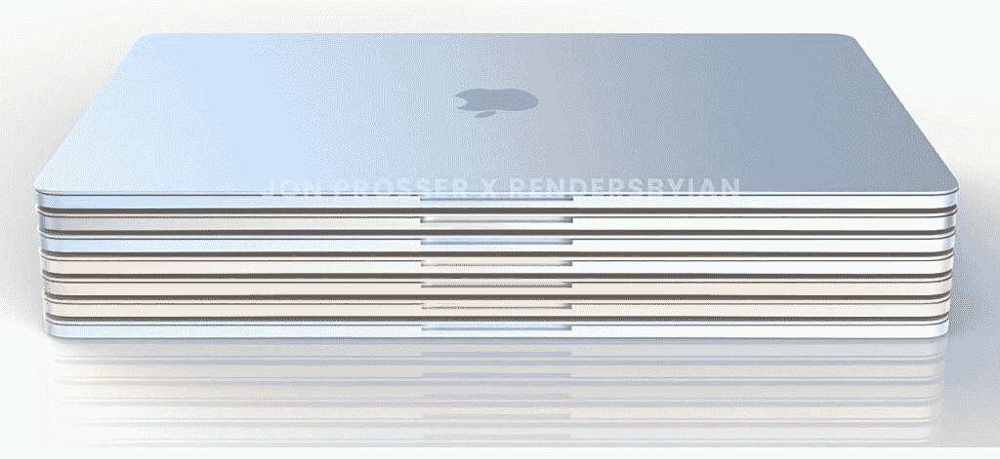

# 以下是对即将到来的苹果九月发布会的期待

> 原文：<https://www.xda-developers.com/apple-event-2021-what-to-expect/>

随着 9 月越来越近，人们对下一代苹果产品的兴奋也越来越强烈。苹果将很快确定下个月发布会的日期，除了新的 [iPhone 13](https://www.xda-developers.com/iphone-13/) 系列，预计将发布新的 [AirPods 3](https://www.xda-developers.com/apple-airpods-3/) 、 [Apple Watch 系列 7](https://www.xda-developers.com/apple-watch-7/) 、iPad mini 第六代，可能还有一些新的 MacBook 型号。

如果来自 [*【彭博】*](https://www.bloomberg.com/news/newsletters/2021-08-15/what-s-new-about-the-next-apple-aapl-iphone-airpods-and-macs-ksdike4t)(via*[9 to 5 MAC](https://9to5mac.com/2021/08/15/gurman-iphone-13-apple-watch-series-7-airpods-3-ipad-mini-6-and-more-coming-at-september-apple-event/)*)的一份新报告可信的话，2021 年 9 月的苹果发布会将会挤满几个公告。像往常一样，我们今年将会看到新的 iPhone，但不是一个“S”的更新，苹果将会跳到 iPhone 13 系列。预计它将具有相同的形状和大小，槽口有所变化，相机有所改进，并采用了新的芯片组。

考虑到泄露和传言的数量，可以肯定地说，新的 iPhone 13 将更多地是去年机型的更新。除了 6.1 英寸和 6.7 英寸的 Pro 机型之外，还将有 5.4 英寸的“迷你”和 6.1 英寸的普通 iPhone 13。与以前的型号相比，新的 iPhones 预计顶部也有一个较小的缺口。去年，我们听到了许多关于苹果计划在 iPhone 上推出 120Hz 促销显示屏的传言。虽然这从未实现，但我们可以期待该功能在新的 iPhone 13 系列中出现。

当然，我们也将看到一个新的芯片组，可能是 A15，这将是去年 A14 的更新。有传言说苹果可能会把它的 M1 芯片带到 iPhone 上，但是我们怀疑这是真的。新的 iPhones 也有望带来一些有趣的相机升级。一种新的视频肖像模式称为电影视频，预计将成为亮点功能，相机可以为您的视频添加景深效果。预计新相机还将采用基于人工智能的过滤系统，用于 iPhone Pro 型号的 ProRes 中的照片、照片和更高质量的视频录制。

苹果还将推出全新设计的 AirPods。广受欢迎的苹果分析师 Ming-Chi Kuo 曾表示，[第三代 AirPods](https://www.xda-developers.com/apple-airpods-3-leaked/) 或 AirPods 3 将采用与 AirPods Pro 类似的设计，耳塞柄将更短，并将采用可更换的耳塞。这些产品的价格可能与最初的 AirPods 相似，甚至更便宜，预计它们还将配备新的无线芯片，并延长电池寿命。

新的 Apple Watch 也将是活动的一部分，据报道，它将有一个更新的设计。今年早些时候，[乔恩·普罗瑟的一段视频暗示](https://www.xda-developers.com/apple-watch-series-7-flat-edge-design/)Apple Watch Series 7 将会有平坦的边缘和新的绿色。这将与我们在 iPhone、iPad 和 iMac 上看到的一致。传言称，它可能会采用更新的屏幕技术，更快的处理器，以及各种新的健康和健身功能。

在过去的几年里，除了 iPad mini，几乎所有的 iPad 都得到了某种程度的更新。最小的 [iPad 终于将看到类似于 iPad Pro 和 iPad Air 第四代的设计变化](https://www.xda-developers.com/ipad-mini-a15-usb-type-c/)。预计它也将运行在即将推出的 A15 芯片上，一个 USB Type-C 端口，顶部的物理触控 ID 传感器和一个磁性智能连接器。面向学生的普通 iPad 也有望通过更薄的机箱和升级的硬件得到更新。

 <picture></picture> 

MacBook concept renders in different iMac-like colors.

最后，苹果也有机会展示或分享其新 MacBook Pro 系列的一些细节。期待 16 英寸机型和新的 14 英寸机型的更新，这两款机型都运行苹果新的 M1X 芯片组，与 M1 芯片组相比，该芯片组将拥有更高的内核数和更好的性能。预计这些新的 MacBooks 也将有各种颜色可供选择，有点类似于 24 英寸的 iMac。

* * *

***更新:**彭博的马克·古尔曼[向](https://twitter.com/markgurman/status/1426954102408318976)澄清，上述产品将于今年秋季在不同的活动中推出。在即将到来的 2021 年 9 月的活动中，苹果可能只会推出 iPhone 13 系列、AirPods 3 和下一代 Apple Watch。*