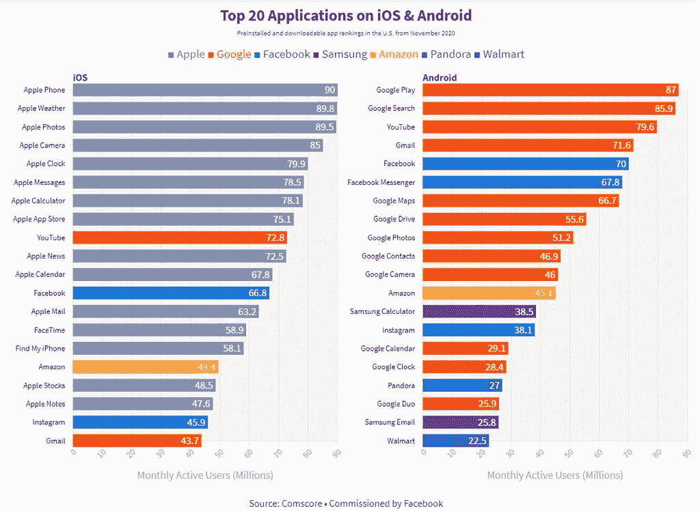

# 新的研究表明，苹果和谷歌的默认应用程序主导了他们的平台

> 原文：<https://www.xda-developers.com/apple-google-default-apps-dominate/>

据 The Verge 独家分享的一项来自康姆斯克的新研究称，人们智能手机上使用的大多数应用程序都是苹果或谷歌预装的。这份报告是由脸书委托撰写的，自从苹果在 iOS 14.5 中引入新的隐私功能后，这家公司就不再是[苹果的忠实粉丝了。当涉及到天气、照片和时钟等基本服务时，预装应用程序占据了主导地位。](https://www.xda-developers.com/facebook-apple-spar-upcoming-app-tracking-transparency-feature-ios-14/)

 <picture></picture> 

Source: The Verge

[报告](https://www.theverge.com/2021/7/7/22549338/apple-google-apps-comscore-study-facebook)还详细说明了并非所有默认应用都能在智能手机上胜出。例如，苹果地图不见了，苹果音乐也不见了，Gmail 在 iOS 上也排在苹果邮件之后。这项研究是在去年 12 月进行的，数据是由康姆斯克从该公司的应用程序和网站上收集的，大约有 4000 人参与其中。在 iOS 上，75%的最常用应用程序是由苹果制作的，在 Android 上，60%的最常用应用程序是由谷歌制作的。脸书是唯一一家在 iOS 前 20 名中拥有一个以上应用的公司，也是唯一一家在 Android 上拥有三个应用的公司。

据公司发言人 Joe Osborne 称，脸书资助了康姆斯克的研究，以展示*“预装应用对竞争应用生态系统的影响”*。苹果拒绝接受该报告的调查结果。*“这项由脸书资助的 2020 年 12 月的调查是精心设计的，给人一种错误的印象，即 App Store 上几乎没有竞争，”*苹果发言人告诉 *The Verge* 。*“事实上，第三方应用在各个领域都与苹果的应用竞争，并获得了巨大的成功。”*

该发言人进一步指出，调查方法“在许多方面存在严重缺陷”。例如，值得注意的是，该结果似乎与康姆斯克在 2021 年 4 月的一份早期报告相矛盾，尽管该研究没有将所有预装应用纳入考虑范围。

这种方法有其独特之处；排名中没有包括苹果的 Safari 和谷歌的 Chrome 等浏览器。它也没有考虑像 Siri 这样的“嵌入式操作系统功能”。例如，Android 的结果不是由特定的手机制造商收集的，这意味着相对于谷歌 Pixel，三星手机的应用程序使用情况没有细分。这就是为什么三星计算器和三星电子邮件在 Android 上排名靠前。