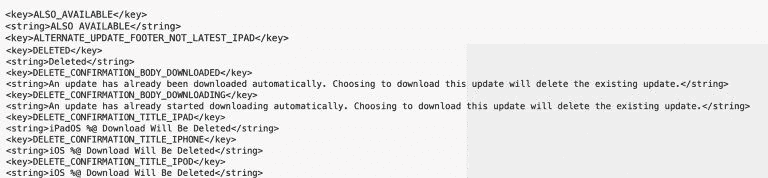

# 苹果正致力于为 iOS 提供单独的安全补丁

> 原文：<https://www.xda-developers.com/apple-ios-security-patch-release/>

# 苹果可能很快会发布独立于其他更新的 iOS 安全更新

据报道，苹果正在开发一项功能，允许 iOS 用户选择安装完整更新或仅安装安全补丁

在每年发布重大平台更新后，如 [Android 12](https://www.xda-developers.com/android-12/) ，谷歌通常会每月推出新的安全补丁。苹果可能会考虑在 iOS 上推出类似的产品。第四个 iOS 14.5 测试版更新包括一些隐藏在内部代码中的变化，这些变化表明苹果正在考虑独立于其他更新提供安全更新。

据 [*9to5Mac*](https://9to5mac.com/2021/03/15/ios-security-fixes-could-soon-be-delivered-separately-from-other-updates-beta-code-suggests/) 报道，苹果正在研究推出独立 iOS 安全更新的方法。iOS 用户应该知道，如果他们想安装安全补丁而不更新到最新版本的操作系统以及其中包含的所有其他功能变化，那是没有办法的。然而，苹果确实为运行在旧款 iPhones 和 iPads 上的 iOS 12 发布了安全更新，但该公司支持的新一代设备没有运行带有最新安全更新的旧版本 iOS 的选项。

随着 iOS 软件更新菜单中增加了一个新的部分，这种情况将来可能会有所改变。苹果预计将提供独立的安全更新，用户可以选择是安装整个 iOS 更新还是只安装安全更新。根据 iOS 14.5 中发现的新字符串代码，一旦您下载了更新，例如，只有安全更新没有任何功能更改，您将必须在安装更新的可用 iOS 更新之前删除它。

 <picture></picture> 

Image: 9to5Mac

这不是苹果第一次提供单独的更新包。它一直在为 Mac 用户提供单独的安全补丁，运行旧版本操作系统的设备可以获得单独的安全更新。这样，用户无需安装最新的 macOS 版本就可以获得安全补丁和漏洞修复。

苹果可以在 iOS 上实现这一点的一个方法是在 iOS 15 发布后继续为 iOS 14 提供安全更新。因此，用户可以选择不更新到最新的主要版本，但仍然会收到重要的安全补丁。说到这里，我们团队的 Ben 列出了一些即将到来的 iOS 15 可以从 Android 12 学到的东西。一定要读一读，告诉我们你希望苹果在 iOS 15 中添加什么。