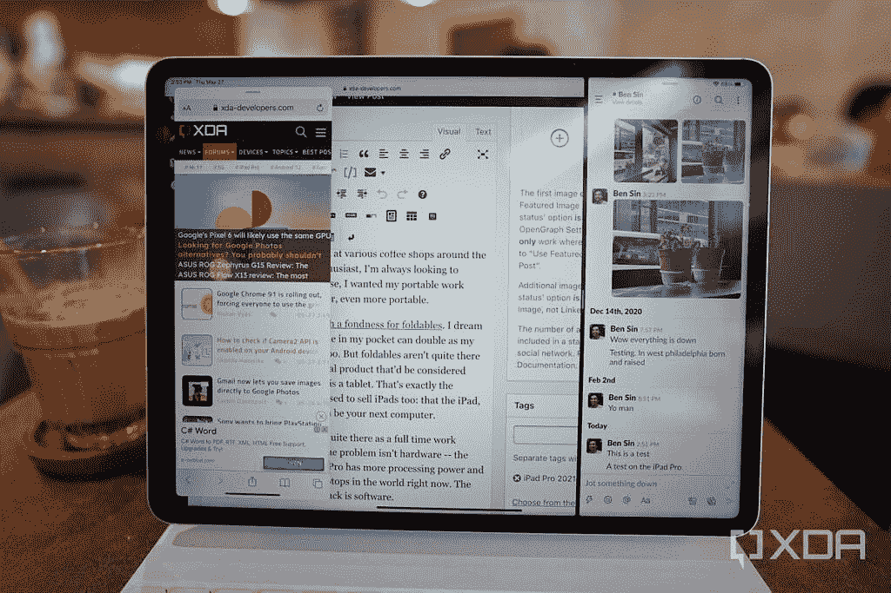
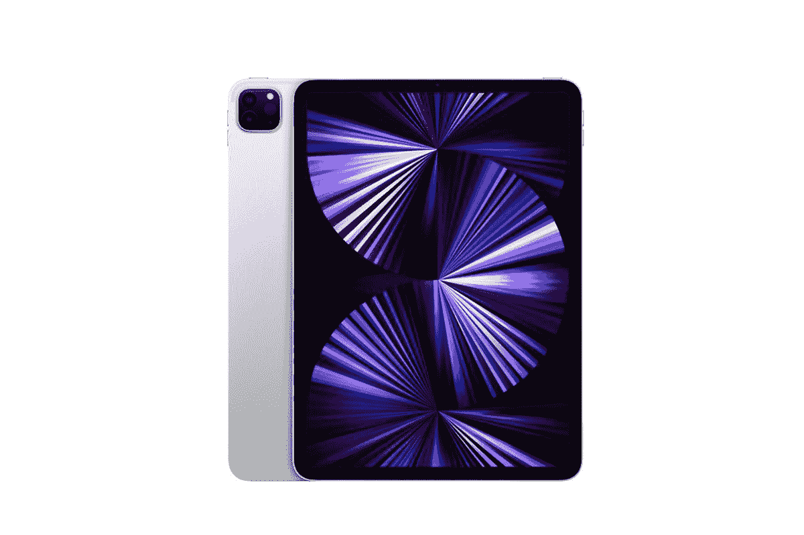
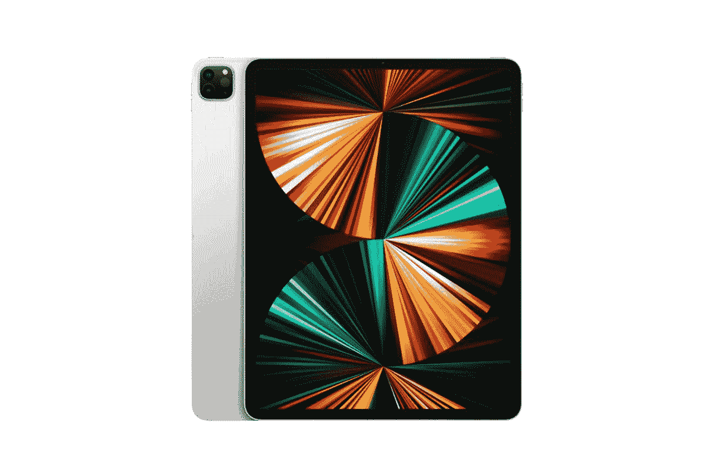
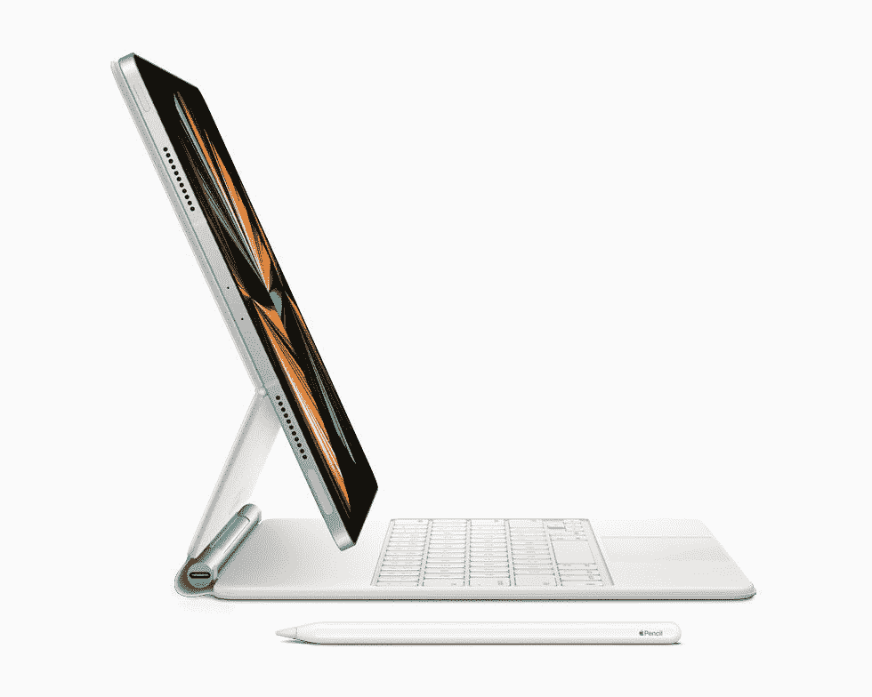

# 苹果的新 iPad Pro 令人惊叹，但 iPadOS 阻碍了它发挥真正的潜力

> 原文：<https://www.xda-developers.com/apple-ipad-pro-ipados-limitations/>

这个术语本身让我畏缩，但我符合对“数字流浪者”的描述——一个在不同地点以在线工作为生的人。不管怎样，我是这样做的，直到新冠肺炎扼杀了世界上大多数地方的旅行。但在去新冠肺炎之前，我每个月至少会离开香港一次，在世界各地的咖啡店里工作。像任何技术爱好者一样，我总是希望升级我的设备——在这种情况下，我希望我的便携式工作机更小、更轻、更便携。

这解释了为什么我如此喜欢伟大的可折叠的东西。我梦想有一天，我口袋里的手机也能成为我的大屏幕工作机。但可折叠产品还没有出现，所以目前，唯一被认为比笔记本电脑更便携的合理产品是平板电脑。这也正是苹果用来销售 iPad 的营销角度 iPad，尤其是 Pro 机型，可以取代电脑。

但是对于许多人来说，iPad Pro 也不是一台全职工作的机器。问题不在于硬件——新款 2021 款 M1 驱动的 iPad Pro 比目前世界上大多数笔记本电脑拥有更强的处理能力和更好的屏幕。阻碍 iPad Pro 发展的是软件。

## 苹果为 iPad 制定的冗长、渐进的过渡计划

自从 iPad 出现以来，一些人试图将其与第三方键盘配合使用，作为便携式工作机。但直到苹果在 2015 年推出了屏幕尺寸更大、配有第一方键盘外壳的 iPad Pro，苹果自己才通过一系列广告宣传推广这一理念。当然，我也尝试过这种设置，但我发现当时在 iPad Pro 上做实际工作几乎是不可能的，因为在 2015 年，iPad 仍然只能一次打开一个应用程序，而且没有合适的文件管理系统。

2017 年的 iOS 11 改变了这一点，当时苹果给了 iPad 版本的 iOS 以分屏模式同时运行两个应用的能力(如果需要，第三个应用可以悬停在顶部)，以及一个有限的文件系统，甚至无法检测外部硬盘或存储卡。大约在这个时候，我可以将 iPad Pro 作为一台工作机器使用，尽管这种体验仍然比仅仅使用笔记本电脑更麻烦。

苹果在 2019 年进一步改善了这一状况，将 iOS 分为 iPadOS，后者提供了一个信息更密集的主屏幕，并支持外置硬盘和鼠标/触控板。搭配苹果昂贵但出色的魔法键盘，iPad Pro 的手感和外观都像笔记本电脑。

因此，苹果一直在努力将 iPad 从一个不能打电话的超大尺寸 iPhone 转变为类似于生产力机器的东西。它只是在享受甜蜜的时光。

## iPadOS 如何阻止这台机器的发展

到现在为止，大多数人应该知道，新的 iPad Pro 2021 运行在苹果广受好评的 M1 芯片上，这给计算行业带来了巨大的变化。从我的个人测试来看，在基准测试和视频渲染测试中，M1 iPad 确实击败了我所有的其他设备(i9 Macs、旧款 iPad、2021 Android 旗舰)。但这些都是小众测试场景——有多少人定期渲染多轨 4K 视频，如果有的话？对于正常的 iPad 使用来说，感觉和 2020 甚至 2018 款的 iPad Pros 差不多。这在平板模式下很棒，但当我试图工作时，iPadOS 仍然太受限制。

### 主屏幕并不是真正免费的

让我们从主屏幕开始。iPadOS 的主屏幕实际上只是 iPhone 主屏幕的一个更大、更宽的版本。你仍然必须将应用程序或小部件放在一个自上而下、自左而右的网格中。举例来说，我不能把我所有的应用程序都放在最下面一行，而把屏幕上面的三分之二空出来。

### 多重任务

然后是多任务处理。对于我目前的工作流程来说，一次只能打开两个应用程序实在是太受限了。事实上，我现在正在 iPad Pro 上输入这篇文章，需要让 Slack 打开已经占据了至少三分之一的屏幕。我当然可以退出应用程序，但仍然会收到通知，但它不会向我的同事显示我“在线”。我希望有一种方法可以在每台笔记本电脑甚至一些 Android 手机上，在*可调整大小的浮动窗口*中打开应用程序，这样我就可以保持 Slack 运行，但占用更少的屏幕空间。

 <picture></picture> 

iPad Pro running two apps in split-screen mode and third app hovering above.

### 过于复杂的归档系统

如果你沉浸在苹果生态系统中，苹果的文件管理系统(官方命名的文件)会很有用，因为该系统无缝地融合了 iCloud 中的文件。例如，我喜欢在 iPad(或 iPhone)的文件应用程序中直接访问 MacBook 主屏幕上的文件(前提是我有足够的 iCloud 存储空间)。但是我们在过去 20-30 年里一直在做的一些基本的计算机任务在苹果的文件系统上仍然异常复杂。

如果我想从网站或电子邮件附件下载图片，默认的下载方式是下载到 iOS 的 iCloud drive，而不是 iPad 本身。如果你想做后者(为了离线访问，或者如果你的 iCloud 存储空间已满)，你必须首先将该图像保存到 iPad 的照片库中，然后只有从那里你才能将其保存到 iPad 的本地存储空间。这是一个额外的任务，需要五到六次点击。

### 有限的外部显示器支持

今年 iPad Pro 的另一个新的硬件升级是 USB-C 端口现在是 Thunderbolt 端口，这使它可以更快地传输文件，并支持更多的配件。但是[外接显示器](https://www.xda-developers.com/best-monitors-surface-laptop-4/)的支持仍然非常有限，近乎无用。就像现在一样，你所能做的就是将 iPad Pro 的显示屏镜像到外部显示器上——你不能扩展屏幕来获得更多的屏幕空间。即使是镜像也很奇怪，因为 iPad Pro 的 4:3 宽高比与大多数显示器的宽屏宽高比不匹配，所以有一些主要的矩形——左右两侧的黑条——正在进行。

## iPad Pro 2021 太强大了，不可能只是一台 iPad

这些软件缺陷使得 iPad 更像是一台“平板电脑”，而不是一台“电脑”，这些缺陷已经存在多年了。但今年的 iPad Pro 尤其令人沮丧，因为它们运行在 M1 MacBook Air 的同一芯片上，后者的性能赢得了普遍的好评。

此外，在我测试的 1TB 机型上，iPad Pro 配备了 16GB 的内存。这一切都是为了一台性能与 iPhone 或老款 iPad 基本相同的机器？

好消息是，对 iPadOS 的改进即将到来。苹果一年一度的全球开发者大会(WWDC)将在一周后举行，苹果肯定会有 iPadOS 的更新。

然而，更新需要是实质性的——就像传言苹果将把 Final Cut Pro 等 MacOS 应用程序带到 iPadOS 上。我个人希望看到改进的多任务处理，比如浮动的可调整大小的应用程序窗口，或者至少是同时分屏显示三个应用程序的能力。免费的主屏幕布局也不会有什么坏处。

如果像过去几年一样，更新是渐进式的，那么 2021 年的 iPad Pro 就像拥有一辆六位数的跑车，但只能在走走停停的郊区交通中行驶。炫耀是好事，但你并没有真正使用所有的马力。

 <picture></picture> 

iPad Pro 2021 11-inch

##### 苹果 iPad Pro 11 英寸(2021 年)

11 英寸的 iPad Pro 可能没有迷你 LED 屏幕，但它仍然有改变游戏规则的 M1 处理器，并具有高度便携的尺寸。

 <picture></picture> 

12.9-inch iPad Pro

##### 苹果 iPad Pro 12.9 英寸(2021 年)

这款 12.9 英寸 iPad Pro 上的屏幕要亲眼看到才会相信。加上 M1 芯片，这对于一台 iPad 来说几乎太强大了。

 <picture></picture> 

Magic Keyboard for iPad Pro 2021 12.9-inch

##### 适用于 iPad Pro 12.9 英寸的苹果魔法键盘

如果你想充分发挥 iPad Pro 的潜力，你需要一个键盘，苹果官方的 Magic Keyboard 在相对较薄的 folio 外壳上拥有最佳的打字和触控板体验。