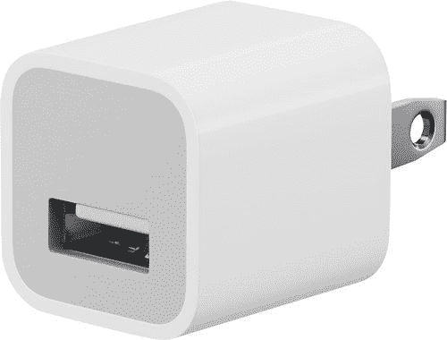

# 最高品质的苹果电源适配器在史泰博只要 15 美元！

> 原文：<https://www.xda-developers.com/apple-power-adapter-staples/>

# 在 Staples 花 15 美元买一个苹果电源适配器，就可以享受质量收费

当你玩弄权力时，你需要小心。只需 15 美元就能买到质量上乘的苹果电源适配器，保护您的技术安全！

我知道你在想什么。我到底为什么需要苹果电源适配器？为什么我不能随便找个适配器，或者用你在垃圾抽屉里找到的那个？当我第一次看到这笔交易时，我也是这么想的。当然，苹果以质量著称，但为我从其他设备上免费获得的东西支付 15 美元似乎很愚蠢。

直到我做了一些研究。首先也是最重要的是，许多大制造商似乎正在用新手机抛弃免费适配器，至少在一些地区是这样。苹果是最先做出这一改变的公司之一，但现在其他公司也纷纷效仿。此外，当谈到适配器时，事实证明您得到了您所支付的东西。许多第三方适配器的构建质量低于 Apple 电源适配器。这可能会导致一些小问题，如充电速度较慢，但结构不佳的适配器也有可能导致电气问题。任何人都不希望发生电力崩溃！

这就把我们带到了苹果电源适配器。这个适配器已经被拆开，并被认为是伟大的建设质量，所以你不必担心任何意外。这也是一个非常紧凑的适配器启动！当然，我的一加曲速充电器应该是搭配我的一加 8 Pro 最好的东西，但你见过它的大小吗？它是巨大的！Apple 适配器要小得多，这意味着它实际上可以放在我床后的插座中。当然，苹果适配器可以与任何通过 USB 连接的电线配合使用，所以你也可以用它来给安卓设备充电！一些 Staples 的评论指出这款适配器仍然有点大，但与我见过的大多数适配器相比，它是较小的一面。

相信了吗？通常 19 美元，你可以在 Staples 只花 15 美元买到这个高质量的适配器。该项目还附带免费送货，或者如果你今天需要它，你可以从当地的史泰博商店拿起它！

 <picture></picture> 

Apple Power Adapter

##### 苹果 20W USB-C 电源适配器

在 Staples 只需 15 美元就能买到苹果电源适配器，享受一个紧凑的适配器就能完成工作，没有失败的风险。