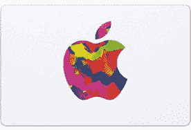

# 苹果销售活动让你在 iPhones、MacBooks 等产品上省钱

> 原文：<https://www.xda-developers.com/apple-sales-event-best-buy/>

当我第一次拿起智能手机时，我有一个决定——安卓还是苹果？出于几个不同的原因，我最终选择了 Android，但其中一个主要原因是苹果产品的成本太高。这要追溯到更经济实惠的选择出现之前，比如 iPhone 12 Mini T1，在智能手机上销售很普遍。说到这里，百思买的苹果销售活动现在开始了，让你可以在各种苹果产品上省钱。也许有了这些折扣，你对选择什么样的生态系统的决定就不会像我这样明确了？

苹果的销售活动也不轻松——百思买几乎为这一场合销售了苹果设备。比如新款 [iPhone 12](https://shop-links.co/1725883186447544467?u1=18d6b8c5-811b-4295-978b-2a64eae14ce0) 和 [iPhone 12 Pro](https://shop-links.co/1725883186544574630?u1=6936f275-30f7-4d88-892a-2ada8a6acee3) ？如果您今天激活 AT & T 并有一部手机以旧换新，您可以节省高达 800 美元！对于新发布的苹果手机来说，这是一笔令人印象深刻的交易。

你还可以在 MacBooks 上节省一大笔钱。事实上，在最新的型号上节省高达 200 美元，平均节省 150 美元。如果你买一台 MacBook，你还可以在 [AppleCare+](https://shop-links.co/1725883187190687462?u1=99636cb6-aa34-46a9-8058-467f23fe0208) 上节省 50 美元，该服务提供延长的技术支持和硬件保修服务。

或者，如果你想为拥有一切的苹果人找一份礼物，苹果礼品卡绝对不会错。对于苹果销售活动，购买一张价值 50 美元的苹果礼品卡可以额外获得一张价值 5 美元的百思买礼品卡和四个月免费的 Apple Music 和 Apple News+。一点也不差！

以上也只是一小部分交易。AirPods、Apple Watches 和大量其他商品也有销售，所以一定要查看销售页面，看看是否有你想要的东西！

 <picture></picture> 

Apple Gift Card

##### 苹果 iPhone 12 Pro

如果你正在寻找苹果产品，无论是给自己还是作为节日礼物，现在是省钱的时候了。百思买的苹果销售活动有一些我们在这些产品上见过的最好的折扣！

本次销售仅持续到周四，库存有限，所以在销售一空之前抓住你想要的！