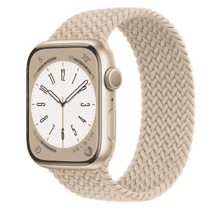

# Apple Watch Series 8 现在正式推出了新的温度传感器

> 原文：<https://www.xda-developers.com/apple-watch-series-8/>

苹果通过宣布新的 Apple Watch Series 8 开始了它的“遥远”活动。这款新手表现在配备了传闻已久的温度传感器和一系列其他健康和安全功能。它还包括两个新的运动传感器，可以检测你是否经历了严重的车祸。这款新手表将于 9 月 16 日开始发售，GPS 型号的售价为 399 美元，蜂窝型号的售价为 499 美元。

Apple Watch Series 8 的新温度传感器可以跟踪小到 0.1 摄氏度的温度变化，并且可以每五秒钟测量一次，这至少可以说是令人印象深刻的。这一新功能还可以让手表通过整夜跟踪体温来帮助您了解排卵周期。这将增强那些跟踪他们周期的人的整体体验。

## 崩溃检测和低功耗模式

Apple Watch Series 8 的另一个新功能是碰撞检测，这意味着它可以检测出你是否经历了严重的车祸。手表可以自动联系紧急服务机构，甚至您的紧急联系人，提醒他们发生的情况。这种特殊的检测功能只会在你开车时运行，这意味着运动传感器不会一直主动消耗电力。

继续关于电源的话题，苹果还在 Series 8 中添加了一种新的低功耗模式，以延长其电池寿命。Apple Watch Series 8 在两次充电之间可以持续长达 18 小时，但低功耗模式可以将其延长至 36 小时。值得庆幸的是，苹果也将低功耗模式引入了老款手表，首先是 Apple Watch Series 4 和更新的手表，前提是它们运行 watchOS 9。并且新的 Apple Watch Series 8 还将首次提供国际漫游。

新款 Apple Watch Series 8 智能手表的屏幕尺寸与其前辈相同——41 毫米和 45 毫米。它也有不锈钢和铝两种表面，但颜色不同。铝变体将有午夜、星光、银色和产品红色可供选择，而不锈钢变体将有银色、金色和石墨色可供选择。

 <picture></picture> 

Apple Watch Series 8

新款 Apple Watch Series 8 比上一代 Apple Watch 进行了几项升级。它现在配有温度传感器，当你遭遇严重车祸时，它也能探测到。

除了常规的 Apple Watch Series 8，该公司还推出了一款新的加固版，名为 [Apple Watch Ultra](https://www.xda-developers.com/apple-watch-ultra-launch/) 。它的起价为 799 美元，但也有许多其他新功能。该公司还在发布会上宣布了 [iPhone 14 系列](https://www.xda-developers.com/apple-iphone-14/)、 [iPhone 14 Pro 系列](https://www.xda-developers.com/apple-iphone-14-pro/)，以及 [Apple Watch SE 2](https://www.xda-developers.com/apple-watch-se-2-launch/) 。